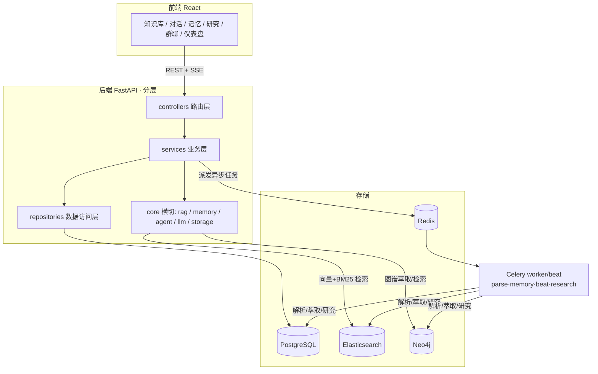

# Comet（彗记）— 项目总览与面试开场

> 个人 AI 知识库 + 记忆助手。本篇是整个项目的总览与「面试开场」资料：一句话介绍、技术栈、架构图、能力亮点、STAR 项目叙述。
> 配套：本目录 `能力地图与JD对照.md` 把项目能力逐条对到 Agent 开发岗招聘要求；各能力域详细设计见 `01~07` 文件夹。

---

## 1. 一句话介绍

Comet 是一个多用户的**个人 AI 知识库与记忆助手**：把用户的文档/图片/网页沉淀为可语义检索的知识库，从对话中自动萃取「记忆」构建专属知识图谱，并用 **LLM Agent 自主编排「知识库 / 记忆 / 联网 + 可外接的 MCP 工具」** 来回答问题；进一步支持**深度研究报告、定时主动任务、多 Agent 群聊、情绪化个性化**。前后端分离，已部署上线（HTTPS）。

**30 秒面试开场版**：

> 我独立做了一个个人 AI 知识库 + 记忆助手 Comet。核心是三层能力：一是 **RAG 知识库**，文档/图片/网页入库、中文混合检索带引用；二是**记忆系统**，从对话自动萃取三元组写进 Neo4j 知识图谱，做成用户画像 + 经历时间线；三是 **Agent 智能问答**，把知识库/记忆/联网/MCP 做成工具让大模型自主编排，强模型走 function calling、弱模型走 ReAct 降级，全程 SSE 流式。在这之上还做了对标 GPT Researcher 的**深度研究 Agent**、可定时自动跑的**主动任务**、**多 Agent 群聊**。技术栈是 FastAPI + React，用了 PostgreSQL / Elasticsearch / Neo4j / Redis 四种存储 + Celery 异步。

---

## 2. 技术栈

| 层 | 选型 | 说明 |
|----|------|------|
| 前端 | React 18 + TypeScript + Ant Design 5 + Vite | 状态 Zustand；图谱 ECharts/AntV X6；图表 ECharts |
| 后端 | FastAPI（全异步） | 分层 controller→service→repository→model/db |
| 业务库 | PostgreSQL 16 + SQLAlchemy 2.0(async) + Alembic | 用户/配置/文档元数据/会话/记忆原文/任务等 |
| 向量+全文 | Elasticsearch 8.17（IK 中文分词） | dense_vector kNN + BM25，混合检索 |
| 记忆图谱 | Neo4j 5.26 | 实体-关系-事件三元组，向量索引 + cjk 全文索引 |
| 异步/缓存 | Celery + Redis | 多队列：parse / memory / beat / research |
| LLM 编排 | LangChain + langchain-openai | Agent 工具循环；MCP 用 langchain-mcp-adapters |
| 部署 | Docker Compose + 腾讯云轻量 + Nginx + HTTPS | `https://cometxrzs.top` |
| 依赖 | 后端 uv，前端 npm | — |

**为什么用四种存储（高频）**：
- **PostgreSQL**：结构化业务数据，强一致 + 事务 + 关系约束。
- **Elasticsearch**：知识库要「向量语义 + BM25 关键词」双路召回，ES 8 原生支持 dense_vector + kNN 又是成熟全文引擎，一个存储满足两种检索。
- **Neo4j**：记忆是「实体-关系」结构，本质是图；多跳关系遍历用图库天然高效，关系库要反复自连接。
- **Redis**：缓存 + Celery 的 broker / result backend。

---

## 3. 整体架构与数据流

**两条主数据流**：
- **写入侧**：上传/对话 → 异步任务（文档解析 / 记忆萃取）→ 写 ES（知识块）/ Neo4j（记忆图谱）。
- **读取侧**：提问 → Agent 编排工具 → 检索 ES/Neo4j → 拼上下文 → LLM 流式生成 → 落库会话 →（回答后）异步萃取记忆，形成闭环。

---

## 4. 能力地图（详细见各能力域文件夹）

| 能力域 | 文件夹 | 覆盖 |
|--------|--------|------|
| LLM 应用工程 | `01-LLM应用工程/` | 模型抽象与多 provider 适配、SSE 流式、ASR 语音输入、配置加密/连接池/统一响应异常 |
| RAG 知识库 | `02-RAG知识库/` | 分块与 IK 中文分词、向量+BM25 混合检索+rerank、引用溯源、多知识库、多模态、文档预览、全局搜索语义门控 |
| Agent 核心 | `03-Agent核心/` | FunctionCalling/ReAct 双路径、工具注册中心、MCP 接入、角色卡/提示词优化器、Skills 技能 |
| 记忆 | `04-记忆/` | 三元组萃取+四层溯源图谱+事件、实体去重、图混合检索、社区聚类 LPA、记忆分层巩固、反思 Insight、主动召回、跨会话 |
| 多 Agent 编排 | `05-多Agent编排/` | 深度研究引擎（规划-检索-提炼-写作）、定时主动任务调度、多 Agent 群聊（主持人调度） |
| 工程化与部署 | `06-工程化与部署/` | 账号鉴权/安全、Celery 多队列、分享导出、消息推送、部署 HTTPS、踩坑集 |
| 情绪与个性化 | `07-情绪与个性化/` | valence-arousal 情绪计算、情绪化音乐推荐、真人对话模式、AI 主动关心/每日回顾 |

---

## 5. 架构设计要点（面试可讲）

### 5.1 严格分层
`controller → service → repository → model/db` 单向调用：controller 只做路由/校验/包装响应；service 写业务、编排 repository 与外部调用；repository 只做存取。横切能力放 `core/` 按子系统分目录，子系统内再按流水线阶段拆（记忆分 preprocessing/extraction/retrieval/clustering）。

### 5.2 异步任务解耦
耗时操作（文档解析、记忆萃取、社区聚类、情绪分析、深度研究、定时任务）走 Celery，接口立即返回。队列按域拆：`parse`（解析/图片/歌曲）/ `memory`（萃取/情绪）/ `beat`（定时：每日回顾、聚类、巩固、心跳）/ `research`（深度研究执行，与心跳分队列防堵）。
> 踩坑：Celery 任务内用 `asyncio.run` 跑异步；每任务用任务级独立 DB 引擎（NullPool）避免全局单例绑到已关闭事件循环；Windows worker 用 `--pool=solo`。

### 5.3 统一响应与异常
所有接口返回 `{ code, message, data }`；业务失败抛 `BizError`（中文提示 + 业务码 + HTTP 码），全局异常处理兜底。

### 5.4 安全
密码 bcrypt；JWT 分 access/refresh；API Key 用 Fernet 对称加密存储、接口返回掩码；所有业务查询强制带 `user_id` 多租户隔离；网页导入/MCP 做 SSRF 防护。

---

## 6. STAR 项目叙述（行为面试用）

- **Situation**：想做一个能长期记住自己、能基于个人资料和实时信息回答问题的 AI 助手，市面框架（Dify 等）封装重、定制难、记忆是黑盒。
- **Task**：独立设计并实现一个多用户、可私有部署的 AI 知识库 + 记忆助手，覆盖 RAG、知识图谱记忆、Agent 编排全链路。
- **Action**：①四存储选型 + 分层架构 + Celery 异步解耦；②自研 RAG 全链路（父子分块 + IK + 向量/BM25 混合 + rerank + 引用）；③自研记忆萃取流水线（受控词表三元组 + 两层去重 + 四层溯源图）；④Agent 双路径编排（function calling / ReAct）+ MCP 接入 + SSE 流式；⑤进阶做深度研究 Agent、定时任务、多 Agent 群聊。
- **Result**：完整跑通并部署上线（HTTPS）；端到端覆盖入库→检索→萃取→问答→记忆闭环；沉淀了一套可讲清原理与取舍的工程实现。

---

## 7. 高频追问

**Q：为什么不用现成框架（Dify、LangChain memory），要自研？**
现成框架封装高、定制难、能力黑盒。自研能完全掌控分块策略、混合检索权重、记忆萃取受控词表与去重逻辑、Agent 双路径，也更能体现对原理的理解。借鉴开源思路但按需求重写、砍掉企业级冗余。

**Q：四个存储怎么保证一致性？**
各司其职，无强一致需求：PG 存元数据/原文（事务保证），ES 存向量/全文，Neo4j 存图谱，Redis 做队列/缓存。跨存储不用分布式事务——异步任务出错把 PG 状态置 failed，ES/Neo4j 写入用幂等（删旧重写 / MERGE）保证可重试，最终一致。

**Q：项目体现了你哪些能力？**
①体系化：四存储选型、分层、异步解耦；②AI 工程：RAG 全链路、Agent 编排、知识图谱萃取，懂原理也能落地；③工程素养：统一响应/异常、连接池、安全（加密/隔离/SSRF）、真实踩坑解决（事件循环、实体去重、SSE 续传）。

**Q：如果重构会改什么？**
①检索融合上 RRF 提鲁棒；②会话历史加摘要压缩；③记忆冲突加时序消解；④加可观测性（链路追踪、检索质量埋点）；⑤评估体系（RAG/Agent 自动 eval）。
