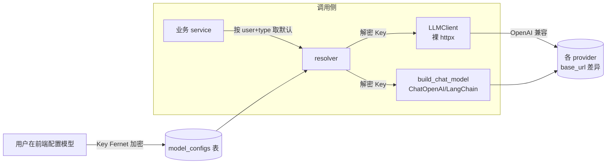

# 模型抽象与多 provider 适配 — 设计与面试

> 用户自配多家大模型（OpenAI/智谱/通义/豆包/DeepSeek），按用途（对话/多模态/向量/重排/联网/语音）分类管理，全项目统一调用。
> 对应能力域：**LLM 应用工程**。代码：`api/app/core/llm/`（client / provider / resolver / chat_model）+ `models/model_config_model.py` + `services/model_config_service.py`。

---

## 0. 能力定位（对应招聘要求）

- 对应 JD：**「熟悉主流大模型 API 接入」「LLM 应用开发」「多模型管理 / 模型路由」「提示词工程」**。
- 角色：整个项目的「模型接入底座」——RAG、记忆萃取、Agent、研究、情绪、ASR 等所有需要 LLM 的地方都通过这层拿到可调用的客户端，上层不关心用的是哪家模型。

---

## 1. 解决什么问题

- **痛点**：不同用户有不同的 API Key 和偏好模型；一个项目要同时用到对话、向量化、多模态、重排、联网搜索、语音识别**多种用途**的模型；硬编码某一家会绑死、也没法多租户。
- **方案**：抽象出 `model_configs` 表，**每用户、每用途可配多个模型**，统一走 OpenAI 兼容协议接入；上层用 `resolver` 按「用户 + 类型」取默认配置构建客户端，与具体 provider 解耦。Key 加密存储。

---

## 2. 架构 / 数据流

调用方只说「给我这个用户的默认对话/向量模型」，resolver 从表里取配置、解密 Key、按 base_url 实例化客户端，业务代码完全不感知背后是智谱还是 DeepSeek。

---

## 3. 核心设计与实现（后端）

### 3.1 模型配置表（`model_config_model.py`）

`model_configs` 关键字段：
- `user_id`：多租户隔离（每用户管自己的模型）。
- `type`：用途分类 —— **chat / multimodal / embedding / rerank / websearch / asr**。同一用途可配多个，`is_default` 标默认。
- `provider`：openai / qwen / doubao / deepseek / zhipu（+ websearch 的 qianfan/tavily）。
- `base_url`、`model_name`：实际请求地址和模型名。
- `api_key_encrypted`：**Fernet 密文**（不存明文）。
- `capability`：能力标记 JSONB，如 `["function_call", "vision"]`——**Agent 强弱模型路由的依据**（强模型走 function calling，弱模型走 ReAct）。

### 3.2 为什么所有 provider 都能「统一适配」

关键认知：**国内外主流大模型几乎都提供 OpenAI 兼容接口**——同样的 `/chat/completions`、`/embeddings`、`/rerank` 路径和请求体，差异只在 `base_url` 和 `model_name`。所以适配多 provider **不需要为每家写一套 SDK**，只要把 base_url 配对（`provider.py` 的 `PROVIDER_DEFAULT_BASE_URL` 给了五家默认地址，用户可覆盖），用同一套 httpx 调用即可。
> 面试一句话：五家 provider 全走 OpenAI 兼容协议，适配差异收敛到「base_url + model_name + api_key」三个配置项，调用代码只有一套。

### 3.3 两套客户端，各管一摊（`client.py` + `chat_model.py`）

项目里**刻意保留两套**模型客户端，对应两类场景：

1. **`LLMClient`（裸 httpx）**——`core/llm/client.py`。封装 `embed / chat / vision / rerank` 四个方法，直接 POST OpenAI 兼容端点。用于**不需要 LangChain 的轻量场景**：向量化、记忆萃取调 LLM、图片多模态识别、重排。特点：依赖少、可控、好加重试。
2. **`build_chat_model` → `ChatOpenAI`（LangChain）**——`core/llm/chat_model.py`。返回 LangChain 的 `ChatOpenAI`，用于**需要工具编排的场景**：Agent 问答（`bind_tools` 做 function calling）、深度研究。因为 Agent 工具循环、流式、function calling 这些能力 LangChain 已经封装好，自己重写不划算。

> 取舍：为什么不用一套？轻量调用引 LangChain 是杀鸡用牛刀；Agent 编排自己撸 function calling 循环又重复造轮子。按场景分两套，各取所长。也**没有**做「动态代理适配异构协议」那种重封装——因为五家都是 OpenAI 兼容，用不上。

### 3.4 LLMClient 的健壮性：有限重试 + 指数退避（`client.py`）

所有请求走 `_post_with_retry`，这是萃取/检索稳定性的关键：
- **可重试**：httpx 传输异常（连接中断、读超时、对端关闭）+ HTTP `429/500/502/503/504`。
- **不重试**：其余 4xx（鉴权失败、参数错误）——重试也没用，直接抛。
- **退避**：最多 3 次，第 n 次等 `1.5 * n` 秒。
- 各方法按耗时设不同 timeout（chat/vision 120s、embed/rerank 60s）。

`embed` 还支持 `dimensions` 参数裁剪输出维度（默认 `settings.embedding_dims=1024`），**和 ES 向量索引维度严格对齐**——否则写入会维度不匹配报错。

### 3.5 resolver：按「用户 + 类型」取默认配置（`resolver.py`）

`get_client_for_type(session, user_id, type_)`：从表里查该用户该类型的配置，**优先 `is_default` 的、否则取第一个**，解密 Key 后构建 `LLMClient`；查不到抛 `BizError("未配置X模型，请先在模型配置中添加", code=2010)`（前端据此引导去配置）。另有 `get_optional_client_for_type` 返回 `None` 而不报错——用于 **rerank、embedding 这类「可选能力」**（没配就降级跳过，比如检索没配 rerank 就只做混合检索不重排）。

`chat_model.py` 同理有 `get_default_chat_config` / `get_default_config_for_type`，`supports_function_call(config)` 判断 capability 里有没有 `function_call`，决定 Agent 走哪条路径。

### 3.6 连接测试（`provider.py`）

配置时点「测试连接」会发一个**最小真实请求**验证 Key/base_url/model 三者匹配：chat/multimodal 发 `max_tokens:1` 的 ping、embedding 发一个短文本、rerank 发一对 query/doc。按 HTTP 码给中文提示（401/403→Key 无效、404→模型不存在或路径错、超时→base_url 不可达）。websearch 真发一次搜索、asr 因是异步任务只校验模型名已填（真实可用性发语音时验证）。

---

## 4. 关键设计取舍

| 决策点 | 选了什么 | 备选 | 为什么 |
|--------|---------|------|--------|
| 多 provider 适配 | 统一 OpenAI 兼容 + base_url 配置 | 每家写一套 SDK | 五家都兼容 OpenAI 协议，一套调用搞定，差异收敛到配置 |
| 客户端封装 | 两套（LLMClient 裸 httpx / ChatOpenAI） | 全用 LangChain / 全自研 | 轻量调用不引重框架，Agent 编排复用 LangChain，各取所长 |
| 是否做异构协议动态代理 | 不做 | 类 RedBearLLM 动态代理 | 五家都 OpenAI 兼容，无异构需求，避免过度设计 |
| Key 存储 | Fernet 对称加密 + 返回掩码 | 明文 / base64 伪加密 | 真加密，泄库也拿不到 Key；详见加密篇 |
| 模型用途 | 按 type 分 6 类各配默认 | 一个模型打天下 | 向量/重排/多模态/联网/语音模型本就不同，分类管理 |
| 重试范围 | 仅传输异常 + 429/5xx | 全部错误都重试 | 4xx（鉴权/参数）重试无意义，只浪费时间 |

---

## 5. 踩坑与解决

- **embedding 维度不匹配**：不同模型默认维度不同，写 ES 会报维度错。解法：`embed` 统一传 `dimensions=settings.embedding_dims`，与 ES 索引维度对齐（智谱 embedding-3 支持按维度裁剪）。
- **把 4xx 也重试**：早期重试逻辑无脑重试，鉴权失败也重试 3 次白等。解法：`_post_with_retry` 区分可重试状态集合，4xx（非 429）直接抛。
- **连接测试只看 HTTP 200 不够友好**：解法：按 401/403/404/超时分别给中文提示，定位问题更快。

---

## 6. 面试问答

**Q1（基础）：怎么接入多家大模型的？**
国内外主流模型大多提供 OpenAI 兼容接口，路径和请求体一致，差异只在 base_url 和 model_name。所以我把这两个 + api_key 做成可配置项，用同一套 httpx 调用适配五家，不为每家写 SDK。

**Q2（设计）：为什么有 LLMClient 和 ChatOpenAI 两套客户端？**
轻量场景（向量化、萃取调 LLM、多模态、重排）用裸 httpx 的 LLMClient，依赖少可控；需要工具编排的 Agent 问答用 LangChain 的 ChatOpenAI，复用它的 bind_tools/流式/function calling。按场景分工，避免杀鸡用牛刀或重复造轮子。

**Q3（原理）：capability 字段干嘛的？**
标模型能力，如 function_call、vision。Agent 编排时 `supports_function_call` 判断走原生 function calling（强模型）还是 ReAct prompt 模拟（弱模型）；多模态判断能不能看图。

**Q4（工程）：LLM 调用的稳定性怎么保证？**
有限重试 + 指数退避：传输异常和 429/5xx 重试最多 3 次、第 n 次等 1.5n 秒；4xx（鉴权/参数）不重试直接抛。按方法设不同超时。萃取这种多次调 LLM 的流程靠这个提升成功率。

**Q5（进阶）：embedding 维度为什么要统一？**
ES 向量索引建的时候固定了维度（1024），写入向量维度必须一致否则报错。所以 embed 调用统一传 dimensions 和索引对齐，支持裁剪维度的模型（智谱 embedding-3）按此输出。

**Q6（进阶）：为什么不做像某些框架那样的「模型动态代理/适配层」？**
那种重适配是为了兼容 Ollama/Bedrock/火山等**异构非 OpenAI 协议**。我接的五家全是 OpenAI 兼容，没有异构需求，再加一层动态代理是过度设计，反而增加复杂度和调试成本。

---

## 7. 相关论文 / 概念

**① OpenAI 兼容 API：事实标准的形成**
2022 底 ChatGPT 爆火后，OpenAI 的 API 格式（`/chat/completions`、`messages` 数组、`/embeddings`）成了**事实标准**。国内外厂商（智谱、通义、DeepSeek、豆包等）为降低用户迁移成本，普遍提供「OpenAI 兼容端点」——同样的路径和请求体，只换 base_url 和 model_name。这是本项目能用一套代码适配多家的根本原因。

**② Function Calling / Tool Use**
OpenAI 2023.6 推出，模型按工具 JSON schema 返回结构化调用。本项目用 `capability` 字段标记模型是否支持，作为 Agent 强弱模型路由依据（详见 Agent 篇）。

**③ Embedding 与维度可裁剪（Matryoshka）**
文本 embedding 把文本映射成稠密向量。**Matryoshka Representation Learning（Kusupati et al. 2022）** 提出「套娃式」表示——一个高维向量的前缀子向量也是有效表示，于是模型可输出指定维度（取前 N 维）。智谱 embedding-3 等支持 `dimensions` 参数即基于此思想。本项目靠它把向量裁到与 ES 索引一致的 1024 维。

**④ 重试与指数退避（Exponential Backoff）**
分布式系统调用外部服务的标准容错模式：失败后等待时间指数增长再重试，避免「失败→立即重试→加剧拥塞」的雪崩。关键是**只对可重试错误重试**（网络抖动、429 限流、5xx），对 4xx（鉴权/参数错）立即放弃。本项目 LLM 调用即此。

> 一句话脉络：OpenAI 兼容 API 成事实标准让多 provider 适配收敛为配置；embedding 的 Matryoshka 特性支持维度裁剪对齐索引；外部调用用「只对可重试错误做指数退避」保稳定。

---

## 8. 可优化方向

- **模型路由 / 自动降级**：默认模型超时或额度耗尽时自动切备用模型。
- **调用限流与配额**：每用户 token/请求限流，防滥用与超支。
- **成本与用量统计**：记录每次调用的 token 数，做成本看板。
- **embedding/chat 结果缓存**：相同输入命中缓存，降调用量（尤其向量化）。
