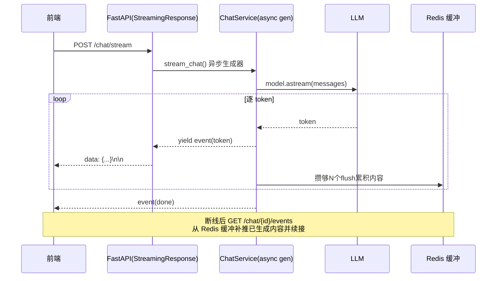

# SSE 流式输出（含断线续传）— 设计与面试

> LLM 回答逐 token 推到前端实现「打字机」效果；长回答不阻塞；断线能重连续传。
> 对应能力域：**LLM 应用工程 / 流式交互**。代码：`controllers/chat_controller.py`（StreamingResponse）+ `services/chat_service.py`（async generator + 续传）+ `core/realtime/bus.py`（Redis 缓冲/广播）。

---

## 0. 能力定位（对应招聘要求）

- 对应 JD：**「流式输出 / SSE」「大模型应用的实时交互」「高并发 I/O / 异步编程」**。
- 角色：所有 LLM 生成场景（单聊、群聊、重新生成、深度研究）的输出通道，决定了产品「秒回 + 打字机」的体感。

---

## 1. 解决什么问题

- **痛点**：LLM 生成一段长回答要几秒到几十秒，若等全部生成完再返回，用户面对转圈很难受；且 HTTP 一次性响应无法边生成边展示。
- **方案**：用 **SSE（Server-Sent Events）** 把生成过程做成**事件流**，逐 token 推给前端打字机式渲染；并设计**断线重连续传**，刷新/断网后能补回正在生成的内容，不丢回答。

---

## 2. 架构 / 数据流

---

## 3. 核心设计与实现（后端）

### 3.1 FastAPI 怎么吐 SSE（`chat_controller.chat_stream`）

返回 `StreamingResponse(async_generator, media_type="text/event-stream")`，关键是三个响应头：
- `Cache-Control: no-cache`：禁缓存。
- `Connection: keep-alive`：保持长连接。
- **`X-Accel-Buffering: no`：禁用 Nginx 缓冲**——这是部署后能不能真流式的关键。Nginx 默认会缓冲后端响应攒一批再发，导致前端「憋很久然后一次性蹦出全部」，看起来不流式。这个头告诉 Nginx 对本响应不缓冲，逐块透传。

生成器每 yield 一段，FastAPI 就按 SSE 格式 `data: {...}\n\n` 发给前端，前端用 `fetch` + `ReadableStream`（或 EventSource）解析。

### 3.2 事件协议（service 产出，前端按 type 分发）

`stream_chat` 是个 async generator，逐步 yield 结构化事件，前端按 `type` 分别处理：
- `meta`：开始，带会话/消息 id；
- `token`：一个文本片段（打字机靠它）；
- `tool_call`：Agent 调了某工具（前端显示「正在查知识库…」）；
- `citation`：引用来源（回答末尾挂引用卡）；
- `done`：结束，回传真实 message_id（前端用它做收藏深链等）；
- `error`：出错。

> 把「文本/工具/引用/结束」拆成不同事件类型，前端能边收边渲染不同 UI 区域，而不是只收一堆文本。

### 3.3 为什么生成器能边生成边推

LLM 客户端（LangChain `model.astream` 或裸 httpx 流式）本身是异步生成器，逐 token 产出；ChatService 把它包一层、加上工具调用/引用事件，再逐个 yield 给 StreamingResponse。整条链路全异步（`async for`），不阻塞事件循环，单 worker 能并发扛很多条流式连接——这也是用 FastAPI 异步的意义。

### 3.4 断线重连续传（亮点，`bus.py` 流式缓冲 + `/chat/{id}/events`）

刷新页面或网络抖动会断掉 SSE 连接，但**后端生成还在跑**（或刚跑完），直接重连历史接口会丢掉正在生成的这条。设计：
1. **生成中持续把累积内容写 Redis 缓冲**（`set_stream_buffer`，存 content/已生成 token 数/citations/tool_calls/status，TTL 600s 覆盖最慢一次生成）。为降写频，攒够 `_BUFFER_FLUSH_EVERY=8` 个 token 才刷一次。
2. **重连走 `GET /chat/{conv_id}/events`**（`resume_events`）：读 Redis 缓冲，若有正在进行的生成，**先一次性补推已生成的内容**，再续接后续 token 直到 done；若没有进行中的生成，立即返回 `idle`，前端据此去拉历史消息（避免重复）。
3. 生成正常结束/落库后 `clear_stream_buffer` 清缓冲。

> 面试一句话：把「生成中的累积内容」实时写进 Redis（带 TTL），断线重连时先补推缓冲里已生成的部分再续接后续 token，没有进行中的就回 idle 让前端拉历史——既不丢正在生成的回答，也不重复。

### 3.5 群聊场景的 Redis Pub/Sub 广播（`bus.py`）

单聊是「一个请求一条流」，群聊是「多人同看一条流」。群聊用 Redis **发布订阅**：任意成员发言或 AI 逐字回答都 `publish` 到该会话频道，每个在场成员开一条 SSE 长连接 `subscribe` 同一频道，实现「谁发消息全员秒级可见」，且跨进程/多 worker 天然广播。空闲时周期吐 `_ping` 心跳（25s）保活，防反向代理空闲超时断连。还有「AI 回合锁」（SET NX EX）防多人同时发言重复触发 AI 调度。

---

## 4. 关键设计取舍

| 决策点 | 选了什么 | 备选 | 为什么 |
|--------|---------|------|--------|
| 流式协议 | SSE | WebSocket | LLM 输出是「服务端→客户端」单向流，SSE 够用、基于 HTTP 更简单、自动重连；WebSocket 双向是杀鸡用牛刀 |
| Nginx 缓冲 | `X-Accel-Buffering: no` | 默认缓冲 | 不禁用就不是真流式，前端会憋一下一次性出 |
| 续传缓冲 | Redis（TTL 600s） | 内存 / DB | 跨 worker 可见、自动过期清理、不污染 DB |
| 群聊广播 | Redis Pub/Sub | 轮询 / 内存广播 | 复用现有 Redis，多 worker 跨进程广播，秒级 |
| token 写缓冲频率 | 攒 8 个 flush 一次 | 每 token 写 | 每 token 写 Redis 太频繁，批量降写压 |

---

## 5. 踩坑与解决

- **部署后不流式（憋一下全出）**：Nginx 默认缓冲响应。解法：响应头加 `X-Accel-Buffering: no`（+ Nginx 侧 `proxy_buffering off`）。
- **刷新页面正在生成的回答丢了**：解法：Redis 流式缓冲 + `/events` 续传接口，重连补推。
- **长连接被代理掐断**：解法：空闲周期发心跳（SSE 注释行 / `_ping`）保活。
- **每 token 写 Redis 压力大**：解法：`_BUFFER_FLUSH_EVERY` 攒批刷。

---

## 6. 面试问答

**Q1（基础）：SSE 是什么？和 WebSocket 区别？**
SSE 是基于 HTTP 的服务端单向推送（`text/event-stream`，`data: ...\n\n` 格式），浏览器原生 EventSource 支持、自动重连。WebSocket 是全双工。LLM 流式输出是服务端→客户端单向，用 SSE 更简单合适，不需要 WebSocket 的双向能力。

**Q2（工程）：FastAPI 怎么实现 SSE？**
返回 `StreamingResponse(async_generator, media_type="text/event-stream")`，生成器逐步 yield 事件。关键响应头 `X-Accel-Buffering: no` 禁 Nginx 缓冲，否则不是真流式。

**Q3（原理）：为什么能边生成边推、不阻塞？**
LLM 客户端是异步生成器逐 token 产出，service 包一层加事件类型再 yield 给 StreamingResponse，全链路 `async for` 不阻塞事件循环，单 worker 能并发扛多条流。

**Q4（进阶）：断线重连怎么不丢正在生成的回答？**
生成中把累积内容实时写 Redis 缓冲（带 TTL，攒批刷降写频）；重连走 /events 接口读缓冲，先补推已生成部分再续接后续 token；没有进行中的就回 idle 让前端拉历史。既不丢也不重复。

**Q5（进阶）：群聊一条流多人看怎么做？**
Redis Pub/Sub：发言/AI 回答 publish 到会话频道，每个在场成员 SSE 订阅同频道，跨进程广播。空闲发心跳保活，AI 回合用 SET NX 锁防重复触发。

**Q6（细节）：事件为什么要分类型（token/tool_call/citation/done）？**
前端要把文本、工具调用提示、引用卡、结束信号渲染到不同 UI 区域。分类型事件让前端能边收边分发，而不是只收一坨文本再解析。

---

## 7. 相关论文 / 概念

**① 三种「服务端推送」技术的对比**
浏览器要实时收服务端数据，历史上有三条路：
- **轮询（Polling）**：客户端定时问「有新数据吗」，简单但有延迟和空请求浪费。
- **WebSocket**：全双工长连接，双向实时，但协议更重、要单独的连接管理、不自动重连。
- **SSE（Server-Sent Events）**：基于 HTTP 的**服务端单向推送**（W3C/WHATWG 标准，`text/event-stream`，`data: ...\n\n` 格式），浏览器原生 `EventSource` 支持、自带断线自动重连。
LLM 流式输出是「服务端→客户端」单向流，**SSE 是最贴合的选择**——比轮询实时、比 WebSocket 简单。本项目用它。

**② 流式生成（Streaming Generation）**
LLM 自回归逐 token 生成，天然可以「边生成边返回」。流式不只是体验优化，更降低「首 token 延迟（TTFT）」感知——用户几百毫秒就看到开头，而非干等几秒。

**③ 反向代理缓冲（Proxy Buffering）**
Nginx 等反向代理默认缓冲上游响应（攒一批再发给客户端），这会**破坏流式**——前端憋很久再一次性收到全部。`X-Accel-Buffering: no`（Nginx 专用响应头）/ `proxy_buffering off` 关闭缓冲，是 SSE 部署的必备知识点。

**④ Redis Pub/Sub 与发布订阅模式**
发布订阅是经典消息模式：发布者发到频道，所有订阅者收到。本项目群聊用它做「一条流多人看」的跨连接广播；跨进程/多 worker 天然可达。

**⑤ 断点续传 / 背压（Backpressure）思想**
本项目「生成中写 Redis 缓冲、重连补推」是断点续传思路；「攒够 N 个 token 才刷一次缓冲」是轻量背压/流控——降低下游（Redis）写压。

> 一句话脉络：服务端推送从轮询→WebSocket→SSE，LLM 单向流用 SSE 最合适；部署要关反向代理缓冲才是真流式；群聊广播用 Redis Pub/Sub；断线续传靠 Redis 缓冲补推。

---

## 8. 可优化方向

- **token 节流/合并**：前端按帧合并 token 渲染，降重绘。
- **断点续传更细**：续传带「已发送 token 序号」精确续接，而非整体补推。
- **生成可取消**：前端断开时后端检测并取消 LLM 请求，省额度（当前后台仍跑完落库）。
- **统一抽象**：单聊续传缓冲与群聊 Pub/Sub 两套机制可抽象成统一的「会话事件流」层。
