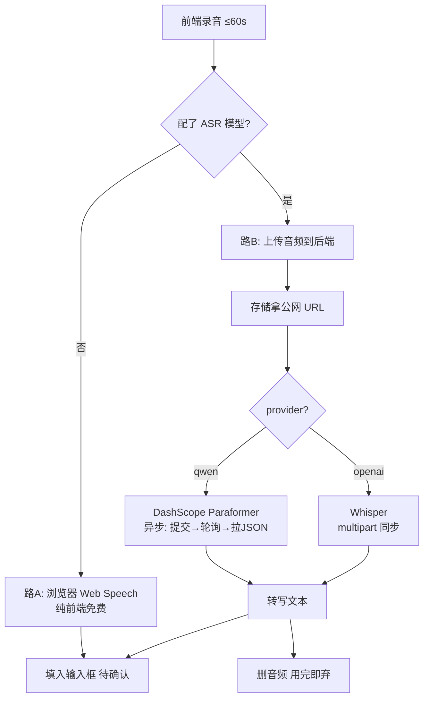

# 语音输入 ASR（浏览器 + 云端异步双路）— 设计与面试

> 对话框语音转文字：优先浏览器免费识别，可选配云端 ASR 模型（DashScope Paraformer / Whisper）做高质量识别。
> 对应能力域：**LLM 应用工程 / 多模态输入**。代码：`core/asr/transcriber.py` + `controllers/chat_controller.py`（`/chat/transcribe`）+ `provider.py`（asr 测试）。

---

## 0. 能力定位（对应招聘要求）

- 对应 JD：**「语音识别 / ASR 接入」「多模态交互」「第三方 AI 服务集成（异步任务/轮询）」**。
- 角色：给对话/群聊加语音输入入口，降低移动端打字成本。

---

## 1. 解决什么问题

- **痛点**：手机端打字慢；想说话直接转成文字发送。但纯云端 ASR 要钱、要配置，纯浏览器识别质量一般且依赖环境。
- **方案**：**双路降级**——默认用浏览器免费的 Web Speech（路 A，纯前端）；用户配了 ASR 模型则走云端高质量识别（路 B，后端）；HTTP 环境麦克风受限时用音频上传兜底。

---

## 2. 架构 / 数据流

---

## 3. 核心设计与实现（后端，路 B）

### 3.1 接口流程（`/chat/transcribe`）

后端只负责路 B（云端）。流程：
1. 取用户默认 ASR 配置，**没配返回 `code=2010`**——前端据此降级到浏览器 Web Speech（路 A）或提示。
2. 收到音频字节 → 存进对象存储拿到**可公网访问的 URL**（DashScope 异步识别需要拉取 URL，所以必须先存储拿 URL，不能直接传字节）。
3. 调 `transcribe(provider, key, model, audio_url)` 转写。
4. **`finally` 里删音频——用完即弃，不入库**（语音只是输入手段，没有留存价值，还省存储）。

### 3.2 DashScope Paraformer 是「异步任务」（关键难点）

Paraformer 录音文件识别**不是同步返回**，是个异步任务，要三步（`_transcribe_dashscope`）：
1. **提交任务**：POST 带 `X-DashScope-Async: enable` 头 + `file_urls`，拿到 `task_id`。
2. **轮询状态**：按 `task_id` GET 任务，每 1.5s 一次、最多 40 次（约 60s，匹配「录音≤60s」），直到 `task_status == SUCCEEDED`（或 FAILED/CANCELED 报错、超时报错）。
3. **拉结果**：成功后结果不是直接给文本，而是给一个 `transcription_url` 指向结果 JSON，**再 GET 这个 URL** 解析出 `transcripts[].text` 拼成最终文本。

> 面试一句话：Paraformer 是异步录音识别，要「提交拿 task_id → 轮询任务状态 → 成功后再下载 transcription_url 指向的结果 JSON 取文本」三步，所以音频必须先存储成公网 URL 给服务端拉取。

### 3.3 Whisper 是同步 multipart（`_transcribe_whisper`）

OpenAI Whisper 简单：后端把音频字节下载下来，`multipart/form-data` 上传到 `/audio/transcriptions`，同步返回文本。一步到位。

### 3.4 统一入口 + 错误码

`transcribe()` 按 provider 分流（qwen→Paraformer / openai→Whisper），失败统一抛 `BizError` 带中文提示和细分错误码（2031 Key 无效 / 2033 识别失败 / 2034 超时 / 2036 没识别到内容 / 2035 连接失败）。整个转写步骤在 controller 里也被兜底，失败前端可降级。

### 3.5 前端双路（说明，非本篇后端重点）

前端 `VoiceInputButton`：录音 ≤60s 红色脉动；优先调后端 `/transcribe`（路 B），返回 2010（没配 ASR）则降级浏览器 Web Speech（路 A）；HTTP 下麦克风 API 受限时用音频上传兜底。转写结果**填入输入框待用户确认，不自动发送**（防误识别直接发出去）。

---

## 4. 关键设计取舍

| 决策点 | 选了什么 | 备选 | 为什么 |
|--------|---------|------|--------|
| 识别路线 | 双路：浏览器免费 + 云端可选 | 只云端 / 只浏览器 | 免费可用 + 高质量可选，按用户是否配模型自动切 |
| 音频留存 | 用完即弃（finally 删） | 入库保存 | 语音只是输入手段无留存价值，省存储 + 隐私 |
| Paraformer 调用 | 提交→轮询→拉结果 三步 | 期望同步返回 | 它本就是异步录音识别接口，必须按异步范式调 |
| 音频传递 | 先存储拿公网 URL | 直接传字节 | DashScope 异步识别需要拉取 URL |
| 转写结果 | 填输入框待确认 | 直接发送 | 防误识别内容直接发出去 |
| 没配 ASR | 返回 2010 让前端降级 | 报错挡住 | 优雅降级到浏览器免费识别 |

---

## 5. 踩坑与解决

- **以为 Paraformer 同步返回**：实际是异步任务。解法：实现「提交→轮询→拉 transcription_url」三步，轮询上限匹配录音时长（≤60s）。
- **直接传音频字节给 DashScope 失败**：它要公网 URL 拉取。解法：先存储拿 URL 再提交，转写完删除。
- **HTTP 环境麦克风权限受限**：浏览器麦克风 API 需 HTTPS。解法：上线 HTTPS + HTTP 下音频上传兜底。
- **误识别直接发送**：解法：转写填输入框，用户确认再发。

---

## 6. 面试问答

**Q1（基础）：语音输入怎么做的？**
双路：默认浏览器 Web Speech 免费识别（纯前端）；用户配了 ASR 模型走云端（DashScope Paraformer / Whisper）。后端只管云端路，没配则返回特定码让前端降级。

**Q2（难点）：DashScope 录音识别和普通同步 API 有什么不同？**
它是异步任务：先提交拿 task_id，再轮询任务状态直到成功，成功后结果是个 transcription_url，要再下载这个 URL 的 JSON 才拿到文本。所以音频得先存成公网 URL 给它拉。

**Q3（工程）：音频怎么处理的？会存吗？**
存储只是为了拿公网 URL 给 DashScope 拉取，转写完在 finally 里立即删除——用完即弃，不入库，省存储也保护隐私。

**Q4（设计）：为什么转写结果不直接发送？**
语音识别可能误识别，直接发出去体验差。填进输入框让用户确认/修改后再发。

**Q5（进阶）：轮询会不会卡住请求？**
设了上限（40 次 × 1.5s ≈ 60s）匹配录音时长，超时报「请重试或缩短录音」。整个转写是 async 的不阻塞事件循环。要更优可改成前端轮询任务状态而非后端长轮询。

---

## 7. 相关论文 / 概念

**① ASR 技术的演进**
语音转文字技术脉络：**HMM-GMM**（隐马尔可夫 + 高斯混合，传统统计语音识别）→ **深度学习端到端**（CTC、RNN-T、Attention）→ **大规模预训练**。两个代表：
- **Whisper（Radford et al. 2022，OpenAI）**：用 68 万小时多语种数据训练的端到端 ASR，鲁棒性强、多语种、开源权重，成为通用 ASR 基线。本项目 OpenAI 路用它。
- **Paraformer（达摩院）**：**非自回归（NAR）** 语音识别模型——传统自回归逐字解码慢，Paraformer 并行一次出全句，速度快。本项目 DashScope 路用它。

**② 浏览器 Web Speech API**
W3C 规范，浏览器原生语音识别接口（`SpeechRecognition`），免费、零部署，但依赖浏览器实现和网络、质量参差、需 HTTPS。本项目作为「路 A」免费降级。

**③ 异步任务 + 轮询（Submit-Poll-Result）范式**
耗时云服务的常见调用模式：提交任务拿 id → 轮询任务状态 → 完成后取结果。本项目 Paraformer 录音识别就是这个范式（还多一步：结果是个 URL，要再下载）。这种范式的好处是不阻塞长连接、能处理大文件，代价是要轮询、有延迟。

**④ 多路降级（Graceful Degradation）**
系统设计原则：高级能力不可用时优雅退到次级能力，而非直接报错。本项目「云端 ASR（高质量）→ 浏览器识别（免费）→ 音频上传兜底」就是多路降级，保证总能用。

> 一句话脉络：ASR 从 HMM-GMM 到端到端深度学习，Whisper（大规模多语种）和 Paraformer（非自回归快速）是代表；本项目双路（浏览器免费 + 云端高质量）+ 多路降级保证可用；云端录音识别用「提交-轮询-取结果」异步范式。

---

## 8. 可优化方向

- **轮询改前端驱动**：后端只提交返回 task_id，前端轮询，释放后端连接。
- **流式 ASR**：边说边转（实时字幕），用支持流式的识别接口。
- **本地化兜底**：内网部署可接开源 Whisper/FunASR 本地推理，免云端依赖。
