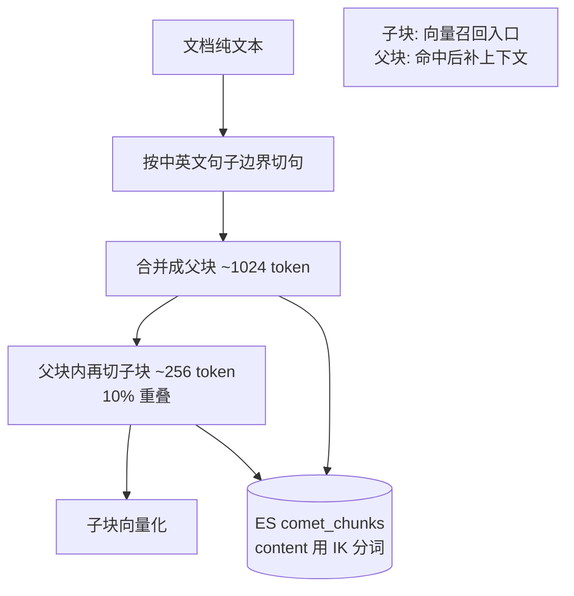

# 分块与中文分词（父子分块 + IK）— 设计与面试

> 文档入库前怎么切块、中文怎么分词——决定 RAG 检索质量的地基。
> 对应能力域：**RAG**。代码：`core/rag/chunker.py`（父子分块）+ `core/rag/es_index.py`（IK 分词 mapping）。

---

## 0. 能力定位（对应招聘要求）

- 对应 JD：**「RAG / 文档分块策略」「中文 NLP / 分词」「Elasticsearch」「embedding」**。
- 角色：知识库写入侧的第一步，分块和分词的质量直接决定后面向量召回和 BM25 召回的上限。

---

## 1. 解决什么问题

- **分块痛点**：整篇文档直接 embedding 太粗（一个向量代表全文、检索不准），切太碎又丢上下文（命中一句话看不懂前因后果）。
- **分词痛点**：ES 默认分词器对中文是**按单字切**，BM25 关键词检索会把「知识库」拆成「知/识/库」，召回质量差。
- **方案**：**父子分块**（子块细粒度做向量召回、父块粗粒度补上下文）+ **IK 中文分词**（按词切，BM25 才准）。

---

## 2. 数据流



---

## 3. 核心设计与实现（后端）

### 3.1 父子分块（`chunker.chunk_parent_child`）

两级切分，先父后子：
1. **切句**：用正则 `(?<=[。！？.!?\n])` 按中英文句末标点切成句子列表——保证不在句子中间断开。
2. **合父块**：把句子贪心合并到 ~1024 token（`PARENT_CHUNK_TOKENS`）一块，用 `tiktoken`（cl100k_base 编码）数 token；单句超长则单独成块。
3. **切子块**：在**每个父块内部**再把句子合并到 ~256 token（`CHILD_CHUNK_TOKENS`）一块，**带 10% 重叠**（`CHILD_OVERLAP_RATIO`，保留尾部句子到下一块，避免边界信息断裂）。

结果是一个 `ParentChunk` 列表，每个父块挂若干子块。

### 3.2 为什么父子分块（small-to-big，关键）

- **子块（小）做向量召回**：粒度细，向量更聚焦一个语义点，检索命中更准。
- **父块（大）做上下文**：命中子块后，**返回它所属父块的内容**给 LLM（见混合检索篇 `_resolve_parent_content`），让模型看到更完整的上下文，而不是孤零零一句话。
- 子块负责「**找得准**」，父块负责「**看得全**」，兼顾召回精度和上下文完整。

> 面试一句话：父子分块就是「small-to-big」——用 256 token 的小子块向量化做精准召回，命中后返回它 1024 token 的父块给 LLM 补全上下文，解决「切细了丢上下文、切粗了召回不准」的两难。

### 3.3 重叠（overlap）为什么要

子块之间 10% 重叠，是为了防止**关键信息正好被切在两块边界**：比如「……解决方案是 || 用 IK 分词」被切成两块，单独哪块都不完整。重叠让边界句在相邻两块都出现，降低这种断裂。

### 3.4 IK 中文分词（`es_index.py` 的 content mapping）

ES `comet_chunks` 索引的 `content` 字段配置：
```
"content": {
  "type": "text",
  "analyzer": "ik_max_word",       # 写入：细粒度（词全切，召回广）
  "search_analyzer": "ik_smart"    # 查询：粗粒度（切大词，精准）
}
```
- **`analysis-ik` 插件**：开源中文分词器，按词典切词。「知识库」切成「知识库/知识/库」而不是单字。
- **写入用 `ik_max_word`（细）**：把文本尽可能多地切出词，建倒排索引时词覆盖全，召回不漏。
- **查询用 `ik_smart`（粗）**：对查询做最粗粒度切分，避免过度切分带来噪声，匹配更精准。
- 这是**「写入细、查询粗」**的经典搭配。

> 面试一句话：ES 默认对中文按单字切，BM25 会把词拆散导致召回差；装 IK 插件，content 字段写入用 ik_max_word 细切保证召回、查询用 ik_smart 粗切保证精准。

### 3.5 索引整体结构（`es_index.py`）

单索引 `comet_chunks`（个人数据量小，单索引 + `user_id` 过滤足够），关键字段：`user_id`/`kb_id`/`source_type`/`chunk_type`(child/parent/image_desc)/`parent_id`(子→父)/`content`(IK)/`tags`/`vector`(dense_vector 1024 维 cosine)。向量和全文在**同一份文档**里，一次检索能同时拿向量分和 BM25 分。

---

## 4. 关键设计取舍

| 决策点 | 选了什么 | 备选 | 为什么 |
|--------|---------|------|--------|
| 分块策略 | 父子分块（256 子 / 1024 父） | 固定大小切 / 只切一级 | 子块精准召回 + 父块补上下文，兼顾准与全 |
| 切分边界 | 按句子标点 | 按固定字符数 | 不在句中断开，保语义完整 |
| 子块重叠 | 10% | 0 / 大重叠 | 防边界信息断裂，又不过度冗余 |
| token 计数 | tiktoken | 字符数 | 按 token 算贴近模型上下文真实占用 |
| 中文分词 | ES IK 插件 | 默认单字 / 自研分词 | IK 成熟，词级 BM25 质量好，不重复造轮子 |
| 写/查分词器 | ik_max_word / ik_smart | 都用一种 | 写入细召回全、查询粗更精准 |
| 索引数 | 单索引 + user_id 过滤 | 每用户一索引 | 个人数据量小，单索引够用且省运维 |

---

## 5. 踩坑与解决

- **中文 BM25 召回差**：默认按单字切。解法：装 analysis-ik，content 配 ik_max_word/ik_smart。
- **命中子块上下文太少**：解法：父子分块，命中子块返回父块内容（small-to-big）。
- **信息被切在块边界丢失**：解法：子块 10% 重叠。
- **单句超长撑爆块**：解法：单句 ≥ 目标 token 时单独成块，不硬塞。

---

## 6. 面试问答

**Q1（基础）：RAG 为什么要分块？**
整篇文档直接向量化太粗、检索不准；要切成小块，每块一个向量，检索时按块匹配。但切太碎又丢上下文，所以要平衡。

**Q2（核心）：父子分块是什么？解决什么？**
子块小（256 token）做向量召回，命中精准；父块大（1024 token）做上下文，命中子块后返回父块给 LLM。子块负责找得准、父块负责看得全，解决「切细丢上下文、切粗召回差」的两难。这是 small-to-big 思路。

**Q3（中文）：中文分词怎么处理的？为什么重要？**
ES 默认对中文按单字切，BM25 会把词拆散召回差。装 IK 插件，content 写入用 ik_max_word 细切（召回全）、查询用 ik_smart 粗切（更精准）。

**Q4（细节）：子块为什么要重叠？**
防关键信息正好被切在两块边界、单独哪块都不完整。10% 重叠让边界句在相邻块都出现。

**Q5（进阶）：为什么用 token 而不是字符数分块？**
token 是模型处理文本的真实单位，按 token 算更贴近模型上下文窗口的实际占用，避免按字符切导致 token 超限。中英文混排时字符数和 token 数差异更大。

**Q6（进阶）：ik_max_word 和 ik_smart 区别？为什么写查不同？**
ik_max_word 把文本尽可能多地切出词（细），ik_smart 做最粗粒度切分（粗）。写入用细的保证倒排索引词覆盖全、召回不漏；查询用粗的避免查询词过度切分引入噪声、匹配更精准。

---

## 7. 相关论文 / 概念

**① 分块策略的演进：固定切 → 递归切 → 语义切 → 父子**
RAG 分块是工程经验主导的领域，演进路线清晰：
- **固定大小切**：按字符/token 数硬切，简单但常切断句子语义。
- **递归字符切（Recursive Character Splitting，LangChain 推广）**：按段落→句子→词的优先级递归切，尽量不破坏语义边界。本项目「按句子标点切再合并」是这个思路。
- **语义分块（Semantic Chunking）**：按相邻句子的语义相似度切，相似的归一块，块内更内聚（本项目列为可优化方向）。
- **Small-to-Big / 父子分块（LlamaIndex、LangChain Parent Document Retriever）**：小块检索、大块补上下文，解决「切细丢上下文、切粗召回差」的两难。本项目核心采用。

**② Small-to-Big 检索范式**
核心洞察：**检索粒度和生成粒度可以解耦**——用小块（精准）做向量召回，命中后返回它的父块（完整）给 LLM。这样召回准、上下文又全。是当前 RAG 分块的主流最佳实践之一。

**③ 中文分词：从词典到统计到子词**
中文没有空格，分词是基础难题。脉络：**词典 + 规则**（正向/逆向最大匹配）→ **统计模型**（HMM、CRF，按语料学习切分概率）→ **子词/神经**（BERT 的 WordPiece、用于深度模型）。**IK Analyzer** 属于「词典 + 规则」流派（带 ik_max_word 细切 / ik_smart 粗切两种模式），成熟稳定、适合 ES 的 BM25 倒排索引。本项目用 IK 而非自研分词，是「用成熟轮子保证中文 BM25 质量」。

**④ Token 化：BPE / tiktoken**
LLM 不按字符、按 **token** 处理文本。**BPE（Byte Pair Encoding）** 是主流子词分词法，把常见字符组合合并成 token。**tiktoken** 是 OpenAI 的 BPE 实现。本项目按 token 而非字符计数分块，因为 token 才是模型上下文窗口的真实计量单位（中英混排时字符数和 token 数差异大）。

> 一句话脉络：分块从「固定切」演进到「父子 small-to-big」（解耦检索与上下文粒度）；中文分词用成熟的 IK 词典分词保证 BM25 质量；按 token 而非字符计数贴合模型真实上下文占用。

---

## 8. 可优化方向

- **语义分块（semantic chunking）**：按语义相似度而非固定 token 切，块内更内聚。
- **按文档结构切**：识别标题/章节层级切块，保留结构信息。
- **动态块大小**：按内容密度调整块大小，代码/表格和散文用不同策略。
