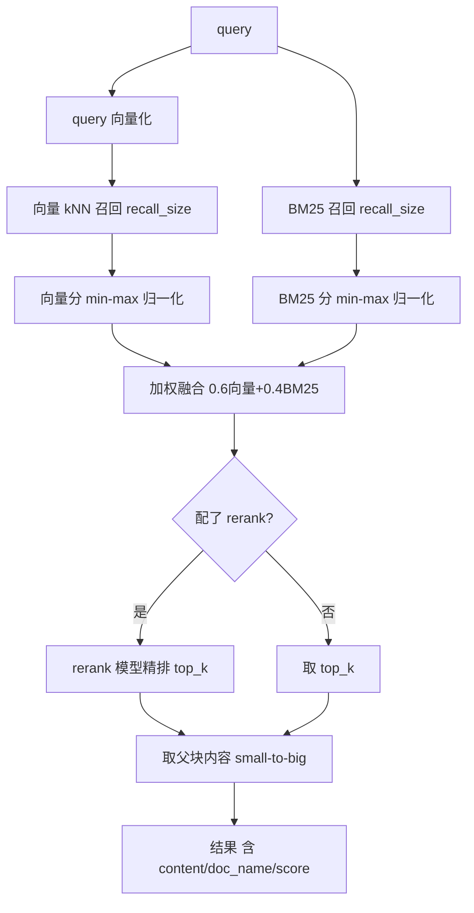

# 混合检索与 rerank — 设计与面试

> 向量召回 + BM25 召回 → 归一化加权融合 →（可选）rerank 重排 → 返回父块上下文。RAG 检索的核心。
> 对应能力域：**RAG / 向量检索**。代码：`core/rag/search.py`（`hybrid_search`）。

---

## 0. 能力定位（对应招聘要求）

- 对应 JD：**「向量检索 / 混合检索」「rerank 重排」「Elasticsearch dense_vector / kNN」「召回排序」**。
- 角色：知识库问答和全局搜索的检索引擎，决定「能不能找到对的资料喂给 LLM」。

---

## 1. 解决什么问题

- **纯向量召回**：擅长语义相似，但对精确关键词（专有名词、编号、人名）不敏感，可能漏召。
- **纯 BM25**：擅长关键词精确匹配，但不懂语义（同义不同词召不回）。
- **方案**：两路都做 + **融合**取长补短；再用 rerank 模型对融合候选**精排**提质；命中子块返回**父块**补上下文。

---

## 2. 数据流

---

## 3. 核心设计与实现（后端，`hybrid_search`）

整个检索强制带 `user_id` 过滤做多租户隔离，按 `source_type`（document/image）和 `kb_id`（多知识库范围）在召回阶段就过滤。

### 3.1 第 1 路 · 向量召回（kNN）

query 用 embedding 模型向量化，走 ES `knn` 检索 `vector` 字段（dense_vector，cosine）。`recall_size=20` 召回候选，`num_candidates=recall_size*5` 是 HNSW 近邻搜索的候选池（越大越准越慢）。filter 同样带 user_id/chunk_type/kb_id。

### 3.2 第 2 路 · BM25 召回

对 `content` 字段做 `match` 查询（content 用 IK 分词），ES 用 BM25 打分。同样 filter 隔离。

### 3.3 归一化 + 加权融合（关键）

两路分数**量纲不同**（向量是相似度、BM25 是 tf-idf 分），不能直接加。做法：
1. 各路分数 **min-max 归一化**到 [0,1]（`_normalize`：`(v-lo)/(hi-lo)`，全相等时全置 1）。
2. 加权融合：`fused = 0.6 * 向量norm + 0.4 * BM25norm`（`_VECTOR_WEIGHT`/`_BM25_WEIGHT`）。
3. 按融合分降序排，取候选。

> 面试一句话：向量分和 BM25 分量纲不同不能直接相加，先各自 min-max 归一化到 [0,1] 再加权融合（向量 0.6 + BM25 0.4），向量主导语义、BM25 补关键词精确匹配。

### 3.4 第 3 步 · 可选 rerank 精排

用户**配了 rerank 模型才走**（`get_optional_client_for_type` 返回 None 就跳过，优雅降级）。把融合后的候选块文本和 query 一起送 rerank 模型（cross-encoder，交叉编码 query+doc 算精确相关度），重排取 top_k。rerank 失败兜底回退融合排序（不中断）。
- **为什么 rerank 有用**：向量召回是 query 和 doc 各自编码后算余弦（bi-encoder，快但粗）；rerank 是 query+doc 拼一起进模型算相关度（cross-encoder，慢但准）。**召回阶段用快的 bi-encoder 粗筛、精排阶段用慢的 cross-encoder 精排**，是检索系统的标准两段式。

### 3.5 第 4 步 · 返回父块上下文（small-to-big，`_resolve_parent_content`）

命中的是子块（child），但返回给 LLM 的是它 `parent_id` 指向的**父块内容**——子块精准命中、父块补全上下文。取不到父块就用子块本身兜底。

### 3.6 全局搜索的「语义门控」分支（精确导向）

`min_vector_score` 不为 None 时（全局搜索用）切换到**纯语义余弦门控**：ES cosine knn 的 `_score = (1+cos)/2`，反推 `cos = 2*score-1`，**只保留余弦 ≥ 阈值的结果**、按余弦排序、丢弃 BM25 单字噪声。详见「全局搜索与语义门控」篇。

---

## 4. 关键设计取舍

| 决策点 | 选了什么 | 备选 | 为什么 |
|--------|---------|------|--------|
| 召回 | 向量 + BM25 双路 | 纯向量 / 纯 BM25 | 语义 + 关键词互补，召回更全 |
| 融合 | min-max 归一化 + 加权(0.6/0.4) | 直接相加 / RRF | 量纲不同必须归一化；加权简单可调（RRF 更鲁棒，可作优化） |
| rerank | 可选（配了才走）+ 失败回退 | 必选 / 不做 | rerank 提质但加延迟/成本，做成可选优雅降级 |
| 召回/精排 | bi-encoder 召回 + cross-encoder 精排 | 只召回 | 快粗筛 + 慢精排，检索标准两段式 |
| 返回内容 | 父块（small-to-big） | 返回命中子块 | 子块准、父块全，给 LLM 更完整上下文 |
| 过滤时机 | 召回阶段 filter | 召回后过滤 | 提前过滤省算力，避免跨类型/跨库互相淹没 |

---

## 5. 踩坑与解决

- **两路分数直接相加排序错乱**：量纲不同。解法：各自 min-max 归一化再加权。
- **图片描述块淹没文档块**（或反之）：解法：召回阶段按 `source_type` + `chunk_type` 过滤，分开检索。
- **没配 rerank 直接报错**：解法：`get_optional_client_for_type` 返回 None 就跳过 rerank，只做融合。
- **rerank 模型偶发失败中断检索**：解法：try/except 回退融合排序。

---

## 6. 面试问答

**Q1（核心）：什么是混合检索？为什么向量和 BM25 都要？**
向量召回懂语义（同义不同词也能召），但对精确关键词（专名/编号）不敏感；BM25 精确匹配关键词但不懂语义。两路融合取长补短，召回更全更准。

**Q2（原理）：两路分数怎么融合？**
量纲不同不能直接加。各自 min-max 归一化到 [0,1]，再加权融合（向量 0.6 + BM25 0.4），按融合分排序。

**Q3（原理）：rerank 是什么？和向量召回区别？**
向量召回是 bi-encoder：query 和 doc 各自编码算余弦，快但粗。rerank 是 cross-encoder：query+doc 拼一起进模型算相关度，慢但准。召回用快的粗筛、精排用慢的 rerank 精排，标准两段式。

**Q4（设计）：rerank 为什么做成可选？**
rerank 提升精度但增加延迟和成本。做成「用户配了 rerank 模型才走、失败回退融合排序」，优雅降级，不强依赖。

**Q5（细节）：命中后为什么返回父块而不是命中的块？**
父子分块：子块小做精准向量召回，但内容少。命中后返回它的父块（更大上下文）给 LLM，模型看得更全。small-to-big。

**Q6（进阶）：kNN 的 num_candidates 是什么？**
ES 向量检索基于 HNSW 近似最近邻。num_candidates 是每个分片探索的候选数，越大越接近精确 kNN 但越慢。本项目设 recall_size*5 平衡精度和速度。

**Q7（进阶）：RRF 了解吗？和加权融合比？**
RRF（Reciprocal Rank Fusion）按各路**排名**而非分数融合（1/(k+rank) 求和），不依赖分数量纲、更鲁棒。本项目用加权融合（简单可调），RRF 是可优化方向。

---

## 7. 相关论文 / 概念

> 检索技术的发展，本质是一条「从词面匹配 → 语义匹配 → 两者融合 + 精排」的主线。

**① 稀疏检索：TF-IDF → BM25（词面匹配时代）**
最早的全文检索靠词频统计：**TF-IDF**（词频 × 逆文档频率）——一个词在本文档出现越多、在全部文档里越少，就越能代表本文档。**BM25**（Okapi BM25，Robertson & Walker 1994 提出的概率相关性框架）是 TF-IDF 的改进，加了词频饱和（一个词出现 10 次不等于 1 次的 10 倍重要）和文档长度归一化，至今仍是 Elasticsearch 默认打分算法，工业界最稳的基线。**局限**：只认词面，「番茄」搜不到「西红柿」（同义不同词召不回）。→ 本项目的 BM25 召回路。

**② 稠密检索：词向量 → 句向量 → DPR（语义匹配时代）**
为解决同义词问题，转向**向量语义匹配**：把文本编码成向量，语义近的向量也近。脉络是 Word2Vec（2013 词向量）→ **Sentence-BERT**（Reimers & Gurevych 2019，把 BERT 改造成能产句向量的双塔结构）→ **DPR（Dense Passage Retrieval，Karpukhin et al. 2020，Facebook）**，确立了「问题和文档各自编码成向量、用近邻搜索召回」的稠密检索范式。**局限**：对精确关键词（人名、编号、专名）反而不如 BM25 敏感。→ 本项目的向量召回路。

**③ 向量检索的工程基础：ANN 与 HNSW**
向量召回不能两两算余弦（太慢），靠**近似最近邻（ANN）**。**HNSW（Hierarchical Navigable Small World，Malkov & Yashunin 2016）** 是目前最主流的 ANN 索引——用多层「小世界图」快速跳转到近邻区域，ES 的 dense_vector kNN 底层就是它。`num_candidates` 就是 HNSW 探索的候选池大小。

**④ 混合检索 + 融合：取长补短**
既然稀疏管精确、稠密管语义，自然想到两路都做再融合。融合有两种思路：**按分数**（本项目用的归一化加权，简单可调）和**按排名**——**RRF（Reciprocal Rank Fusion，Cormack et al. 2009）** 用 `1/(k+rank)` 按各路排名求和，不依赖分数量纲、更鲁棒，是业界推荐的融合法。→ 本项目用加权融合，RRF 列为可优化方向。

**⑤ 精排：Cross-encoder rerank**
召回是 **bi-encoder**（问题、文档分开编码，快但粗）；精排用 **cross-encoder**（**monoBERT，Nogueira & Cho 2019**，把问题和文档拼一起进模型算精确相关度，慢但准）。「bi-encoder 召回 + cross-encoder 精排」成为检索系统标准两段式。→ 本项目的可选 rerank。

**⑥ Small-to-Big / 父子分块**
检索粒度与上下文的权衡，LlamaIndex / LangChain 推广的检索范式：小块检索保精度、大块喂 LLM 保上下文。→ 本项目父子分块即此（见分块篇）。

**⑦ RAG 本身**
**RAG（Retrieval-Augmented Generation，Lewis et al. 2020，Facebook）**：检索外部知识拼进上下文再生成，解决 LLM 知识过时、幻觉、无法引用私有数据的问题。本项目整个知识库问答就是 RAG，混合检索是其检索环节。

---

## 8. 可优化方向

- **融合改 RRF**：按排名融合，不受分数量纲影响，更鲁棒。
- **召回数自适应**：按 query 难度动态调 recall_size。
- **rerank 缓存**：相同 query+候选缓存重排结果。
- **多路扩展**：加入标题/标签等结构化字段的 boost。
