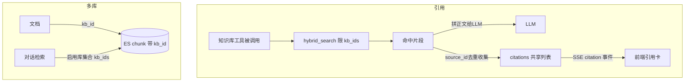

# 引用溯源与多知识库 — 设计与面试

> 回答带「来源引用」让用户可溯源核对；知识库分库管理，按库控制检索范围。
> 对应能力域：**RAG / 可信问答 / 多租户数据组织**。代码：`tools/builtin/knowledge.py`（引用收集）+ `es_index.py`（kb_id mapping + reindex 修复）+ `es_store.py`（kb_id 回写/回填）+ `document_service.py`。

---

## 0. 能力定位（对应招聘要求）

- 对应 JD：**「RAG 可溯源 / 引用」「减少幻觉」「知识库分域管理」「Elasticsearch 过滤」**。
- 角色：让知识库问答**可信**（带出处）+ **可控**（按库选范围），是 RAG 落地到产品的关键两点。

---

## 1. 解决什么问题

- **引用痛点**：LLM 基于检索内容作答，但用户不知道这话从哪来、是不是编的。要把「答案依据的来源」一并返回，可点开核对，降低幻觉信任成本。
- **多库痛点**：所有资料混一个池子，检索时无关库的内容互相干扰；不同主题（工作/学习/项目）想分开管理、对话时只查指定库。

---

## 2. 数据流

---

## 3. 核心设计与实现（后端）

### 3.1 引用收集（`knowledge.py` 知识库工具）

知识库被做成 LangChain 工具（见 Agent 篇）。工具内部调 `hybrid_search` 拿到命中片段后做两件事：
1. **拼正文给 LLM**：把命中片段的 content 拼成文本返回给模型作答。
2. **收集引用到共享列表 `citations`**：每个命中按 `source_id` 去重（同一文档多块只记一次），记录 `source_id / source_type / doc_name / score`，append 到 `ToolBuildContext.citations`。

这个 `citations` 是**贯穿整轮问答的共享列表**（构建工具时注入），Agent 编排结束后 ChatService 把它作为 SSE `citation` 事件吐给前端，前端渲染成可点的「引用卡」，还存进 assistant 消息 `meta_data`。
> 面试一句话：引用不是让 LLM 自己写（会编），而是检索工具命中时把真实来源按 source_id 去重收集到一个贯穿本轮的共享列表，回答末尾随 SSE 事件单独吐给前端，保证引用真实可溯源。

### 3.2 多知识库：kb_id 过滤（`es_index.py` + `search.py`）

- ES chunk 文档加 `kb_id`（keyword 类型）字段，标识所属库。
- `hybrid_search(kb_ids=[...])`：召回阶段 `base_filter` 加 `{"terms": {"kb_id": kb_ids}}`，**只检索指定库集合**。
- 对话时取用户**「已启用检索」（chat_enabled）的库集合**传入；传 `[]`（空列表）表示没有任何启用库 → 直接返回空不检索（区别于 `None` 不限库）。
- 文档归属：上传时 `_resolve_kb_id` 指定库则校验归属、没指定落默认库（`ensure_default` get-or-create）。
- 移库：`move_to_kb` 改 PG 的 doc.kb_id + `update_kb_by_source` 同步回写该来源所有 ES chunk 的 kb_id。

### 3.3 踩坑硬核：kb_id 被动态映射成 text（`ensure_index` 自愈）

多知识库是后加的功能。**老索引在没有 kb_id 字段时，ES 动态映射会把首次写入的 kb_id 推断成 `text` 类型**（带分词），而 `terms` 过滤要求 `keyword`，导致**多库过滤直接失效**。ES **不允许原地修改字段类型**。解法（`ensure_index` 启动自检）：
- 不存在 → 按正确 mapping 建。
- 存在但 kb_id 缺失 → `put_mapping` 增量补字段。
- **存在但 kb_id 类型错（text）→ 自动 reindex 重建**：建临时索引（正确 mapping）→ reindex 原→临时 → 删原、按正确 mapping 重建 → reindex 临时→原 → 删临时。整个过程幂等，数据量小可接受。
- 存量数据用 `backfill_kb_id` 把缺 kb_id 的 chunk 回填到默认库。

> 面试一句话：多库过滤要求 kb_id 是 keyword，但老索引动态映射把它推断成了 text，ES 又不能原地改类型，所以做了启动自检——检测到类型不对就用临时索引中转 reindex 重建，幂等可重跑。

---

## 4. 关键设计取舍

| 决策点 | 选了什么 | 备选 | 为什么 |
|--------|---------|------|--------|
| 引用来源 | 检索命中时收集真实来源 | 让 LLM 自己标引用 | LLM 标引用会编造，检索收集才真实可溯源 |
| 引用传递 | 共享 citations 列表 + SSE 单独事件 | 混在正文里 | 结构化传递，前端独立渲染引用卡 |
| 多库过滤 | ES kb_id keyword + terms 过滤 | 多索引 / 应用层过滤 | 单索引召回阶段过滤，简单高效 |
| 无启用库 | 空列表→返回空 / None→不限 | 都当不限 | 区分「没启用库」和「不限库」语义 |
| 类型错修复 | 启动自检 + reindex 自愈 | 手动重建 / 文档说明 | 自动幂等修复，用户无感 |
| 移库同步 | PG 改 + ES update_by_query | 只改 PG | 不同步 ES 则检索范围错乱 |

---

## 5. 踩坑与解决

- **kb_id 被映射成 text 致多库过滤失效**：解法：`ensure_index` 启动自检 + reindex 自愈（见 3.3）。
- **存量 chunk 没有 kb_id**：解法：`backfill_kb_id` 回填默认库。
- **移库后检索范围不对**：解法：`update_kb_by_source` 同步回写 ES chunk kb_id。
- **同一文档多块重复引用**：解法：按 source_id 去重收集。

---

## 6. 面试问答

**Q1（核心）：引用怎么实现的？为什么不让 LLM 自己标？**
检索工具命中片段时，把真实来源（source_id/doc_name/score）按 source_id 去重收集到贯穿本轮的共享列表，回答末尾随 SSE 事件单独吐给前端渲染引用卡。不让 LLM 自己标是因为它会编造来源，检索收集才真实可溯源。

**Q2（设计）：多知识库怎么做范围过滤？**
ES chunk 加 kb_id（keyword），检索时 terms 过滤指定库集合。对话取用户启用检索的库集合传入；空列表表示无启用库直接返回空，None 表示不限库。

**Q3（硬核）：kb_id 字段遇到过什么坑？**
多库是后加功能，老索引动态映射把首次写入的 kb_id 推断成了 text，而 terms 过滤要 keyword，导致过滤失效；ES 又不能原地改字段类型。解法是启动自检，检测到类型不对就临时索引中转 reindex 重建，幂等可重跑，并回填存量数据。

**Q4（细节）：移动文档到另一个库要做什么？**
改 PG 的 doc.kb_id，同时 update_by_query 把该来源所有 ES chunk 的 kb_id 同步改掉，否则检索范围会错乱。两边一致。

**Q5（进阶）：引用的 score 是什么？可信吗？**
是混合检索的融合分（或全局搜索的余弦）。它反映相关度排序，不直接等于「答案正确性」，给用户参考哪些来源更相关。要更严谨可加「答案-来源」的 grounding 校验。

---

## 7. 相关论文 / 概念

**① RAG 与可溯源生成（Grounded / Attributed Generation）**
RAG（Lewis et al. 2020）让模型基于检索内容作答。但「基于检索」不等于「忠于检索」——模型仍可能编造。**Attribution / Grounding** 研究的就是「让生成内容可归因到具体来源、并验证是否真有来源支撑」。本项目的引用机制是 attribution 的工程落地：**引用不让 LLM 自己标（会编），而是检索时收集真实命中来源**，这从源头保证引用真实。学术上更进一步有「句级归因」「答案-来源蕴含校验」，本项目列为可优化方向。

**② 幻觉（Hallucination）与缓解**
LLM 幻觉指「自信地编造不存在的事实」。缓解手段里，RAG（给真实资料）+ 引用（让用户能核对）是工程上最有效的组合——不消除幻觉，但让幻觉「可被发现」。带出处的回答把「信不信」的判断权交还用户。

**③ 多租户数据隔离（Multi-tenancy）**
SaaS 经典模式。数据隔离有「独立数据库 / 独立 schema / 共享表带租户字段」三档。本项目用最轻的「共享索引 + user_id 过滤」（个人数据量小），知识库再叠加 kb_id 做库级范围。

**④ Elasticsearch 动态映射与 Mapping 不可变**
ES 的**动态映射（Dynamic Mapping）** 会按首次写入的值自动推断字段类型——方便但有坑：本项目 kb_id 就因此被推成 text。而 ES **mapping 一旦建立不可原地改字段类型**（倒排/doc_values 结构已定），只能 **reindex** 重建。这是 ES 使用的重要知识点，本项目的启动自检自愈正是应对它。

> 一句话脉络：RAG 解决「让模型用外部知识」，但要可信还需 attribution（引用可溯源）——本项目用「检索时收集真实来源」而非让 LLM 自标来落地；多库靠 ES kb_id 过滤，并处理了 ES 动态映射推错类型 + mapping 不可变的工程坑。

---

## 8. 可优化方向

- **句级引用**：标到答案的哪句话对应哪个来源（更细粒度 attribution）。
- **答案-来源 grounding 校验**：用模型校验答案是否真有来源支撑，过滤幻觉。
- **引用置信度**：结合 rerank 分给引用打可信度。
