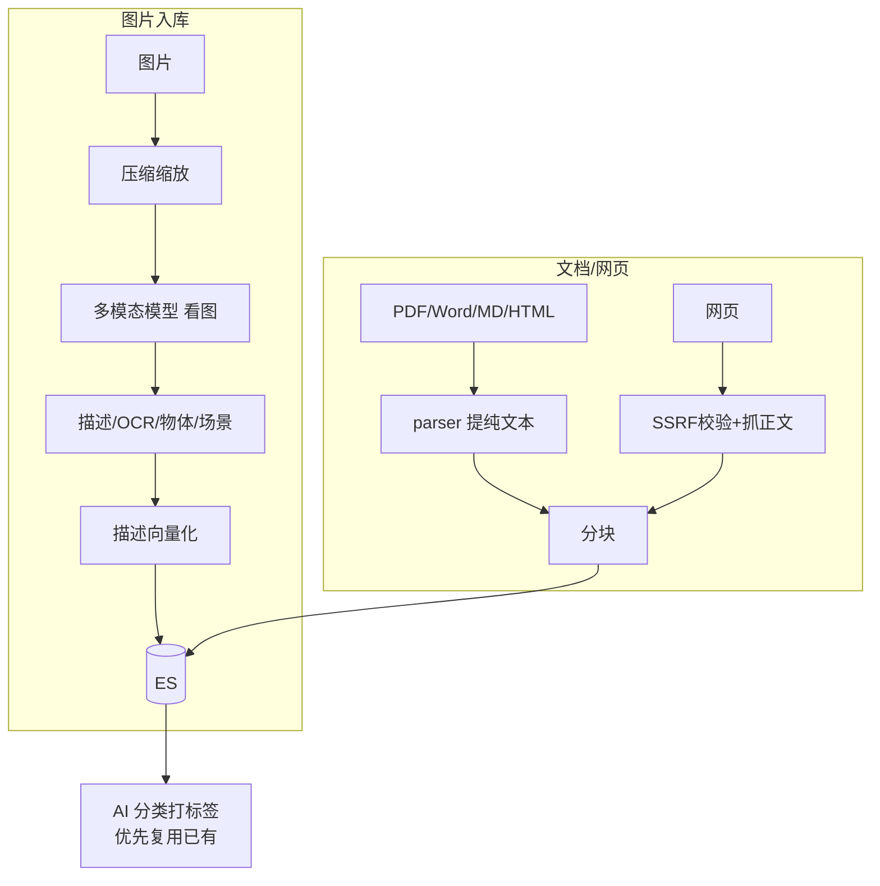

# 多模态识别 · AI 打标签 · 网页抓取 · 文档预览 — 设计与面试

> 知识库入库的「多源处理」：图片多模态理解、AI 自动分类标签、网页正文抓取、文档原文预览。
> 对应能力域：**RAG / 多模态 / 数据接入**。代码：`core/rag/image_describe.py`、`classifier.py`、`web_crawler.py`、`parser.py` + `services/document_service.py`（preview）。

---

## 0. 能力定位（对应招聘要求）

- 对应 JD：**「多模态理解」「文档解析」「数据清洗 / 接入」「LLM 信息抽取」**。
- 角色：让知识库不止能存文本，还能把图片、网页、各类文档都转成可检索内容。

---

## 1. 解决什么问题

- 知识库要支持**多种来源**：PDF/Word/MD/TXT/HTML 文档、图片、网页链接，都要变成可向量化、可检索的文本。
- 图片不是文本，怎么进知识库？→ 多模态模型「看图说话」+ OCR，把图变成描述文本。
- 资料太多怎么组织？→ AI 自动打主题标签。
- 想直接看某文档原文？→ 文档预览。

---

## 2. 数据流

---

## 3. 核心设计与实现（后端）

### 3.1 图片多模态理解（`image_describe.describe_image`）

图片无法直接向量化检索，要先「翻译」成文本：
1. **压缩**（`compress_for_vision`）：大图先缩放 + 重编码，避免 base64 过大触发多模态接口 400/超限。
2. **看图**：转 base64 拼 data URL，调多模态模型（`LLMClient.vision`），用一个**结构化 prompt** 要求输出 JSON：`description`（详细描述，供检索）/`ocr_text`（图中文字）/`objects`（主要物体）/`scene`（场景类别）。
3. **健壮解析**（`_parse`）：走 `json_repair` 容错（代码块包裹、裸换行、截断），解析不出就把整段当 description 兜底，绝不把原始 JSON 抛给用户。
4. 把 description 向量化写 ES（chunk_type=image_desc），实现「**以文搜图**」——搜文字命中图片描述。

> 面试一句话：图片进知识库的关键是用多模态模型把图「翻译」成结构化文本（描述+OCR+物体+场景），再把描述向量化，从而能用文字语义检索到图片。

### 3.2 AI 自动分类打标签（`classifier.classify_content`）

入库后让 LLM 给内容打 1~2 个**宽泛主题标签**。核心设计是**防标签膨胀**：
- prompt 把**用户已有标签列表**喂进去，要求「**优先复用，只有都不合适才造新的**」，禁止造近义词/同义词。
- 限定标签是宽泛大类（技术/学习/工作…）不是细分关键词，每个 2~6 字、最多 2 个。
- 失败返回空列表不阻断主流程。

> 不做这个约束，AI 会给每篇文档造一堆近义标签（「技术」「技术文章」「编程技术」），标签体系很快失控。喂已有标签让它复用是关键。

### 3.3 网页正文抓取 + SSRF 防护（`web_crawler.fetch_url_content`）

- **SSRF 防护**（`_is_safe_url`）：解析 URL 的所有 IP，任一落在 private/loopback/link-local/reserved/multicast 就拒绝——防止用户用「导入网页」功能让服务器去访问**内网地址**（探测内网服务、读云元数据）。这是用户可控 URL 必做的安全防护。
- **抓取**：用接近真实浏览器的 User-Agent + Accept 头（降低被 Cloudflare 521/403 反爬拦截），瞬时错误重试 1 次。
- **提正文**：`trafilatura.extract` 抽正文（去导航/广告，保表格），提元数据拿标题。

### 3.4 文档解析（`parser.parse_document`）

按扩展名分流：PDF 用 PyMuPDF(fitz)、Word 用 python-docx、MD 用 markdown→BeautifulSoup 去标签、HTML 用 BeautifulSoup（去 script/style）、TXT 用 `chardet` 检测编码解码。统一提纯文本。`decode_text` 对外暴露保留原始文本（不转纯文本），供预览。

### 3.5 文档预览（`document_service.preview`）

让用户直接看文档原文：从对象存储取原始文件 →
- **md/txt 保留原文**（markdown 交前端渲染、txt 原样）；
- **pdf/docx/html 用 parse_document 提纯文本**；
- 超 `PREVIEW_MAX_CHARS=80000` 字截断带 `truncated` 标记；
- 返回 `is_markdown` 标记让前端选渲染方式，网页源附原链接。

---

## 4. 关键设计取舍

| 决策点 | 选了什么 | 备选 | 为什么 |
|--------|---------|------|--------|
| 图片检索 | 多模态转描述文本再向量化 | 图像 embedding 直接检索 | 复用文本检索链路，「以文搜图」够用且简单 |
| 图片 prompt | 结构化 JSON(描述/OCR/物体/场景) | 只要一段描述 | 多字段利于多角度检索和展示 |
| 大图处理 | 先压缩再 base64 | 原图直传 | 防 base64 过大触发接口超限 |
| 标签策略 | 喂已有标签优先复用 | 自由生成 | 防近义词膨胀，标签体系可控 |
| 文档解析 | PyMuPDF 等通用库 | 版面识别(DeepDOC) | 通用库把文本抽全够用，不过度工程 |
| 网页导入 | SSRF 校验所有解析 IP | 不校验 | 用户可控 URL 必防内网探测 |
| 预览 md | 保留原文前端渲染 | 提纯文本 | markdown 渲染体验好 |

---

## 5. 踩坑与解决

- **大图多模态接口 400/超限**：base64 太大。解法：`compress_for_vision` 先压缩缩放。
- **多模态返回非标准 JSON**：解法：json_repair 容错 + 解析失败整段当描述兜底。
- **标签近义词爆炸**：解法：prompt 喂已有标签强制优先复用。
- **网页被反爬 521/403**：解法：真实浏览器请求头 + 重试。
- **网页导入可被用来探测内网**：解法：SSRF 校验解析出的所有 IP。
- **TXT 中文乱码**：解法：chardet 检测编码再解码，失败回退 utf-8 ignore。

---

## 6. 面试问答

**Q1（核心）：图片怎么进知识库被检索？**
图片不能直接向量化检索，先用多模态模型「看图说话」生成结构化文本（描述+OCR+物体+场景），把描述向量化写 ES。检索时用文字语义匹配图片描述，实现「以文搜图」。

**Q2（设计）：AI 打标签怎么防止标签泛滥？**
prompt 把用户已有标签喂进去，要求优先复用、只有都不合适才造新的、禁造近义词，且限定宽泛大类、最多 2 个。不这么做 AI 会造一堆近义标签让体系失控。

**Q3（安全）：网页导入怎么防 SSRF？**
解析 URL 的所有 IP，任一落在内网/回环/保留段就拒绝，防止用户让服务器去访问内网地址探测服务或读云元数据。用户可控 URL 必做。

**Q4（工程）：各类文档怎么解析的？为什么不做版面识别？**
PDF 用 PyMuPDF、Word 用 python-docx、MD/HTML 用 BeautifulSoup、TXT 用 chardet 检测编码。不做 DeepDOC 版面识别是因为通用库把文本抽全已够用，版面识别是过度工程，按需裁剪用成熟替代。

**Q5（细节）：多模态调用为什么先压缩图片？**
多模态接口对 base64 大小有限制，大图直传会 400/超限。先缩放重编码压到合理大小再转 base64。

**Q6（进阶）：以文搜图 vs 图像 embedding 检索？**
以文搜图是把图转描述文本再用文本检索，复用现有链路、简单，但受描述质量限制。图像 embedding（CLIP 类）直接对图编码、支持以图搜图，更强但要额外模型和索引。本项目个人场景以文搜图够用。

---

## 7. 相关论文 / 概念

**① 多模态大模型（VLM）的发展**
让模型同时理解图和文，脉络：**CLIP（Radford et al. 2021，OpenAI）** 用对比学习把图和文映射到同一向量空间，开启图文对齐时代 → **BLIP / LLaVA / Qwen-VL** 等把视觉编码器接到 LLM 上，让模型能「看图对话」→ GPT-4V/4o、Qwen-VL 等成熟可用。本项目用这类 VLM 的「看图说话」能力，把图片转成描述文本。

**② 以文搜图 vs 图像 embedding 检索（两条路线）**
- **以文搜图（本项目）**：用 VLM 把图转成文字描述，再用文本检索链路。优点：复用现有 RAG、简单；缺点：受描述质量限制。
- **图像 embedding 检索（CLIP 路线）**：直接把图编码成向量建索引，支持「以图搜图」「图文跨模态检索」。更强但要额外模型和向量索引。本项目个人场景选了前者，后者列为可优化方向。

**③ OCR**
图中文字识别。早期是专门的 OCR 引擎（Tesseract 等），现在多模态模型可一并输出文字。本项目让 VLM 在描述图片时顺带输出 ocr_text。

**④ SSRF（Server-Side Request Forgery，服务端请求伪造）**
OWASP 重点关注的 Web 安全漏洞：攻击者诱导服务器去请求**攻击者指定的地址**，常用于探测内网服务、读取云厂商元数据接口（如 169.254.169.254 拿临时凭证）。**凡是「用户能控制服务器去访问哪个 URL」的功能**（网页导入、webhook、图片 URL 拉取）都必须防 SSRF——解析目标 IP，落在内网/回环/保留段就拒绝。本项目网页导入和 MCP 接入都做了。

**⑤ 文档解析与版面理解**
从「纯文本提取」（PyMuPDF/python-docx，本项目用）到「版面理解」（识别标题/表格/图表的结构，如 DeepDOC、LayoutLM 系列）。后者更强但重，本项目按需选了通用文本提取。

> 一句话脉络：多模态从 CLIP（图文对齐）到 VLM（看图对话）；图片入知识库有「以文搜图」（转描述，本项目）和「图像 embedding」（CLIP，以图搜图）两条路；用户可控 URL 必防 SSRF。

---

## 8. 可优化方向

- **图像 embedding（CLIP）**：支持以图搜图。
- **版面感知解析**：表格/公式/图表结构化提取。
- **网页抓取渲染**：JS 渲染页用无头浏览器抓取。
- **标签层级化**：大类 + 子标签两级，兼顾收敛和细分。
