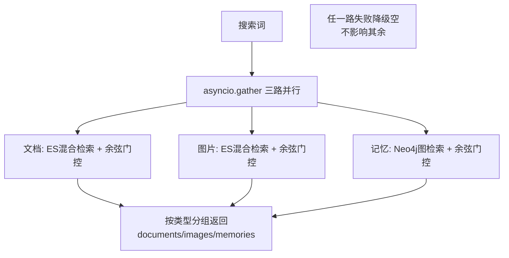

# 全局搜索与语义门控 — 设计与面试

> 一个搜索框搜遍文档/图片/记忆三类，三路并行；用「语义余弦门控」只展示真正相关的结果。
> 对应能力域：**RAG / 检索质量**。代码：`services/search_service.py` + `core/rag/search.py`（门控分支）。

---

## 0. 能力定位（对应招聘要求）

- 对应 JD：**「多源检索 / 联合检索」「检索质量与相关度控制」「异步并发」**。
- 角色：全站统一搜索入口，体现「检索不只要召回，还要控相关度」的工程判断。

---

## 1. 解决什么问题

- **痛点 1**：用户想一次搜遍所有资料（文档 + 图片 + 记忆），不想分三个地方搜。
- **痛点 2（核心）**：**向量 kNN 永远返回 top-k 最近邻**——哪怕库里没有相关内容，也会返回「最不远」的几个。搜「小狗」可能返回一篇不相关的「案例分析.pdf」。全局搜索是「精确导向」（找到就给、找不到就空），不能像问答那样「召回导向」（宁多勿漏）。

---

## 2. 数据流

---

## 3. 核心设计与实现（后端）

### 3.1 三路并行（`SearchService.search_all`）

用 `asyncio.gather` 同时跑三路检索：
- **文档**：`hybrid_search(source_type="document")`；
- **图片**：`hybrid_search(source_type="image")`；
- **记忆**：Neo4j 图谱混合检索 `search_memory`。

**任一路失败不影响其余**（每路 try/except 降级返回空），结果按类型分组 `{documents, images, memories}`。三路并行而非串行，是为了把总延迟压到「最慢一路」而非「三路之和」。

### 3.2 语义余弦门控（核心，`search.py` 的 `min_vector_score` 分支）

全局搜索给 `hybrid_search` 传 `min_vector_score`（来自配置 `global_search_min_vector_score=0.45`），触发**精确导向分支**，逻辑和问答的「召回导向」完全不同：
1. ES 的 cosine kNN 返回的 `_score = (1 + cos) / 2`，**反推真实余弦** `cos = 2*score - 1`。
2. **只保留余弦 ≥ 阈值的结果**（`kept`），其余（包括 BM25 单字弱命中的噪声）全部丢弃。
3. 没有任何达标的 → **直接返回空**（这正是要的：没有相关内容就不展示，而不是硬塞最近邻）。
4. 达标的按余弦降序，分数显示真实余弦。

> 面试一句话：向量 kNN 永远返回 top-k 最近邻，全局搜索如果照搬问答的召回逻辑，就算没相关内容也会塞几个不相关的；所以全局搜索切到「纯语义余弦门控」——把 ES 的 cosine score 反推成真实余弦，只展示余弦≥阈值的，没有达标的就返回空。

### 3.3 为什么问答和全局搜索用不同策略

- **问答（RAG）= 召回导向**：宁可多召回点喂给 LLM，让模型判断有没有用，漏召比误召更糟（融合 + rerank，不门控）。
- **全局搜索 = 精确导向**：直接展示给用户看，误召（展示一堆不相关）体验很差，宁缺勿滥（余弦门控）。

同一个 `hybrid_search` 函数，靠 `min_vector_score` 参数切换两种模式——**检索策略要匹配使用场景**，这是这块的核心判断。

### 3.4 记忆侧同理

`search_memory` 也支持 `min_vector_score`（`memory_search_min_vector_score=0.45`），Neo4j 向量索引本身就是 cosine，直接按余弦门控。

---

## 4. 关键设计取舍

| 决策点 | 选了什么 | 备选 | 为什么 |
|--------|---------|------|--------|
| 三路检索 | asyncio.gather 并行 | 串行 | 总延迟=最慢一路，不是三路之和 |
| 失败处理 | 每路独立降级空 | 一路失败全失败 | 一路挂不影响其余结果展示 |
| 全局搜索相关度 | 纯语义余弦门控 | 沿用问答融合排序 | kNN 永远返 top-k，不门控会塞不相关结果 |
| 门控阈值 | 配置化 0.45 | 写死 | 按实测可调，偏高更精准偏低召回多 |
| 问答 vs 搜索 | 召回导向 vs 精确导向 | 统一一套 | 使用场景不同，检索策略要匹配 |

---

## 5. 踩坑与解决

- **搜「小狗」出不相关的 PDF**：向量 kNN 永远返 top-k 最近邻。解法：余弦门控只展示达标的。
- **min-max 归一化抹掉绝对相关度**：归一化后最不相关的也会被拉到 1.0。解法：门控用**反推的真实余弦绝对值**，不用归一化分。
- **IK 单字弱命中混入**：BM25 把「小狗」拆字弱命中无关文档。解法：门控分支只认向量余弦，BM25 噪声不达标即丢。
- **一路检索挂导致整体失败**：解法：每路 try/except 降级空。

---

## 6. 面试问答

**Q1（核心）：全局搜索为什么要「门控」？和问答检索有什么不同？**
向量 kNN 永远返回 top-k 最近邻，没相关内容也会塞几个最不远的。问答是召回导向（多召给 LLM 判断），全局搜索是精确导向（直接给用户看，误召体验差）。所以全局搜索切到纯语义余弦门控，只展示余弦≥阈值的，没达标就返回空。

**Q2（原理）：怎么从 ES 分数算真实余弦？**
ES cosine kNN 的 _score = (1+cos)/2，反推 cos = 2*score-1。用这个真实余弦绝对值做阈值过滤，而不是 min-max 归一化分（归一化会把最不相关的也拉到 1.0，丢失绝对相关度）。

**Q3（工程）：三路检索怎么组织？**
asyncio.gather 并行跑文档/图片/记忆三路，总延迟是最慢一路而非三路之和；每路独立 try/except，一路失败降级空不影响其余，结果按类型分组返回。

**Q4（设计）：同一个 hybrid_search 怎么支持两种模式？**
靠 min_vector_score 参数：None 走召回导向（融合+rerank），不为 None 走精确导向（余弦门控）。检索策略匹配使用场景，复用同一函数。

**Q5（进阶）：阈值 0.45 怎么定的？**
按实测调：偏高更精准但可能漏，偏低召回多但有噪声。做成配置项 global_search_min_vector_score，按真实数据反馈调整。

---

## 7. 相关论文 / 概念

**① 召回率 vs 精确率（Recall vs Precision）**
信息检索最基础的权衡：**召回率**=该找到的找回了多少（怕漏），**精确率**=找回的里有多少是对的（怕错）。两者通常此消彼长。**不同场景偏好不同**——这是本篇的核心：RAG 问答偏召回（多召给 LLM 判断，漏召更糟），全局搜索偏精确（直接给用户看，误召体验差）。同一套检索按场景调到不同的召回/精确平衡点。

**② kNN / ANN 的「永远返回 top-k」特性**
向量最近邻检索（kNN/ANN）的本质是「返回最近的 k 个」——**它没有「绝对不相关就不返回」的概念**，库里再不相关也会返回「最不远」的 k 个。这是全局搜索必须加门控的根因：不设阈值，搜什么都有结果，且可能全是噪声。

**③ 相似度度量与归一化陷阱**
余弦相似度衡量向量方向接近程度（[-1,1]）。本篇一个关键工程点：**min-max 归一化会抹掉绝对相关度**——把一批分数线性拉到 [0,1]，那批里最不相关的也会被拉到接近 1。所以门控不能用归一化分，要用**反推的真实余弦绝对值**（从 ES 的 cosine score `(1+cos)/2` 反推 cos）做阈值。

**④ 并发 I/O 模型**
多路检索是典型 I/O 密集任务（等 ES/Neo4j 响应）。用 `asyncio.gather` 并发，总耗时取决于最慢一路而非各路之和——这是异步编程相对同步串行的核心收益。每路独立异常隔离则是「部分失败不拖垮整体」的可用性设计。

> 一句话脉络：检索的召回/精确权衡要匹配场景（问答偏召回、搜索偏精确）；向量 kNN「永远返 top-k」导致搜索必须加余弦门控；且门控要用真实余弦而非归一化分（归一化会丢绝对相关度）。

---

## 8. 可优化方向

- **阈值自适应**：按 query 长度/类型动态调门控阈值。
- **统一相关度尺度**：跨三路（ES 文档/图片、Neo4j 记忆）用统一可比的相关度。
- **搜索建议/纠错**：无结果时给查询改写建议。
