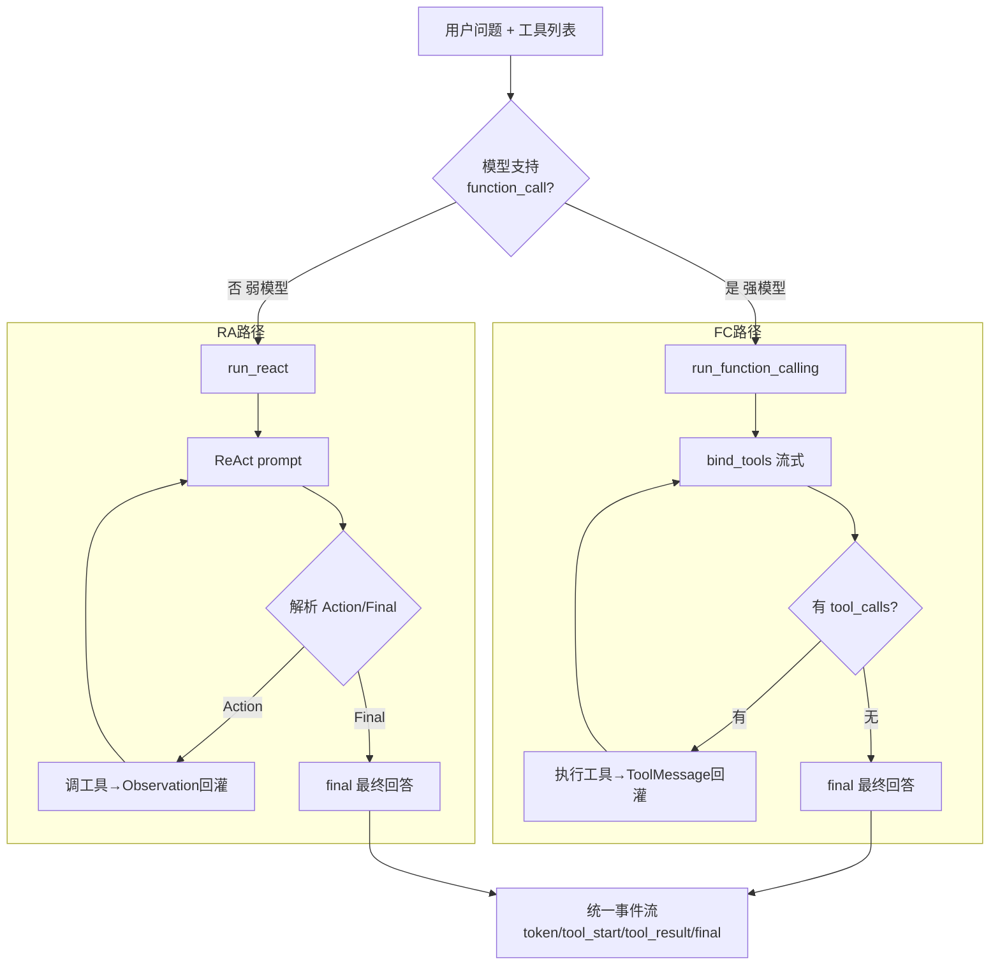

# Function Calling 与 ReAct 双路径编排 — 设计与面试

> Agent 的心脏：把检索能力做成工具，让 LLM 自主决定调哪个、调几次。强模型走原生 function calling，弱模型走 ReAct prompt 模拟降级。
> 对应能力域：**Agent 核心**。代码：`core/agent/orchestrator.py`（`run_function_calling` / `run_react`）。

---

## 0. 能力定位（对应招聘要求）

- 对应 JD：**「Agent / 工具编排」「Function Calling」「ReAct」「LangChain」「多步推理 / 工具循环」**。
- 角色：智能问答的中枢——决定「这个问题要不要查知识库/记忆/联网、怎么把工具结果组织成回答」，是整个项目最核心的 Agent 能力。

---

## 1. 解决什么问题

- **痛点**：用户问题千差万别——闲聊不用查、问个人资料要查知识库、问"我之前说过啥"要查记忆、问实时信息要联网。不能写死 if-else，要让 **LLM 自主判断调用哪个工具、调几次、怎么综合**。
- **再痛**：强模型支持原生 function calling，但用户可能配的是不支持的弱模型，调用方式不同。
- **方案**：**方案 B 双路径**——把知识库/记忆/联网做成工具，强模型走原生 function calling 工具循环，弱模型走 prompt 模拟的 ReAct 手动解析，两条路径产出**统一事件流**，上层无感知。

---

## 2. 架构 / 数据流

---

## 3. 核心设计与实现（后端）

### 3.1 统一事件流（两路径的契约）

无论走哪条路径，都产出同一套事件 dict，让 ChatService 和前端无需关心底层：
- `token`：流式文本片段；
- `tool_start`：开始调某工具（`tool` + `query`）；
- `tool_result`：工具执行结果（`status`/`text`预览/`stats`统计/`latency_ms`/`cached`）；
- `final`：最终回答。

引用由工具执行时写入外部传入的 `citations` 列表（见引用篇），编排结束后调用方读取。工具统计写入 `stats_holder`，编排器产 `tool_result` 时读出附在事件上（前端 chip 副文动态绑定）。

### 3.2 强模型路径：原生 Function Calling（`run_function_calling`）

核心是「**流式工具循环**」，最多 `MAX_TOOL_ITERATIONS=5` 轮：
1. `model.bind_tools(tools)` 把工具的 JSON schema 绑给模型；
2. `astream` 流式拿模型输出，**边产 token 边累积 chunk**（`gathered = chunk if None else gathered + chunk` 合并流式块）；
3. 流结束后看 `gathered.tool_calls`：
   - **没有工具调用** → 这就是最终回答，产 `final` 返回；
   - **有工具调用** → 把模型消息 append 进 messages，逐个执行工具，结果包成 `ToolMessage` **回灌** messages，继续下一轮循环（让模型看到工具结果后接着想/再调工具/给答案）。
4. 5 轮还不收敛 → 用现有内容兜底 final。

> 面试一句话：function calling 是个工具循环——bind_tools 让模型自己决定调哪个工具，执行后把结果作为 ToolMessage 回灌再让模型继续，直到它不再调工具给出最终回答，最多 5 轮防死循环。

**同轮工具缓存**：`call_cache` 按「工具名 + 参数」缓存结果，模型用相同参数重复调同一工具时直接复用，跳过握手和执行（消除浪费，尤其 MCP 工具）。

### 3.3 弱模型路径：ReAct prompt 模拟（`run_react`）

弱模型不支持原生 function calling，用 prompt 教它按 **ReAct 格式**（Reasoning + Acting）输出，手动解析：
1. `react.jinja2` 把工具列表 + 格式说明渲染成 system prompt，要求模型按 `Thought / Action / Action Input` 或 `Final Answer` 格式输出。
2. 每轮 `ainvoke` 拿模型文本，**正则解析**：
   - 匹配到 `Final Answer:` → 产 final 返回；
   - 匹配到 `Action:` + `Action Input:` → 取工具名和查询词，调对应工具；
   - 都没匹配到 → 整段当回答兜底。
3. 把模型这轮输出（AIMessage）+ `Observation: 工具结果`（HumanMessage）**回灌** convo，继续循环。同样 5 轮上限 + 同轮缓存。

> 面试一句话：弱模型走 ReAct——用 prompt 让它按「Thought→Action→Action Input」格式输出，我正则解析出工具名和参数手动调用，把结果作为 Observation 拼回去让它继续推理，直到输出 Final Answer。本质是用 prompt 模拟 function calling。

### 3.4 工具返回值的格式化（`_format_observation`，易踩坑）

工具返回值五花八门——内置工具返回字符串，**MCP 工具常返回 `[{'type':'text','text':'...'}]`** 这种结构（甚至是它的字符串字面量形式）。`_format_observation` 统一处理：列表逐项抽 `text` 字段拼接、dict 优先取 text 否则 JSON 美化、字符串若是 Python 字面量则 `literal_eval` 后递归格式化、对象取 `text` 属性。目的是给 LLM 和前端**干净可读的文本**，而不是一坨 Python 字面量噪声。

### 3.5 路径选择（在 ChatService）

`supports_function_call(config)` 判断模型 capability 有没有 `function_call`，决定走哪条。无工具时直接纯流式（不进编排）。

---

## 4. 关键设计取舍

| 决策点 | 选了什么 | 备选 | 为什么 |
|--------|---------|------|--------|
| 工具调用 | function calling + ReAct 双路径 | 只支持强模型 | 兼容用户配的弱模型，降级可用 |
| 检索即工具 | 知识库/记忆/联网做成工具 | 写死检索流程 | LLM 自主判断调哪个，灵活、可扩展 MCP |
| 路径契约 | 统一事件流 | 各路径各返各的 | 上层和前端无需关心底层路径 |
| 循环上限 | 5 轮 | 不限 | 防工具死循环/刷 token |
| 同轮重复调用 | call_cache 复用 | 每次都执行 | 模型重复调同一工具时省握手和执行 |
| 工具结果格式化 | 统一 _format_observation | 直接 str() | MCP 返回结构化，str 出来是噪声 |

---

## 5. 踩坑与解决

- **MCP 工具结果是一坨 `[{'type':'text'...}]` 字面量**：解法：`_format_observation` 抽 text 字段、literal_eval 递归格式化。
- **模型用相同参数重复调同一工具刷延迟**：解法：同轮 call_cache 按「工具名+参数」复用。
- **流式下 tool_calls 拿不全**：解法：`gathered = gathered + chunk` 合并所有流式块再读 tool_calls。
- **弱模型 ReAct 不按格式输出**：解法：正则解析失败时整段当回答兜底，不卡死。
- **工具执行抛异常中断编排**：解法：try/except 把异常转成"工具执行失败：xxx"喂回模型，让它继续。

---

## 6. 面试问答

**Q1（核心）：你的 Agent 怎么编排工具的？**
方案 B 双路径：把知识库/记忆/联网做成 LangChain 工具，强模型走原生 function calling 工具循环、弱模型走 prompt 模拟的 ReAct 手动解析，两条路径产出统一事件流。LLM 自主决定调哪个工具、调几次。

**Q2（原理）：Function Calling 工具循环怎么跑的？**
bind_tools 把工具 schema 绑给模型，astream 流式输出；流结束看有没有 tool_calls，没有就是最终回答，有就执行工具、把结果包成 ToolMessage 回灌 messages 继续下一轮，直到模型不再调工具，最多 5 轮防死循环。

**Q3（原理）：ReAct 是什么？怎么模拟？**
ReAct = Reasoning + Acting，让模型交替「思考-行动」。弱模型不支持原生 function calling，就用 prompt 教它按 Thought/Action/Action Input 格式输出，正则解析出工具名和参数手动调，把结果作为 Observation 拼回去继续，直到 Final Answer。

**Q4（对比）：function calling 和 ReAct 哪个好？为什么都做？**
function calling 是模型原生能力、结构化可靠、不用解析文本，强模型首选；ReAct 靠 prompt + 文本解析，兼容任何模型但脆（格式不稳要兜底）。都做是为了兼容用户配的不同档位模型，强模型走好的、弱模型有降级。

**Q5（工程）：怎么防止工具循环死循环或刷 token？**
设 MAX_TOOL_ITERATIONS=5 上限，到顶用现有内容兜底；同轮 call_cache 缓存「工具名+参数」相同的调用避免重复执行。

**Q6（细节）：工具返回值怎么处理的？**
统一 _format_observation：MCP 常返回 [{'type':'text','text':...}] 结构，抽 text 拼接；dict/list JSON 美化；字符串若是 Python 字面量 literal_eval 递归处理。给 LLM 和前端干净文本而非字面量噪声。

**Q7（进阶）：流式输出时怎么拿到 tool_calls？**
流式下工具调用信息分散在多个 chunk，要 `gathered = gathered + chunk` 把所有流式块合并成完整消息，再从合并结果读 tool_calls。

---

## 7. 相关论文 / 概念

> Agent 的核心是「让 LLM 会用工具、会多步推理」。这条线从「让模型先想再答」开始。

**① CoT：让模型先推理（Chain-of-Thought，Wei et al. 2022，Google）**
发现让模型「一步步思考」再给答案，复杂推理准确率大幅提升。这是 Agent 的思想起点——模型不是一步出答案，而是能分步推理。

**② ReAct：推理 + 行动交替（Yao et al. 2022，*ReAct: Synergizing Reasoning and Acting*）**
在 CoT 的「只推理」之上加了「行动」：让模型按 `Thought（想）→ Action（调工具）→ Observation（看结果）` 循环，边推理边调用外部工具，再根据工具结果继续推理。这让 LLM 能查实时信息、调 API，突破了「只能用训练知识」的局限。**本项目弱模型路径**就是用 prompt 教模型按这个格式输出、手动解析 Action 调工具。

**③ Toolformer：模型自学用工具（Schick et al. 2023，Meta）**
进一步让模型在预训练阶段就学会「何时、如何调用工具」（API），而非靠 prompt 引导。代表了「工具使用内化进模型能力」的方向。

**④ Function Calling：工具调用产品化（OpenAI 2023.6）**
OpenAI 把工具调用做成模型原生能力：给模型工具的 JSON schema，模型直接返回结构化的工具调用（函数名 + 参数），不用再解析自由文本。比 ReAct 的文本解析更可靠、更省 token。**本项目强模型路径**用的就是它（`bind_tools` + 工具循环）。**ReAct vs Function Calling**：前者靠 prompt + 文本解析、兼容任何模型但脆；后者是原生结构化、可靠但需模型支持——本项目两条都做，按模型能力路由。

**⑤ Agentic RAG**
传统 RAG 是「先检索再生成」的固定流程；Agentic RAG 让 Agent **自主决定**要不要检索、检索什么、检索几次（把检索做成工具）。本项目把知识库/记忆/联网都做成工具交给 LLM 编排，就是 Agentic RAG 的实践。

**⑥ 工具循环的上限与编排框架**
朴素的工具循环（本项目手写的 5 轮上限循环）够用但简单。业界用 **LangGraph**（把 Agent 流程建模成状态图，支持条件分支、回退重试、人工确认、并行）做更复杂可控的编排。→ 本项目列为可优化方向。

> 一句话脉络：CoT（会思考）→ ReAct（边想边用工具）→ Function Calling（工具调用原生化、结构化）→ Agentic RAG（自主决定检索）。本项目同时实现 ReAct（弱模型）和 Function Calling（强模型）两条路径。

---

## 8. 可优化方向

- **并行工具调用**：一轮内多个独立工具并发执行（function calling 支持 parallel tool calls）。
- **LangGraph 编排**：用状态图管理工具循环、人工确认、回退重试，比手写循环更可控。
- **工具选择优化**：工具多时先做一轮工具路由/筛选，减少模型决策负担。
- **ReAct 格式鲁棒性**：用结构化输出约束（JSON mode）替代正则解析。
