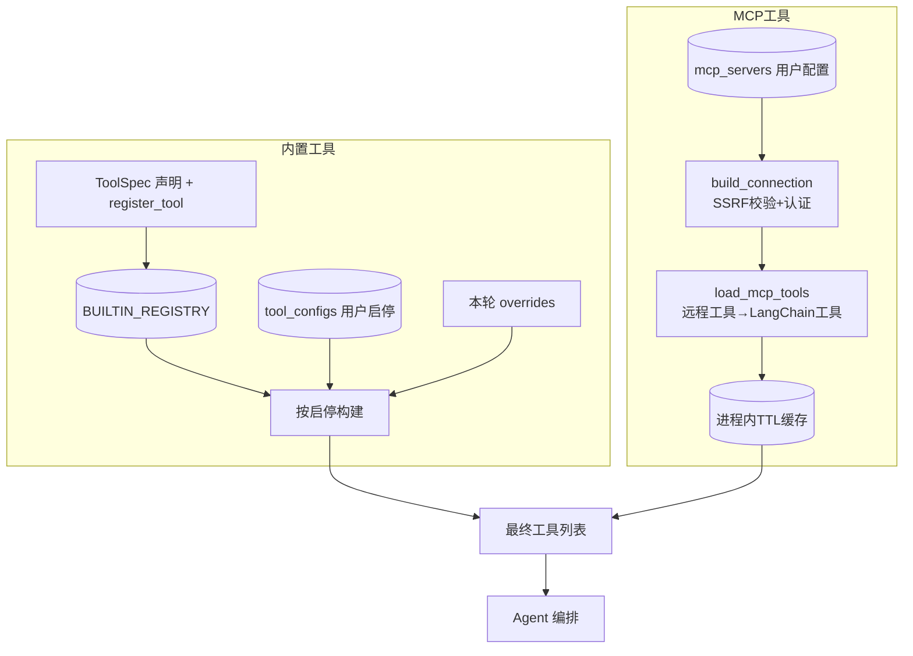

# 工具注册中心与 MCP 接入 — 设计与面试

> 内置工具用注册表声明 + 用户启停；外接 MCP server 动态加载工具。让 Agent 的工具可插拔、可扩展。
> 对应能力域：**Agent 核心 / 可扩展性**。代码：`core/agent/tools/`（base / registry / builtin / mcp）。

---

## 0. 能力定位（对应招聘要求）

- 对应 JD：**「Agent 工具体系」「MCP（Model Context Protocol）」「插件化 / 可扩展架构」「工具动态注册」**。
- 角色：把 Agent 的工具从「写死三个」升级为「可配置、可外接」，体现工程扩展性和对 MCP 这种前沿协议的掌握。

---

## 1. 解决什么问题

- **痛点 1**：内置工具（知识库/记忆/联网/时间）要能让用户**按需启停**，不能全写死全开。
- **痛点 2**：用户想接**自己的外部工具**（查数据库、调内部 API、第三方 MCP server），不能每加一个都改代码。
- **方案**：内置工具用**注册表 + ToolSpec 声明式定义**、启停存表；外部工具走 **MCP 协议动态加载**（官方 `langchain-mcp-adapters`），运行时把远程工具转成 LangChain 工具注入 Agent。

---

## 2. 架构 / 数据流

---

## 3. 核心设计与实现（后端）

### 3.1 内置工具：声明式注册 + 闭包注入上下文

每个内置工具用 `ToolSpec` 声明（key/名称/图标/builder 构建函数/默认是否启用），导入时注册进全局注册表。**新增工具只要写一个文件 + 注册，编排逻辑不用改**。

关键是 `builder` 的设计：它不返回静态工具，而是拿到「构建上下文」（含 session、引用收集列表 citations、统计字典 stats_holder、知识库范围 kb_ids）后，构建一个闭包工具。工具执行时，把要给模型看的结果作为**文本返回**，同时把**引用、命中统计这些副产物写进上下文里的共享列表/字典**。
> 为什么这么做：LangChain 工具只能返回一个字符串给模型，但引用、统计要传回业务层渲染。靠「工具返回文本给模型 + 副产物写进调用方传入的共享对象」旁路传出，绕开这个限制。

### 3.2 三级启停优先级

构建工具时按优先级决定每个工具开不开：**本轮临时开关（对话请求）> 用户持久配置（tool_configs 表）> 工具默认值**。需要额外配置但没配的工具（如联网没配 websearch 模型）自动跳过；单个工具构建失败也跳过，不影响其余。技能的工具白名单也复用「本轮开关」实现（白名单内开、外的关）。

### 3.3 MCP 接入：把外部工具协议接进来

**MCP（Model Context Protocol）** 是 Anthropic 的「AI 工具标准协议」——任何遵循它的 server 暴露的工具都能被统一发现调用。用户配置 server 的 url / 传输方式（SSE / Streamable HTTP）/ 认证，本项目用官方 `langchain-mcp-adapters` 接入，三步：
1. **建连接**：解密认证信息拼请求头 + **SSRF 校验**（防内网，详见安全篇）+ 按传输方式组装连接配置。
2. **拉工具**：连 server 把远程工具转成 LangChain 工具。
3. **注入 Agent**：和内置工具一起进编排，模型可像调内置工具一样调它们。

> 面试一句话：MCP 是 AI 工具的标准协议，用官方 adapter 把用户配置的远程 MCP server 工具运行时拉下来转成 LangChain 工具注入 Agent，不改代码就能扩展任意外部工具。

### 3.4 工具名清洗（为什么必须做）

OpenAI function calling 对工具名有硬约束：只能是字母/数字/下划线/连字符、不超过 64 字符。MCP 工具名可能含中文、空格、特殊字符，所以加载后统一清洗——非法字符替成下划线、**加 server 名前缀**（区分不同 server 的同名工具）、超长截断、重名加序号去重。不清洗，模型一调用就报参数非法。

### 3.5 性能：缓存清单 + 持久会话

MCP 的痛点是每轮对话都要连 server 握手拉工具清单，累计延迟高。两个优化：
- **缓存工具清单**：按用户缓存 5 分钟，缓存键带「所有启用 server 的指纹（id + 更新时间）」——**任一 server 增删改，指纹变化、缓存自动失效**，配置改了立刻生效。
- **持久会话 vs 无状态**：群聊/深度研究一轮内会多次调工具，用**持久会话**版（整轮复用一条 server 连接、不重复握手）；单聊用**无状态**版（只缓存清单、不预连，只在模型真正调用某 MCP 工具时才连）——这样闲聊或只用内置工具的轮次零 MCP 握手。

> 真实优化过的坑：早期单聊每轮都预开所有 MCP 会话，日志里每轮 4~5 个握手、首字很慢；改成「单聊只在真调用时才连」后消除了无谓握手。按场景选：多次调用用持久会话省握手，可能不调用用无状态避免预连。

### 3.6 单 server 失败隔离

单个 server 连不上/加载失败就跳过、记日志，不影响其余 server 和内置工具——一个外部 server 挂了 Agent 仍能正常用其他工具。

---

## 4. 关键设计取舍

| 决策点 | 选了什么 | 备选 | 为什么 |
|--------|---------|------|--------|
| 内置工具定义 | ToolSpec 声明 + 注册表 | 硬编码工具列表 | 新增工具不改编排，可插拔 |
| 启停 | 三级优先级(本轮>用户>默认) | 全局开关 | 灵活：持久配置 + 本轮临时覆盖 |
| 外部工具 | MCP 协议 + 官方 adapter | 自定义插件协议 | MCP 是标准协议，生态通用，不重造 |
| MCP 工具名 | 清洗 + server 前缀 + 去重 | 原样用 | function name 有字符限制，不清洗会报错 |
| MCP 连接 | TTL 缓存清单 + 持久会话 | 每次重连 | 消除每轮握手延迟 |
| 单聊 MCP | 无状态版只在真调用时连 | 每轮预开会话 | 闲聊不调 MCP 的轮次零握手 |
| 单 server 失败 | 跳过不影响其余 | 全失败 | 一个 server 挂不拖垮整个 Agent |

---

## 5. 踩坑与解决

- **MCP 工具名含中文/特殊字符致 function calling 报错**：解法：清洗非法字符 + server 前缀 + 去重。
- **每轮对话重连 MCP server 握手很慢**：解法：进程内 TTL 缓存清单 + 单聊只在真调用时连。
- **公网 MCP 被 SSRF 拦（代理 fake-ip）**：解法：加 `mcp_allow_private_url` 开关放行（详见安全篇）。
- **needs_config 工具未配置时构建失败**：解法：builder 返回 None 自动跳过。
- **一个 MCP server 连不上拖垮全部**：解法：单 server try/except 跳过。

---

## 6. 面试问答

**Q1（设计）：工具系统怎么设计的？怎么扩展？**
内置工具用 ToolSpec 声明式定义 + register_tool 注册进全局注册表，新增工具只写一个文件不改编排。构建时按「本轮覆盖 > 用户配置 > 默认」三级优先级决定启停。外部工具走 MCP 协议动态加载。

**Q2（核心）：MCP 是什么？怎么接入的？**
MCP（Model Context Protocol）是 AI 工具的标准协议，server 暴露工具供客户端统一发现调用。我用官方 langchain-mcp-adapters，把用户配的 MCP server 工具运行时拉下来、清洗工具名加 server 前缀、转成 LangChain 工具注入 Agent，不改代码就能扩展工具。

**Q3（工程）：MCP 性能怎么优化的？**
两点：进程内 TTL 缓存工具清单（按 server 指纹失效）避免每轮重连拉清单；持久会话版整轮复用会话不重复握手。单聊用无状态版只缓存清单、只在模型真调用时才连，闲聊轮次零握手。

**Q4（细节）：为什么要清洗 MCP 工具名？**
OpenAI function calling 要求工具名匹配 [a-zA-Z0-9_-] 且≤64 字符。MCP 工具名可能含中文/特殊字符，不清洗会报参数非法。统一替非法字符、加 server 前缀防重名、去重。

**Q5（健壮性）：一个 MCP server 挂了会怎样？**
单 server try/except 跳过，记 warning，不影响其余 server 和内置工具。Agent 仍能用其他工具正常工作。

**Q6（进阶）：MCP 的 transport 有哪些？**
本项目支持 SSE 和 Streamable HTTP 两种远程传输。还有 stdio（本地子进程）本项目没做——stdio 适合本地命令式 MCP，远程部署用 HTTP 类传输。

---

## 7. 相关论文 / 概念

**① 工具增强 LLM（Tool-Augmented LLM）的脉络**
让 LLM 调外部工具突破「只能用训练知识」的局限：**ReAct（2022）** 用 prompt 引导调工具 → **Toolformer（Meta 2023）** 让模型自学何时调 API → **Function Calling（OpenAI 2023）** 把工具调用做成原生结构化能力。工具是 Agent 从「会聊天」到「会干活」的关键。

**② MCP（Model Context Protocol，Anthropic 2024.11）**
在 Function Calling 之上更进一步的标准化尝试。痛点：每家应用接每个工具都要自己写适配，是 M×N 的重复劳动。MCP 定义了**统一协议**——工具方实现一个 MCP server（暴露 tools/resources/prompts），任何 MCP 客户端都能即插即用，把 M×N 降为 M+N。类比「AI 工具界的 USB 接口」。本项目用官方 langchain-mcp-adapters 做 MCP 客户端，接入用户配置的任意 MCP server。

**③ 插件化 / 注册表模式（软件工程）**
「声明式注册 + 运行时发现」是经典可扩展架构：组件自我声明并注册到中心表，框架运行时遍历表加载，新增组件不改框架代码。本项目内置工具的 ToolSpec + 注册表即此模式。

**④ 连接复用与池化（性能工程）**
「建连接（握手）很贵，要复用」是网络编程通识（HTTP keep-alive、数据库连接池同理）。本项目 MCP 的「持久会话整轮复用」「清单 TTL 缓存」就是这个思想在工具调用上的应用——区别在于按场景（多次调用 vs 可能不调用）选「持久会话」还是「无状态延迟连接」。

> 一句话脉络：工具增强 LLM 从 ReAct→Toolformer→Function Calling；MCP 是工具接入的标准化协议（M×N 降到 M+N，AI 界的 USB）；工具体系用注册表模式保可扩展、用连接复用/缓存保性能。

---

## 8. 可优化方向

- **MCP 工具语义筛选**：工具多时按 query 先筛相关工具再给模型，减少决策负担和 token。
- **stdio transport**：支持本地命令式 MCP server。
- **工具调用审计**：记录每次工具调用入参/结果/耗时，做可观测。
- **工具权限分级**：危险工具（写操作）加二次确认。
