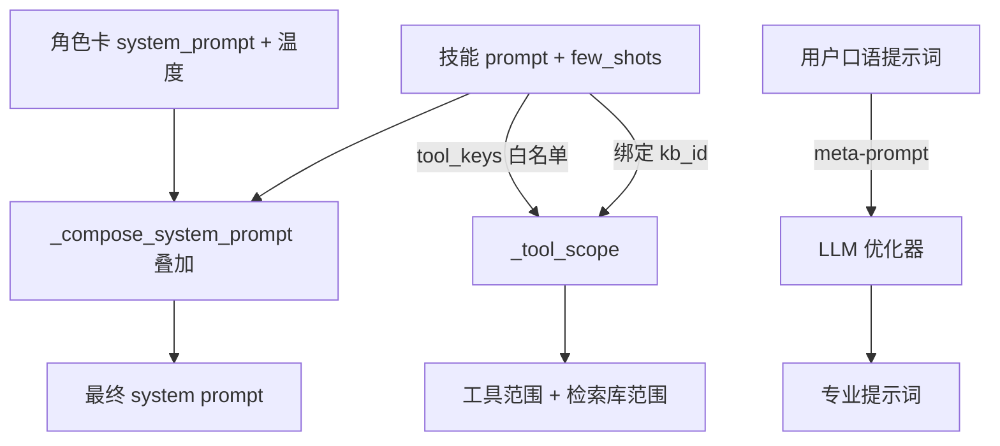

# 角色卡（人格）· Skills 技能 · 提示词优化器 — 设计与面试

> 三个围绕「提示词工程」的能力：角色卡定「我是谁」、Skills 定「我现在干什么专项任务」、提示词优化器帮用户把口语提示词改专业。
> 对应能力域：**Agent 核心 / 提示词工程**。代码：`chat_service._compose_system_prompt` / `_tool_scope`、`skill_service.py`、`agent_config_service.py` + `prompts/optimize_*.jinja2`。

---

## 0. 能力定位（对应招聘要求）

- 对应 JD：**「提示词工程」「Agent 人格 / 角色定制」「可配置的任务能力」「meta-prompt」**。
- 角色：让同一个 Agent 通过提示词组合扮演不同角色、执行不同专项任务，是「用提示词而非改代码定制行为」的体现。

---

## 1. 解决什么问题

- **角色卡**：用户想要不同人设（严谨助理 / 毒舌朋友 / 某领域专家），切换人格和语气。
- **Skills 技能**：想要可复用的「专项任务包」——绑定特定提示词 + 工具白名单 + 知识库 + few-shot，对话时一键挂载（如「股票分析」技能只开联网、「知识库问答」技能限定某库）。
- **提示词优化器**：用户写的提示词往往口语、笼统，效果差；一键帮他改写得清晰专业。

---

## 2. 架构 / 数据流



---

## 3. 核心设计与实现（后端）

### 3.1 角色卡 + 技能的提示词叠加（`_compose_system_prompt`）

「角色卡定我是谁、技能定我现在干什么专项任务，两者可组合叠加」。拼装顺序：
1. **角色卡人设**：`persona.system_prompt`（用户选的当前角色），打头。
2. **技能任务提示词**：若挂了技能，加 `【当前任务能力：{skill.name}】\n{skill.prompt}`。
3. **技能 few-shot 示例**：把技能 config 里的 `few_shots`（input→output 对）拼成「参考以下示例的风格作答」——**用 few-shot 稳定该技能的输出风格**。

角色卡还带 `temperature`（人格的发散度）。这样同一个对话引擎，换角色卡 + 挂不同技能 = 完全不同的行为，全靠提示词组合，不改代码。

> 面试一句话：角色卡是「我是谁」的人设 prompt，技能是「我现在干什么任务」的任务 prompt + few-shot + 工具白名单，两者在 system prompt 里叠加——角色定语气、技能定专项能力，组合出不同 Agent 行为。

### 3.2 技能的工具白名单 + 知识库限定（`_tool_scope`）

技能不只叠加提示词，还**约束能力范围**：
- **工具白名单**（`skill.tool_keys`）：非空则只开白名单内的工具（通过 overrides 实现：白名单内 True、外的 False）。比如「股票分析」技能只开联网搜索。
- **知识库限定**（`skill.kb_id`）：技能绑了库则检索限定到该库（优先于对话页选的库集合）。比如「合同审查」技能只查合同库。

`_tool_scope` 算出本轮 overrides（启停覆盖）+ kb_ids（检索范围），优先级：对话页本轮临时开关 > 技能白名单 > 用户持久配置。

### 3.3 内置技能模板（`skill_builtins.py`）

4 个内置模板（知识库问答 / 股票分析 / 翻译润色 等）做成**代码常量**，含 prompt + tool_keys + quick_prompts（快捷开场提问）+ few_shots。用户一键添加成自己的技能（可改可删），免灌数据库初始数据。

### 3.4 提示词优化器（meta-prompt，`agent_config_service.optimize_prompt` / `skill_service.optimize_prompt`）

用 LLM 当「提示词工程师」帮用户改写：
- 取用户默认对话模型（`temperature=0.4` 适度发散、`streaming=False` 要完整结果）。
- 渲染**元提示词**（meta-prompt）：`optimize_prompt.jinja2`（角色卡用，写人设/风格）和 `optimize_skill_prompt.jinja2`（技能用，**聚焦任务执行不写人设**）——两个场景用不同元提示词，因为角色卡要人格化、技能要任务化。
- `ainvoke` 拿结果，剥代码块/引号返回。

> 面试一句话：提示词优化器就是「用 LLM 优化给 LLM 的提示词」——写一个 meta-prompt 让模型扮演提示词工程师，把用户口语化的提示词改写成清晰、结构化、可执行的版本；角色卡和技能用不同的元提示词（一个写人设、一个写任务）。

---

## 4. 关键设计取舍

| 决策点 | 选了什么 | 备选 | 为什么 |
|--------|---------|------|--------|
| 角色 vs 技能 | 分两层（人设 / 任务）可叠加 | 合成一个 prompt | 角色可复用于不同任务，正交组合更灵活 |
| 技能配置 | 轻量塞 config JSONB | 每项建表字段 | quick_prompts/few_shots 轻量配置，JSONB 灵活 |
| few-shot | 拼进 system prompt | 不给示例 | few-shot 稳定输出风格，提示词工程关键手段 |
| 工具约束 | 技能白名单 override | 不约束 | 专项技能只开相关工具，减干扰、提专注 |
| 知识库限定 | 技能绑库优先 | 全局库 | 专项技能查专门的库更精准 |
| 内置模板 | 代码常量一键添加 | 灌数据库 | 免初始数据，用户可改可删 |
| 优化器元提示词 | 角色/技能各一份 | 共用 | 角色要人格化、技能要任务化，目标不同 |

---

## 5. 踩坑与解决

- **优化器返回带代码块包裹**：解法：剥 ```代码块和成对引号再返回。
- **角色卡和技能 prompt 冲突**：解法：明确分层（角色定语气、技能定任务），叠加顺序固定，技能段加标题分隔。
- **技能白名单与本轮开关优先级**：解法：`_tool_scope` 明确优先级（本轮 > 技能 > 持久配置）。
- **few-shot 格式不规范**：解法：校验 input/output 都非空才拼入。

---

## 6. 面试问答

**Q1（设计）：角色卡和技能有什么区别？怎么组合？**
角色卡是「我是谁」的人设 prompt（定语气/风格 + 温度），技能是「我现在干什么专项任务」的任务 prompt + few-shot + 工具白名单 + 绑定知识库。两者在 system prompt 里叠加——角色可复用于不同技能，正交组合出不同 Agent 行为，全靠提示词不改代码。

**Q2（提示词工程）：few-shot 在这里怎么用？为什么有用？**
技能 config 里存 input→output 示例对，拼进 system prompt 作为「参考这些示例的风格作答」。few-shot 给模型具体范例，比纯文字描述更能稳定输出格式和风格，是提示词工程提升稳定性的关键手段。

**Q3（核心）：提示词优化器怎么实现的？**
用 LLM 优化给 LLM 的提示词：写一个 meta-prompt 让模型扮演提示词工程师，把用户口语化提示词改写成清晰可执行版本。角色卡和技能用不同元提示词——角色写人设、技能聚焦任务不写人设。

**Q4（设计）：技能怎么约束 Agent 能力的？**
两方面：tool_keys 工具白名单（非空则只开白名单内工具，通过 overrides 实现）；kb_id 绑定知识库（检索限定到该库）。比如股票分析技能只开联网、合同审查技能只查合同库，减少干扰提升专注度。

**Q5（工程）：技能的 quick_prompts/few_shots 为什么塞 JSONB 不建表？**
这些是轻量、结构灵活的配置（字符串列表、示例对），建独立表过重。塞进 config JSONB 字段，读写方便、schema 灵活，适合这种半结构化配置。

**Q6（进阶）：meta-prompt 是什么概念？**
用来生成/优化其他 prompt 的 prompt。本项目优化器就是 meta-prompt 的应用——它不直接回答用户问题，而是指导模型如何改写一段提示词。

---

## 7. 相关论文 / 概念

**① In-context Learning 与 Few-shot（GPT-3，Brown et al. 2020）**
GPT-3 论文揭示大模型能**仅凭上下文里的少量示例**就学会任务，不用微调——这就是 in-context learning。**Few-shot** 即在 prompt 里给几个「输入→输出」范例引导模型类比。本项目技能的 few_shots 拼进 system prompt 稳定输出风格，正是这个机制。zero-shot（不给例子）/ one-shot / few-shot 是 prompt 的三种基本形态。

**② 提示词工程（Prompt Engineering）**
围绕「怎么写 prompt 让模型表现更好」的方法论：角色设定（role/persona prompting）、给示例（few-shot）、让其分步思考（CoT）、明确输出格式约束等。本项目角色卡（persona prompting 定语气）+ 技能（任务 prompt + few-shot）是其综合应用。

**③ System Prompt 分层与组合**
现代 LLM 应用把 system prompt 分层组织（人设层 / 任务层 / 上下文层 / 风格层），各层正交、可复用组合。本项目「角色卡（我是谁）+ 技能（干什么任务）」叠加就是分层思想——角色可复用于不同技能，组合出不同行为。

**④ Meta-prompting（用 prompt 优化 prompt）**
让 LLM 扮演「提示词工程师」来改写/生成 prompt。本项目提示词优化器即此——它不回答用户问题，而是按一个 meta-prompt 把用户的口语提示词改写得更专业。业界还有「自动提示词优化（APE、DSPy 等）」用程序化方式搜索/优化 prompt，本项目是其轻量手动版。

**⑤ 角色扮演 / persona 一致性**
让模型稳定扮演某角色（character.ai 类应用的核心）。挑战是多轮后「人设漂移」。本项目角色卡注入 system prompt 维持人格，真人对话模式（见情绪篇）进一步强化。

> 一句话脉络：GPT-3 的 in-context learning 让 few-shot 成为塑造输出的利器；提示词工程把它和角色设定、分层组合系统化；meta-prompting 用 LLM 优化 prompt——本项目角色卡/技能/优化器是这套方法论的工程落地。

---

## 8. 可优化方向

- **自动 few-shot 检索**：从历史好回答里检索相似示例动态拼入（dynamic few-shot）。
- **提示词版本管理 + A/B**：优化前后对比效果、可回滚。
- **角色/技能市场**：分享、导入他人的角色卡和技能。
- **优化器带评估**：优化后自动跑几个测试用例对比效果。
