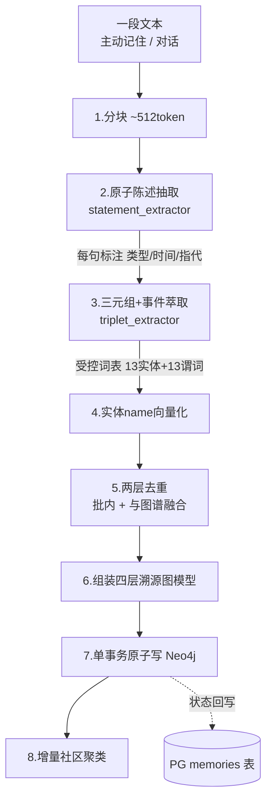

# 三元组萃取与四层溯源图谱（含事件萃取）— 设计与面试

> 从对话/文本自动萃取「实体-关系-事件」三元组，写入 Neo4j 知识图谱，给 AI 装上结构化长期记忆。
> 对应能力域：**记忆 / 知识图谱**。代码：`api/app/core/memory/`（ontology / graph_models / preprocessing / extraction）+ `api/app/repositories/neo4j/`。
> 同域其他篇：实体去重、图混合检索、社区聚类与分层巩固、反思引擎、主动召回（各自单独成篇）。

---

## 0. 能力定位（对应招聘要求）

- 对应 JD：**「熟悉知识图谱 / 三元组抽取 / LLM 信息抽取」「长短期记忆设计」「Neo4j 等图数据库」「提示词工程」**。
- 在项目里的角色：记忆系统的**写入侧核心**——把非结构化对话转成结构化图谱，是「AI 记得住用户」的地基；检索侧（混合检索/主动召回）消费它产出的图。

---

## 1. 解决什么问题

- **痛点**：LLM 无状态，多轮之外不记得用户是谁、有什么偏好/经历。直接把历史全塞进上下文不可持续（窗口有限、贵、噪声大）。
- **方案**：把用户信息**结构化**成知识图谱——从对话萃取 (主语, 谓词, 宾语) 三元组和事件，沉淀为可检索、可追溯、可累积的实体关系图。回答时只按需检索相关实体+关系注入，而非全量历史。
- **与 RAG 的区别**：RAG 存非结构化**文档块**，回答「文档里写了什么」；记忆存结构化**实体关系图**，回答「关于用户本人的事实」。

---

## 2. 萃取流水线数据流



编排在 `core/memory/extraction/orchestrator.py`，**异步执行**（Celery）。主动记住/对话回答时只落库 + 派发任务立即返回，萃取在 worker 后台跑，完成回写 `memories` 表状态与统计。

---

## 3. 核心设计与实现（后端）

> 编排在 `extraction/orchestrator.run_extraction()`，是看懂整条流水线的主线。下面按它的执行顺序逐步拆解，看完不用翻代码也能讲清「一句话怎么变成图里的节点和边」。

### 3.1 四层溯源图结构（`graph_models.py`）

```
Dialogue（来源：一次对话/一段主动记住文本，记 source / dialog_at）
  └─[:HAS_CHUNK]→ Chunk（片段，记 sequence 序号）
        └─[:HAS_STATEMENT]→ Statement（原子陈述，带类型/时间/重要度/情绪）
              └─[:MENTIONS]→ Entity（实体）
语义层（在实体之上）：
  Entity ─[:RELATION{predicate}]→ Entity   实体间三元组关系（带谓词/时效/重要度）
  Event  ─[:INVOLVES]→ Entity              事件涉及的实体（带 event_time）
  Entity ─[:IN_COMMUNITY]→ Community        社区聚类
```

**为什么保留四层溯源**：每个实体都能逐层回溯「它从哪段对话、哪个片段、哪句话萃取出来」。这带来三个价值——**可解释**（回答引用记忆时能给出处）、**可审计**（错误记忆能定位到源头那句话）、**可纠错**（删掉源 Dialogue 能连带清理派生节点）。三种边职责严格区分：`MENTIONS` 是溯源边（这句话提到了这个实体），`RELATION` 是实体间真实语义关系（带谓词，是知识本身），`INVOLVES` 是事件参与边。把"溯源"和"语义"分开，检索时只打语义层、回溯时才走溯源层，互不干扰。

### 3.2 第 1 步 · 分块（`preprocessing/chunker.py`）

来源文本先建一个 `DialogueNode` 根节点（记 source 来源类型、dialog_at 时间），再按 ~512 token 切成若干 `ChunkNode`（带 sequence 顺序）。分块是为了让后续 LLM 抽取的输入不超长、且能定位到片段；单条主动记住通常一两块，长对话会多块。

### 3.3 第 2 步 · 原子陈述抽取（`preprocessing/statement_extractor.py`）

**不直接从整块文本抽三元组**，而是先让 LLM 把每块切成**原子陈述句**——一句话只承载一个事实。每句标注三组属性：

- **陈述类型**：FACT（事实）/ OPINION（观点）/ PREDICTION（预测）/ SUGGESTION（建议）——区分可信度。
- **时间类型**：STATIC（静态属性，如"是程序员"）/ DYNAMIC（会变，如"在减肥"）/ ATEMPORAL（与时间无关）——判断记忆是否会过时。
- **指代标记 `has_unsolved_reference`**：能解析的指代直接归一（「我」→「用户」）；**解析不了的（如"他""那个东西"无上文）整条标记跳过**，不进入下一步，从源头防噪声。
- 还顺带抽 importance/confidence 和情绪四字段（valence-arousal 情绪记忆复用）。

调用时 `temperature=0.2`（要稳定不要发散），失败返回空列表、跳过该块不中断。**为什么要这一层**：长文本直接抽，LLM 容易漏抽、把多个事实揉进一个三元组、指代混乱；"一句一事实"后逐句抽，召回更全、更准，且每个实体能溯源到具体哪句 Statement。这是典型的「分而治之」。

### 3.4 第 3 步 · 三元组 + 事件萃取（`extraction/triplet_extractor.py`）

对每条陈述（跳过 `has_unsolved_reference` 的）让 LLM 抽三类产物，`temperature=0.1`（更确定），并用 `asyncio.Semaphore(4)` **限并发批量跑**（多句并行又不触发 LLM 限流）：

1. **实体**：每个带 `entity_idx`（块内局部编号）、name、type、description、importance/confidence。
2. **三元组**：`(subject_id, predicate, object_id)`——注意主宾用的是上面那个**局部 entity_idx**，不是全局 id（此时实体还没去重、没落库，只能先用局部编号占位，后面再翻译成真实 id）。还带 predicate_surface（原文表述）、valid_at/invalid_at（时效）、value（属性值）。
3. **事件 `ExtractedEvent`**：title / description / event_time / participants（参与者名字列表）——专门捕捉"一次性、有时间的经历"。

**受控词表（`ontology.py`）**：13 类实体类型（生命体/组织/地点设施/知识能力/偏好习惯…）+ 13 类谓词（拥有/位于/偏好/了解/负责…），用中文标签约束 LLM。`normalize_entity_type` / `normalize_predicate` 把越界输出强制规范到「其他」/「关联于」。**为什么要受控词表**：开放抽取会让实体类型无限膨胀、同义谓词碎片化（"喜欢/爱好/偏爱"各算一种），后续聚合、检索、去重都没法做；约束成有限集合才能形成稳定可查询的图。

### 3.5 画像 vs 事件（两类记忆）

- **画像类 → Entity + RELATION**：稳定的偏好/关系/属性（"在腾讯工作""养了只狗叫多多"）。
- **事件类 → Event + INVOLVES**：一次性、有明确时间的经历（"2025年3月看了演唱会"），带 event_time，用于**时间线**展示。

萃取时让 LLM 自行判断一条陈述是稳定事实还是一次性经历，分别落不同节点。区分的意义：事件能按时间排序成经历时间线，画像不需要时间维度、要的是"当前事实"。

### 3.6 第 4~6 步 · 向量化 → 两层去重 → id 重定向（流水线的关键衔接）

这是整条流水线最容易讲不清、但最体现工程细节的地方：

1. **向量化**：把所有抽出的实体 name 批量向量化（`embedder.embed_texts`），存进 `name_embedding`，供去重和检索用。
2. **批内去重**（`dedup.dedup_within_batch`）：本次萃取的实体之间先合并，产出**重定向表 `redirect1`**（被合并实体的旧 id → 保留实体 id）。
3. **与图谱融合**（`dedup.merge_with_graph`）：去重后的实体再和 Neo4j 里已有的同类型实体比对合并，产出 **`redirect2`**。
4. **id 解析 `resolve(eid)`**：把一个原始实体 id 先过 redirect1 再过 redirect2，得到它最终落库的真实 id。

有了 `resolve`，就能把第 3 步里用**局部 idx 占位**的三元组、mention、事件参与者，全部翻译成最终实体 id：
- **MENTIONS 边**：每条 `resolve(entity_id)`，丢弃指向已被合并掉的实体的边。
- **RELATION 边**：三元组的 subject/object 先经 idx_map 拿到 EntityNode，再 `resolve` 成最终 id；跳过自环（sid==oid）和指向不存在实体的边。
- **Event/INVOLVES**：事件的 participants 是**名字**，先用"本块实体名→EntityNode"映射（`chunk_name_map`）找到节点，再 `resolve` 成最终 id 连 INVOLVES 边、去重参与者。

> 面试讲这段的一句话：因为实体在抽取时还没落库、没去重，三元组只能先用"块内局部编号"占位指向主宾；等两层去重产出新旧 id 重定向表后，再统一把局部编号 / 名字翻译成最终实体 id 去连边——这是"先抽后接"的两阶段连边设计。

### 3.7 第 7 步 · 单事务原子落库（`repositories/neo4j`）

组装好 Dialogue/Chunk/Statement/Entity/Event 节点 + MENTIONS/RELATION/INVOLVES 边后，`save_graph` 用 **UNWIND + MERGE 在单个写事务里原子落库**。MERGE 配节点 id 唯一约束保证**幂等**——异步任务即使重跑，同一份数据也只更新属性、不产生重复节点。即便一个实体都没抽到，也会把 Dialogue + Statement 写入（保留溯源），关系/事件为空。

### 3.8 第 8 步及之后 · 萃取后的连锁触发

- **增量社区聚类**：写图后立刻对新实体跑一次增量 LPA（归入已有社区/新建），失败只记 warning 不影响萃取结果。
- **反思增量触发**：用 Redis 计数器 `reflect:pending:{user_id}` 累加本次新增实体数，**达到阈值就清零并派发一次单用户反思任务**（归纳高层 Insight，见反思引擎篇）——这是"攒够够多新信息再反思一次"的节流设计。

### 3.9 提示词工程（`prompts/*.jinja2`，纯中文）

`extract_statement` / `extract_triplet` 模板用 jinja2 把受控词表、few-shot 示例、输出 JSON schema 渲染进 prompt。要点：完整列出 13+13 受控词表、给覆盖边界情况的示例（无可抽内容返回空数组、指代不明怎么标）、强调「只输出 JSON、不要 markdown 代码块包裹、不要多余解释」。LLM 返回统一走 `core/memory/json_utils.py`（`json_repair` 容错裸换行/尾逗号/代码块包裹/截断等常见瑕疵），解析失败兜底空结构、单句失败跳过。`memories` 表（PG）记原文/来源/状态/萃取统计 stats（dialogue/chunk/statement/entity/relation/event 计数 + 实体 id 列表），供前端轮询状态与溯源。

---

## 4. 关键设计取舍

| 决策点 | 选了什么 | 备选 | 为什么 |
|--------|---------|------|--------|
| 抽取粒度 | 先切原子陈述再逐句抽 | 直接从长文抽 | 长文抽 LLM 易漏抽/揉合/指代乱；逐句更全更准可溯源 |
| 实体/谓词 | 13+13 受控词表约束 | 开放抽取 OpenIE | 防类型泛滥、关系碎片化，利于后续聚合与检索 |
| 溯源层级 | 保留四层（Dialogue→Chunk→Statement→Entity） | 只存实体+关系 | 可解释/可审计/可纠错；面试体现企业级思维 |
| 画像 vs 事件 | 分 Entity / Event 两类节点 | 全当实体 | 事件带 event_time 能排时间线，画像不需要 |
| 萃取时机 | 异步 Celery | 同步阻塞返回 | 多次调 LLM 很慢，异步保接口响应 |
| 写入方式 | UNWIND+MERGE 单事务 | 逐条 CREATE | MERGE 幂等（配 id 唯一约束）保证任务可重试不产生重复 |

---

## 5. 踩坑与解决

- **首次萃取报 `UnknownPropertyKeyWarning`**：去重查 type 属性时库里还没该属性键，无害，写入后消失。
- **指代污染**：早期「我/他」直接入图导致一堆指代实体。解法：陈述抽取阶段做指代消解（「我」→「用户」），不可解析的整条跳过。
- **LLM 返回非法 JSON**（裸换行、尾逗号、代码块包裹、截断）：统一走 `json_utils` 的 `json_repair` 修复 + 兜底空结构，单句失败跳过不中断流水线。
- （实体重复见「实体去重」篇——同名「用户」节点反复新建的根因与修复。）

---

## 6. 面试问答

**Q1（基础）：知识图谱 / 三元组是什么？**
知识图谱用「实体-关系-实体」描述知识。三元组 = (主语,谓词,宾语)，如（用户,偏好,周杰伦）。本项目从对话萃取三元组写 Neo4j 构建用户画像图谱。

**Q2（原理）：怎么从文本萃取三元组？**
先切原子陈述句 + 指代消解，再让 LLM 按受控词表（限定实体类型/谓词）抽实体和三元组，用 jinja2 prompt 给示例和 JSON schema 约束。受控词表防类型泛滥。

**Q3（原理）：原子陈述这一层为什么需要？直接从原文抽不行吗？**
长文直接抽，LLM 易漏抽、把多个事实揉一起、指代混乱。先切成一句一事实并标注类型/时间、做指代消解再逐句抽，召回更全更准，且可溯源到具体哪句。分而治之。

**Q4（设计）：画像和事件为什么要区分？**
画像是稳定属性（在腾讯工作），事件是一次性有时间的经历（3月看演唱会）。事件带 event_time 能排时间线。萃取时让 LLM 判断陈述是稳定事实还是一次性经历，分别落 Entity / Event。

**Q5（原理）：MERGE 幂等是什么？为什么重要？**
Neo4j 的 MERGE「存在则匹配，不存在则创建」，配节点 id 唯一约束，重复写同一份数据只更新属性不产生重复节点 → 萃取任务可安全重试（异步任务可能重跑）。

**Q6（工程）：萃取为什么异步？**
要多次调 LLM（陈述抽取+三元组+去重判定），很慢。主动记住/回答时只落库+派发 Celery 任务立即返回，后台跑完回写状态。

**Q7（进阶）：怎么保证萃取质量？**
①受控词表约束输出；②jinja2 prompt 给充分 few-shot + 严格 JSON schema；③指代消解、不可解析整条跳过；④健壮 JSON 解析容错；⑤单句失败跳过不中断。

**Q8（进阶）：陈述的类型/时间标注（FACT/STATIC…）有什么用？**
区分事实与观点/预测便于按可信度处理；时间类型帮助判断记忆是否会过时、是否落成事件。本项目主要用它辅助判断是否落事件，企业级可做记忆更新/失效。

---

## 7. 相关论文 / 概念

> 从对话萃取结构化记忆，本质是「信息抽取 + 知识图谱」两条技术线在 LLM 时代的结合。

**① 知识图谱（Knowledge Graph）**
2012 年 Google 提出工业级「知识图谱」概念，用「实体-关系-实体」的图结构组织知识（如 (北京, 是首都, 中国)），支撑搜索的实体理解。核心数据单元就是**三元组 (主语, 谓词, 宾语)**。本项目用 Neo4j 把用户信息组织成这种图。

**② 信息抽取：OpenIE → LLM 抽取**
从文本抽三元组叫信息抽取。早期是 **OpenIE（Open Information Extraction，华盛顿大学 2007 起）**，用句法规则从开放文本抽 (主体, 关系, 客体)，但抽出的关系五花八门、难归一。**受限抽取**则预定义实体类型和关系类型（schema）约束输出。LLM 时代用大模型 + prompt 抽取，质量远超规则法。**本项目**用「LLM + 受控词表（13 实体 + 13 谓词）」，是受限抽取思路——比 OpenIE 规整、比纯开放抽取可聚合。

**③ 指代消解（Coreference Resolution）**
NLP 经典任务：把「他」「这个」等指代词链接回指向的实体。不做指代消解，抽出的三元组会有一堆「他」当主语、无法归并。本项目在陈述抽取阶段做轻量归一（「我」→「用户」），不可解析的整句跳过。

**④ 实体消歧 / 实体对齐（Entity Resolution / Disambiguation）**
判断「不同提及是否指同一实体」（「小米」是公司还是手机还是人名？）。是知识图谱构建的核心难题。本项目的两层去重就是做这件事（详见去重篇）。

**⑤ 知识图谱嵌入（KG Embedding）**
**TransE（Bordes et al. 2013）** 等把实体和关系嵌入向量空间（让 头+关系≈尾），用于关系预测。本项目没做关系预测，但「实体 name 向量化做检索」借用了「实体可向量化」的思想。

**⑥ GraphRAG（微软 2024）**
把 RAG 从「检索文本块」升级为「检索知识图谱」：先从语料建实体-关系图 + 社区摘要，回答时能做多跳推理和全局性问题。本项目的「四层溯源图 + 一跳邻居遍历 + LPA 社区聚类」是 GraphRAG 思想的轻量个人版。

**⑦ 记忆型 Agent 的近期方向**
让 Agent 有长期记忆是 2023 起的热点（如各种 long-term memory 框架）。共识是「从对话抽取结构化记忆 + 按需检索注入」，而非把全部历史塞上下文。本项目的萃取 + 主动召回正是这个范式。

> 一句话脉络：知识图谱（三元组组织知识）+ 信息抽取（OpenIE→受限→LLM 抽取）+ 指代消解/实体消歧（保证图干净）→ GraphRAG（图谱增强检索）。本项目是这套在「个人对话记忆」场景的轻量落地。

---

## 8. 可优化方向

- 关系/陈述带 `valid_at` / `invalid_at` 做**时序消解**，处理「先在腾讯后在字节」这类冲突（当前新增不覆盖、靠对话时间区分）。
- 萃取引入**置信度阈值过滤**，低置信三元组进待确认区而非直接入图。
- 大规模下对溯源层（Dialogue/Chunk/Statement）做**归档/冷热分离**，检索只打 Entity 层。
- 萃取**批处理 + 缓存**：相同陈述模式复用，降 LLM 调用量。
