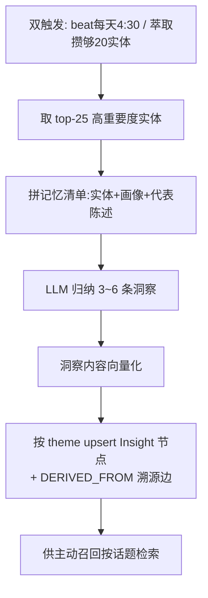

# 反思引擎（Insight 高层洞察）— 设计与面试

> 定期回看高频/高重要度的记忆，用 LLM 归纳出更高层的「洞察」（如「用户是个爱钻研的后端工程师，近期在转 AI 方向」），存成 Insight 节点供主动召回消费。
> 对应能力域：**记忆 / Agent 自省**。代码：`core/memory/reflection/reflector.py`。

---

## 0. 能力定位（对应招聘要求）

- 对应 JD：**「记忆系统 / 长期记忆」「Agent 反思（Reflection）」「LLM 归纳/摘要」**。
- 角色：在「原子记忆（一条条事实）」之上再抽象一层「高层洞察（对用户的整体理解）」，让 AI 不只记得零碎事实，还能形成对用户的画像级认知。

---

## 1. 解决什么问题

- **痛点**：萃取出的是一条条**原子事实**（在腾讯工作、养了狗、在学 Rust…），但缺少**高层概括**。问答时注入一堆零碎事实，模型难形成「这是个什么样的人」的整体认知。
- **方案**：定期「反思」——回看最重要的一批实体和代表性陈述，让 LLM **归纳成几条高层洞察**（Insight），存成图节点。洞察是「对用户的理解」，比零碎事实更适合开场注入。

---

## 2. 数据流

---

## 3. 核心设计与实现（后端）

### 3.1 反思的输入：top-K 高价值实体 + 代表陈述（`_build_memory_block`）

不是把所有记忆都喂给 LLM（太多、噪声大），而是**精选**：
- 取 `reflection_top_k=25` 个**高重要度/高频实体**（消费了分层巩固产出的 importance、mention_count、画像）。
- 每个实体拼上：类型、描述、核心事实/特质（巩固画像增强的产物）、`reflection_stmt_per_entity=4` 条代表性陈述。
- 拼成一个可读的「记忆清单」文本，同时记录「实体名→id」映射（供溯源连边）。

> 这里体现模块协同：反思**消费**了巩固产出的「高频长期实体 + core_facts/traits」，输入质量更高。

### 3.2 LLM 归纳洞察（`reflect.jinja2`）

把记忆清单喂给 LLM，要求归纳 `reflection_min_insights=3` ~ `max_insights=6` 条洞察，每条带：`theme`（主题）、`content`（一句话洞察）、`based_on`（基于哪些实体名）、`importance`/`confidence`。`temperature=0.5`（归纳要一点概括发散）。

### 3.3 按 theme upsert + 溯源边（`upsert_insight`）

落库的关键设计：
- **按 theme upsert**（不是每次新建）：同一主题（如「职业发展」）的洞察更新而非堆叠，避免反思多次产生一堆重复洞察。
- **DERIVED_FROM 溯源边**：洞察连到它 `based_on` 的实体节点，记录「这条洞察是从哪些记忆推导出来的」——保持可溯源（和四层溯源一脉相承）。
- **洞察向量化**：content 向量化存索引，供主动召回**按当前话题检索相关洞察**。
- 内容超 200 字截断（洞察应是一句概括，防异常长文入库）。

### 3.4 双触发：定时 + 增量（节流）

- **定时**：Celery beat 每天 4:30 对用户反思一次。
- **增量**：萃取时用 Redis 计数器累加新增实体数，**攒够 `reflection_trigger_threshold=20` 个新实体就触发一次反思**（清零计数）——"攒够够多新信息再反思"的节流，避免每次萃取都反思（太频繁、浪费）。

### 3.5 跳过条件 + 健壮性

实体少于 `reflection_min_entities` 不反思（信息太少归纳没意义）；没配 chat 模型跳过；LLM 调用/解析/单条落库失败都不中断（记 warning）。遵循「记忆不遗忘」——反思**只新增/更新高层洞察节点，不删改原子记忆**。

---

## 4. 关键设计取舍

| 决策点 | 选了什么 | 备选 | 为什么 |
|--------|---------|------|--------|
| 反思输入 | top-K 高价值实体 + 代表陈述 | 全部记忆 | 精选降噪、控 token，质量更高 |
| 洞察落库 | 按 theme upsert | 每次新建 | 防同主题洞察重复堆叠 |
| 溯源 | DERIVED_FROM 边连实体 | 不记来源 | 洞察可溯源，知道从哪推导 |
| 触发 | 定时 + 增量计数节流 | 每次萃取都反思 | 攒够新信息再反思，省调用 |
| 洞察向量化 | 存向量供召回 | 只存文本 | 主动召回能按话题检索洞察 |
| 与原子记忆 | 只增高层洞察不动原子 | 替换原子 | 洞察是抽象层，原子记忆仍是溯源根基 |

---

## 5. 踩坑与解决

- **反思太频繁浪费 LLM**：解法：增量触发用 Redis 计数器，攒够 20 个新实体才反思一次。
- **同主题洞察重复堆叠**：解法：按 theme upsert 而非新建。
- **洞察异常长文/截断残句入库**：解法：超 200 字截断。
- **信息太少硬归纳出空洞洞察**：解法：实体少于阈值直接跳过。
- **LLM 给的 importance/confidence 非法**：解法：`_clamp` 夹到 [0,1]，非法用默认。

---

## 6. 面试问答

**Q1（核心）：反思引擎是干什么的？**
在原子记忆（零碎事实）之上再抽象一层高层洞察。定期回看最重要的一批实体和代表陈述，让 LLM 归纳出几条「对用户的整体理解」（如"爱钻研的后端工程师，在转 AI"），存成 Insight 节点。比零碎事实更适合问答开场注入。

**Q2（设计）：反思的输入怎么选？为什么不全喂？**
取 top-25 高重要度/高频实体 + 每个实体的核心事实/特质 + 几条代表陈述。不全喂是因为记忆太多、噪声大、token 爆。精选高价值的归纳质量更高。这里还消费了巩固产出的画像（core_facts/traits）。

**Q3（设计）：洞察怎么落库？为什么按 theme upsert？**
按主题 upsert 而非每次新建——同一主题（职业发展）的洞察更新而非堆叠，避免反思多次产生一堆重复洞察。还连 DERIVED_FROM 边到来源实体保持可溯源，content 向量化供主动召回按话题检索。

**Q4（触发）：什么时候反思？**
双触发：beat 每天定时一次 + 萃取攒够 20 个新实体增量触发一次（Redis 计数器节流）。不每次萃取都反思，攒够够多新信息再反思，省调用。

**Q5（模块协同）：反思和巩固、召回什么关系？**
巩固产出高频长期实体 + 画像（core_facts/traits）→ 反思以这些为输入归纳洞察 → 洞察向量化 → 主动召回按当前话题检索洞察注入对话。三者是「原子记忆→巩固提炼→反思归纳→召回消费」的链条。

**Q6（进阶）：反思和 Agent 的「Reflexion」是一回事吗？**
思想相通（让 Agent 回看、自省、总结），但场景不同。Reflexion 论文是让 Agent 反思任务失败教训改进下次行动；本项目反思是对「用户记忆」做画像级归纳。都是「在原始信息上做更高层抽象」的 reflection 思想。

---

## 7. 相关论文 / 概念

**① Generative Agents 的「记忆 + 反思」（Park et al. 2023，斯坦福「斯坦福小镇」）**
这篇开创性工作让 25 个 LLM Agent 在虚拟小镇生活，核心是「记忆流（memory stream）+ 反思（reflection）+ 规划」架构：Agent 把经历存进记忆流，**定期反思——把零散记忆归纳成更高层的洞察**（如从"多次看到 A 在读书"归纳出"A 爱学习"），高层洞察再指导行为。本项目的反思引擎正是这个思想的落地——从原子记忆归纳高层 Insight。

**② Reflexion（Shinn et al. 2023）**
让 Agent 反思任务失败的教训、写成文字记忆、改进下一次尝试。和本项目方向不同（任务改进 vs 用户画像），但同属「reflection」——让 Agent 在原始信息上做自省式抽象。

**③ 记忆的层次：情景记忆 vs 语义记忆**
认知科学区分「情景记忆」（具体经历）和「语义记忆」（抽象知识）。本项目的「原子陈述/事件（情景）→ 反思归纳的洞察（语义）」是这个分层的工程映射——洞察是从具体经历提炼的抽象认知。

**④ 多文档摘要 / 归纳（Summarization）**
反思本质是「把多条记忆归纳成几条洞察」，是摘要任务的变体——从大量细节提炼要点。GraphRAG 的「社区摘要」也是类似思路（对社区内容做摘要）。

> 一句话脉络：反思引擎源自 Generative Agents（斯坦福小镇）的「记忆流 + 反思」架构——定期把零散记忆归纳成高层洞察指导认知；本项目把它落地为「top-K 高价值实体 → LLM 归纳 → Insight 节点（按 theme upsert + 溯源 + 向量化）」，供主动召回消费。