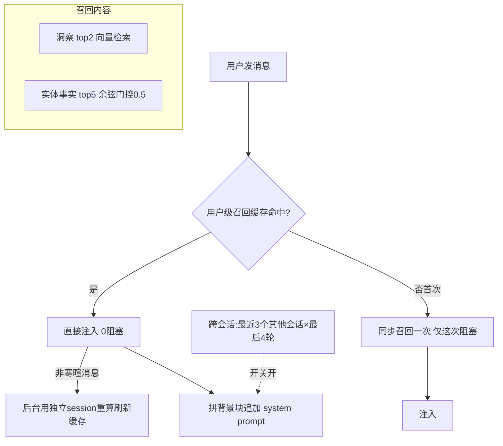

# 主动召回与跨会话上下文 — 设计与面试

> 对话每轮自动注入「关于用户的已知信息」（洞察 + 相关记忆），不用等模型主动调记忆工具；并可注入最近其他会话的片段，让跨会话也能接着聊。
> 对应能力域：**记忆 / 上下文工程**。代码：`core/memory/retrieval/active_recall.py`、`chat_service._recall_lagged` / `_cross_session_context`。

---

## 0. 能力定位（对应招聘要求）

- 对应 JD：**「记忆按需召回 / 上下文注入」「长期记忆应用」「对话上下文管理」「性能优化」**。
- 角色：让 AI「一开口就认识你」——不依赖模型主动查记忆，每轮自动把对用户的理解注入上下文。

---

## 1. 解决什么问题

- **痛点 1**：记忆做成了工具（模型可调），但模型不一定每次都想到去调，导致它"不记得"用户。希望**主动**把相关记忆注入，不依赖模型决策。
- **痛点 2**：每轮都召回（embedding + 图查询）有延迟，闲聊也召回很浪费。
- **痛点 3**：记忆是萃取出的"事实"，但有时想要的是"上一个会话刚聊的原话"——跨会话上下文。

---

## 2. 数据流

---

## 3. 核心设计与实现（后端）

### 3.1 召回什么（`active_recall.recall_context`）

每轮用当前问题召回两类，拼成「关于用户的已知信息」背景块追加进 system prompt：
- **洞察**（top2）：反思引擎产出的 Insight，按当前问题向量检索最相关的——"我对用户的理解"。
- **相关记忆**（top5）：图谱实体事实，**带余弦门控 0.5**（相关度低于阈值不注入，节流防噪声），每个实体带 1~2 条关系。

背景块措辞「供参考，可自然融入回答，不必刻意提及」——引导模型自然用而非生硬复述。

### 3.2 性能优化①：一次 embedding 两路并行 + 超时（`_do_recall`）

- **query 只 embed 一次**，洞察召回和实体召回**复用同一向量**（实体召回 `search_memory` 支持传入 query_vector 省一次 embedding）。
- 洞察、实体两路 **`asyncio.gather` 并行**。
- 整体 **3.5s 超时**（`asyncio.wait_for`）——召回是锦上添花，超时就放弃注入，**绝不拖累对话首字延迟**。

### 3.3 性能优化②：用户级温热缓存 + 后台刷新（核心，`_recall_lagged`）

> 这是真实优化过的。原本**每轮都同步召回**（embedding + 两次图查询），直接加在首字延迟上，闲聊也照跑很浪费。

改成**按 user_id 缓存「对用户的了解」、每轮都注入**：
- 缓存命中 → **0 阻塞**直接注入（闲聊、首轮、新会话都"认识你"）。
- 缓存未命中（进程内该用户首次）→ 同步召回一次（**仅这一次阻塞**），存缓存。
- 命中后，**非寒暄消息**才在**后台用独立 session 重算刷新缓存**（fire-and-forget，给下次用）；寒暄消息（"嗯""好的"，正则 + 长度判断）注入缓存但不重算。

**为什么用户级而非会话级**：换新会话、重开对话，首轮也能吃到温热缓存，AI 一直认识你。代价是召回**滞后一轮**（用上次刷新结果）——但记忆内容（洞察+事实）本就稳定，滞后几乎无感。

> 面试一句话：主动召回原本每轮同步做（embedding+图查询）加在首字延迟上。改成按用户缓存「对你的了解」、每轮 0 阻塞注入，只在非寒暄消息时后台异步刷新缓存给下次用——记忆稳定所以滞后一轮无感，首字延迟基本不受召回拖累，且闲聊/首轮/新会话都认识你。

> 设计演进（诚实）：中途曾做成「会话级 + 闲聊/首轮不召回」，但那样首轮和闲聊就"不认识你"了；经修正改为现在的「用户级 + 始终注入 + 后台刷新」。

### 3.4 跨会话上下文（`_cross_session_context`，开关默认关）

和主动召回互补——主动召回注入的是萃取的"事实"，跨会话注入的是最近其他会话的**原始对话片段**：
- 纯 PG 查询，取**最近 3 个其他会话 × 每个最后 4 轮**，拼成「最近你还和我聊过」背景块。
- 开关 `enable_cross_session` 默认关（不是所有人都想要跨会话串扰），开时追加 system prompt，超长截断。
- 不建表、不建向量索引——直接查会话历史表，轻量。

### 3.5 与记忆工具并存

主动召回（主动注入基础背景）和记忆工具（模型可主动调查更细）**并存**：主动召回保证"基础认知一直在场"，记忆工具让模型需要时查更深。两者互补不冲突。

---

## 4. 关键设计取舍

| 决策点 | 选了什么 | 备选 | 为什么 |
|--------|---------|------|--------|
| 注入方式 | 主动每轮注入 + 记忆工具并存 | 只靠工具 | 不依赖模型主动调，保证基础认知在场 |
| 召回缓存 | 用户级温热 + 后台刷新 | 每轮同步召回 | 首字延迟基本不受召回拖累 |
| 缓存粒度 | 用户级 | 会话级 | 新会话/首轮也认识你 |
| 滞后 | 接受滞后一轮 | 实时 | 记忆稳定，滞后无感，换零延迟 |
| 寒暄处理 | 注入缓存但不重算 | 跳过不注入 | 闲聊也认识你，但不浪费 embedding |
| 召回门控 | 余弦 0.5 节流 | 不门控 | 防无关记忆挤占上下文 |
| 跨会话 | 纯 PG 查原片段 + 默认关 | 建表/向量索引 | 轻量；不是人人想要跨会话串扰 |
| 超时 | 3.5s 放弃 | 等到底 | 召回是锦上添花，不拖累首字 |

---

## 5. 踩坑与解决

- **每轮召回拖慢首字**：解法：用户级温热缓存，每轮 0 阻塞注入，后台异步刷新。
- **会话级缓存致新会话首轮不认识你**：解法：改用户级缓存。
- **闲聊也召回浪费**：解法：寒暄消息（正则+长度）注入缓存但不触发后台重算。
- **召回挂了/慢了拖累对话**：解法：3.5s 超时 + 各路 try/except 降级，超时放弃注入照常回答。
- **后台刷新用请求 session 报错**（请求结束 session 关了）：解法：后台任务用独立 SessionLocal 建新 session。
- **重复 embedding**：解法：query embed 一次，洞察/实体召回复用。

---

## 6. 面试问答

**Q1（核心）：主动召回和记忆工具区别？为什么都要？**
记忆工具是模型可主动调，但它不一定每次想到调。主动召回是每轮自动把"对用户的理解（洞察+相关事实）"注入 system prompt，不依赖模型决策，保证基础认知一直在场。两者并存：主动召回给基础背景、工具让模型需要时查更深。

**Q2（性能，重点）：每轮召回会不会很慢？怎么优化的？**
原本每轮同步召回（embedding + 两次图查询）直接加在首字延迟上。优化成按用户缓存「对你的了解」每轮 0 阻塞注入，只在非寒暄消息时后台用独立 session 异步刷新缓存给下次用。记忆内容稳定，滞后一轮无感，首字延迟基本不受召回影响。

**Q3（设计）：缓存为什么用户级不是会话级？**
用户级缓存让换新会话、重开对话的首轮也能吃到温热缓存，AI 一直认识你。会话级则每个新会话首轮都得重新召回、"不认识你"。

**Q4（细节）：怎么避免闲聊也浪费召回？**
寒暄/超短消息（正则匹配"嗯/好的/晚安"等 + 长度≤2）仍注入已有缓存（保持"认识你"），但不触发后台重算，省 embedding。

**Q5（健壮性）：召回失败或慢了会影响对话吗？**
不会。整体 3.5s 超时，超时放弃注入直接让模型回答；各路 try/except 降级。召回是锦上添花，绝不拖累首字延迟或阻断对话。

**Q6（设计）：跨会话上下文和主动召回什么区别？**
主动召回注入的是萃取的"事实"（结构化），跨会话注入的是最近其他会话的"原始对话片段"（原话）。互补。跨会话默认关（不是人人想要串扰），纯 PG 查不建表。

**Q7（上下文工程）：注入这么多东西不会撑爆上下文吗？**
有控制：洞察 top2、实体 top5 且余弦门控、背景块整体截断（max_chars）；跨会话也限会话数/轮数 + 截断。且这些注入按相关度筛选，不是全量塞。

---

## 7. 相关论文 / 概念

**① 上下文工程 / 上下文窗口管理（Context Engineering）**
LLM 上下文窗口有限且贵，"往里放什么"是门工程。手段有：检索注入（RAG）、记忆注入（本篇）、摘要压缩、按相关度筛选。本项目主动召回是「记忆注入」——把最相关的用户认知放进 system prompt，而非把全部历史塞进去。

**② 长期记忆的「写入 + 召回」范式**
让 Agent 有长期记忆的共识架构：写入侧从对话抽取结构化记忆（萃取），召回侧按当前对话检索相关记忆注入（本篇）。本项目「萃取→巩固→反思→主动召回」是完整的写入+提炼+召回链条。MemGPT（虚拟上下文管理）等也是这个方向——把有限上下文当"内存"、外部记忆当"磁盘"，按需换入换出。

**③ 缓存与「滞后一致性」（Cache + Staleness）**
本项目用户级温热缓存 + 后台刷新，是典型「用一点数据新鲜度换性能」的缓存策略（类似 cache-aside + 异步刷新 / stale-while-revalidate）。因为记忆数据稳定，滞后一轮可接受，换来召回不阻塞首字。

**④ 节流与降级（Throttling / Graceful Degradation）**
余弦门控（不相关不注入）是节流；3.5s 超时放弃注入是降级——保证核心链路（对话）不被辅助功能（召回）拖累。

> 一句话脉络：主动召回属上下文工程里的「记忆注入」，配合萃取/巩固/反思构成长期记忆的写入-召回闭环（类 MemGPT 思想）；性能上用「用户级缓存 + 后台刷新」的滞后一致性策略换零阻塞，用门控+超时做节流降级。