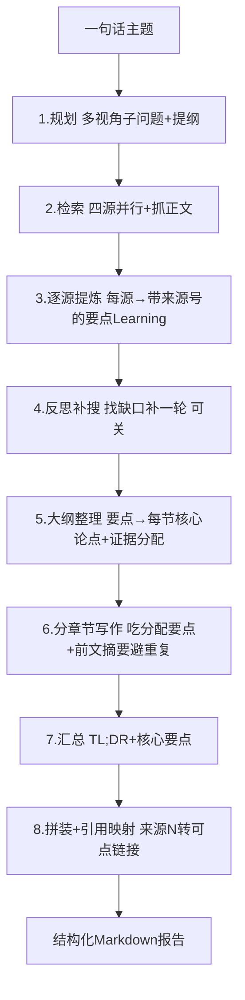

# 深度研究引擎（规划→检索→提炼→反思→大纲→写作）— 设计与面试

> 一句话需求 → 自主多步研究 → 结构化带来源的 Markdown 报告。对标 GPT Researcher / STORM 的多阶段研究流水线。
> 对应能力域：**多 Agent 编排 / 复杂任务自动化**。代码：`core/agent/research/`（engine / planner / retriever / distiller / reflector / curator / writer）。

---

## 0. 能力定位（对应招聘要求）

- 对应 JD：**「多步 Agent 编排」「复杂任务自动化」「RAG 进阶 / 深度检索」「类 GPT Researcher / STORM」**。
- 角色：项目里最复杂的 Agent——把「研究一个主题」拆成规划、检索、提炼、写作多个阶段自动跑完，是「Agent 能自己干活」的代表作。

---

## 1. 解决什么问题

- **痛点**：单轮问答只能答简单问题；「帮我研究下 X 行业现状」这种需要查多个来源、综合分析、成文的任务，单次 LLM 调用做不了（上下文塞不下、容易泛泛而谈、没来源）。
- **方案**：把研究拆成**多阶段流水线**，每阶段专注一件事，像人做研究一样：先列提纲和要查什么 → 多源检索 → 从资料提炼要点 → 查缺补漏 → 整理大纲 → 分章节写 → 汇总。产出结构化、带真实来源的报告。

---

## 2. 数据流（v2 八步流水线）

---

## 3. 核心设计与实现（后端）

### 3.1 引擎是「纯异步生成器」与传输层解耦（`engine.run_research`）

引擎本身不关心结果怎么传出去，只 `yield` 结构化事件（status/plan/sources/token/report…）。这样**同一个引擎**能被两种场景复用：
- **在线发起**：research_service 在后台任务里消费，事件经 Redis bus 广播给前端（可断线续传，见 SSE 篇）。
- **定时任务**：Celery worker 直接消费同一引擎，无 bus（见定时任务篇）。

> 面试一句话：研究引擎写成纯异步生成器、只产出事件，和传输层彻底解耦——在线场景接 SSE+bus 续传、定时场景 Celery 直接 await 同一引擎，一套逻辑两处复用。

### 3.2 为什么是 v2 八步（对标业界的关键改进）

v1 跑通后质量不够，调研 GPT Researcher（CMU benchmark 第一）和 STORM 后定位为**架构缺环**而非 prompt/模型问题。v2 加了三个关键模块：

- **逐源提炼 distiller（GPTR 核心）**：检索回来的原始网页正文又长又有噪声，直接喂给写作会稀释重点、引用对不齐。distiller **对每个来源先提炼成带来源号（source_index）的要点 Learning**——引用对齐提前到提炼阶段、噪声过滤前置。这是 GPT Researcher 拿第一的核心做法。
- **反思补搜 reflector**：提炼完评估「信息够不够」，找出缺口生成补充查询，**再补一轮检索+提炼**（可配置关闭/轮数）。模拟人「发现没查全再补查」。
- **大纲整理 curator（STORM/GPTR）**：把所有要点整理成「每个章节配核心论点 thesis + 分配证据编号 learning_ids」，写作时每节只吃分配给它的要点，**章节互斥不重叠**。

### 3.3 检索：四源并行 + 续编引用号（`_retrieve`）

一轮检索并行查四类源：**联网搜索 + 并发抓正文**（gather_web_sources）、**知识库**（gather_kb_sources）、**MCP 增强**（gather_mcp_sources，强模型 + 配了 MCP 才跑工具循环）。每源失败降级继续。`assign_indices` 给所有来源**统一编全局引用号**（反思补搜的第二轮从上次末尾接着编），保证引用号全程唯一、可映射。

### 3.4 进度透传：emit 回调 + asyncio.Queue（`_pump`）

研究很慢（几十秒到几分钟），用户要看到实时进度。`_pump` 把「会上报进度的异步任务」包一层：任务通过 `emit` 回调把细粒度进度（搜了某角度/读了某网页/抓取失败/写某章节）push 进 `asyncio.Queue`，`_pump` 边 drain 队列 yield progress 事件边等任务完成。于是检索/提炼这些内部步骤的进度能实时冒泡到前端活动流。

> 面试一句话：研究内部步骤（检索、提炼）通过 emit 回调把细粒度进度推进一个 asyncio.Queue，外层边消费队列产出 progress 事件边等任务完成，实现「慢任务实时进度透传」。

### 3.5 分章节流式写作 + 避免重复（`write_section_stream`）

逐章节写：每节只喂**分配给它的要点**（curator 分的 learning_ids）+ **前面已写章节的摘要**（prev_summaries）。前文摘要让后面章节知道"前面讲过啥别重复"——解决多章节内容重叠的通病。每节流式产 token（前端实时显示）。

### 3.6 引用映射：[来源N] → 可点链接（`_linkify_citations`）

写作时 LLM 在正文标 `[来源N]` 角标，最后拼装时把它替换成**带短标题的可点链接**：有网址的渲染成 `[N · 短标题](url "标题·域名")`（手机端不用悬停也看得懂跳哪、桌面 tooltip 显完整），无网址的（知识库/工具）保留角标 + 文末「参考来源」可查。引用号在检索阶段就分配好，全程可映射。

### 3.7 降级与兜底

每个阶段都降级处理尽量产出报告：检索某源失败继续、反思可关、写作某节空了填占位。失败时若有部分正文也保留（定时任务篇的 `_mark_failed` 存 partial）。

---

## 4. 关键设计取舍

| 决策点 | 选了什么 | 备选 | 为什么 |
|--------|---------|------|--------|
| 引擎形态 | 纯异步生成器，与传输解耦 | 耦合 SSE | 在线/定时两场景复用同一引擎 |
| 流水线 | v2 八步（加 distiller/reflector/curator） | v1 规划→检索→写 | 逐源提炼+反思补搜+大纲整理是业界第一梯队做法 |
| 引用对齐 | 提炼阶段就带来源号 | 写作时让 LLM 标 | 提前对齐 + 噪声过滤前置，引用更准 |
| 检索 | 四源并行 + 续编引用号 | 单源 / 串行 | 多源互补、并行快、引用号全局唯一 |
| 进度 | emit + asyncio.Queue 透传 | 只在阶段间报 | 慢任务要实时细粒度进度 |
| 章节写作 | 喂分配要点 + 前文摘要 | 每节看全部 | 章节互斥不重叠、不超 token |
| 反思补搜 | 可配置轮数（默认 1） | 固定 / 不做 | 平衡质量和耗时/成本 |

---

## 5. 踩坑与解决

- **报告泛泛而谈、章节重叠**：v1 缺提炼和大纲整理。解法：v2 加 distiller（提炼要点）+ curator（每节配论点分证据）+ 写作喂前文摘要。
- **引用对不齐**：写作时让 LLM 标引用容易错位。解法：检索阶段统一编号，提炼阶段就把要点和来源号绑定。
- **联网源质量差（营销号/抓取失败）**：解法：抓取后按质量分排序、丢弃正文过少的源（来源质量过滤，开关默认开）。
- **网页抓取被反爬 521/403**：解法：真实浏览器 UA + 重试。
- **慢任务无进度**：解法：emit + Queue 透传细粒度进度。
- **手机端 [来源N] 看不懂跳哪**：解法：链接文字带短标题。

---

## 6. 面试问答

**Q1（核心）：深度研究怎么实现的？为什么要多阶段？**
拆成八步流水线：规划（提纲+多视角子问题）→ 四源检索+抓正文 → 逐源提炼成带来源号的要点 → 反思补搜（找缺口补一轮）→ 大纲整理（每节配论点分证据）→ 分章节写作（吃分配要点+前文摘要避重复）→ 汇总 → 拼装引用。多阶段是因为研究任务单次 LLM 做不了（上下文塞不下、泛泛而谈、没来源），像人做研究一样分步专注。

**Q2（设计）：引擎和传输层怎么解耦的？**
引擎写成纯异步生成器，只 yield 结构化事件不管怎么传。在线发起接 SSE + Redis bus 续传，定时任务 Celery 直接 await 同一引擎。一套逻辑两处复用。

**Q3（对标）：对标了谁？v2 改了什么？**
对标 GPT Researcher（CMU benchmark 第一）和 STORM。v1 质量不够定位为架构缺环，v2 加了三模块：逐源提炼 distiller（GPTR 核心，引用对齐前置+噪声过滤）、反思补搜 reflector（找缺口补查）、大纲整理 curator（每节配论点分证据，章节互斥）。

**Q4（关键）：为什么要"逐源提炼"？**
检索回来的原始正文又长又有噪声，直接喂写作会稀释重点、引用对不齐。先对每个来源提炼成带来源号的要点，把引用对齐和噪声过滤提前到提炼阶段——这是 GPT Researcher 拿第一的核心做法。

**Q5（工程）：慢任务的实时进度怎么做的？**
内部步骤通过 emit 回调把细粒度进度推进 asyncio.Queue，外层边消费队列 yield progress 事件边等任务完成。前端就能看到"搜了某角度、读了某网页、写某章节"的实时活动流。

**Q6（细节）：章节怎么避免内容重叠？**
curator 给每节分配专属要点（learning_ids），写作时每节只吃分给它的要点 + 前面已写章节的摘要（知道前面讲过啥别重复）。

**Q7（引用）：引用怎么保证准确可点？**
检索阶段就给所有来源统一编全局引用号，提炼时把要点和来源号绑定，写作标 [来源N]，最后拼装替换成带短标题的可点链接（有网址跳原文、无网址文末可查）。

---

## 7. 相关论文 / 概念

**① 自动研究 Agent 的代表作**
- **STORM（Stanford 2024，*Assisting in Writing Wikipedia-like Articles*）**：模拟「多视角提问 + 多轮对话搜集 + 大纲 + 成文」写维基风格长文。核心贡献是**多视角（perspective）提问**和**先大纲后写作**——本项目的「规划多视角子问题」和「大纲整理 curator」借鉴了它。
- **GPT Researcher（开源，CMU 相关 benchmark 表现突出）**：把研究拆成 planner（规划子问题）+ executor（每个子问题检索 + 提炼成 research notes）+ 写作。核心是**逐源/逐子问题提炼成带来源的笔记**再综合——本项目 v2 的 distiller 直接对标它。

**② RAG 的进阶检索范式**
- **HyDE（Hypothetical Document Embeddings，Gao et al. 2022）**：先让 LLM 生成一个"假设答案"再用它检索，提升召回。
- **Query Decomposition / Multi-query**：把复杂问题拆成多个子查询分别检索再综合——本项目规划阶段的「多视角子问题」即此。
- **Iterative Retrieval / Self-RAG**：检索-生成-反思-再检索的迭代，模型自己判断够不够——本项目的反思补搜 reflector 是这个思想。

**③ Plan-and-Execute Agent**
相对 ReAct 的「走一步看一步」，Plan-and-Execute 是「先规划完整步骤再逐步执行」，适合复杂可分解任务。深度研究是典型的 plan-and-execute——先规划提纲和查询，再分阶段执行。

**④ Map-Reduce 式综合**
「逐源提炼（map）→ 汇总成文（reduce）」是处理「多文档综合」的经典模式，避免一次性把所有原文塞进上下文。本项目 distiller（map）+ writer/summarize（reduce）即此结构。

> 一句话脉络：自动研究 Agent 从 STORM（多视角+大纲）和 GPT Researcher（逐源提炼成带来源笔记）确立范式；技术上融合了多查询分解、迭代检索/反思（Self-RAG 思想）、Plan-and-Execute、Map-Reduce 综合——本项目 v2 八步流水线是这些的工程整合。