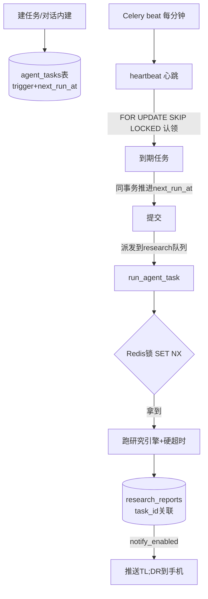

# 定时 / 主动任务调度 — 设计与面试

> 建个任务（如「每天 9 点研究 AI Agent 岗招聘」），到点自动跑深度研究、落库、推送。让 Agent 从「问一句答一句」变「自己定时干活」。
> 对应能力域：**多 Agent 编排 / 任务调度 / 分布式健壮性**。代码：`tasks/agent_task.py`（心跳 + 执行）+ `agent_task_service.py`（CRUD + 时区计算）+ `core/agent/tools/builtin/schedule.py`（对话内建任务）。

---

## 0. 能力定位（对应招聘要求）

- 对应 JD：**「任务调度 / 定时任务」「Celery / 分布式任务」「并发控制 / 健壮性」「Agent 自动化」**。
- 角色：让深度研究能无人值守定时跑，是「主动 Agent」的关键；也是体现分布式调度健壮性（锁、超时、原子认领）的地方。

---

## 1. 解决什么问题

- **痛点**：深度研究是好能力，但每次都要手动发起。求职追踪、行业监控这类需求是「周期性」的——希望定时自动跑、结果送到手上。
- **方案**：任务表 + Celery beat 心跳调度。用户建任务（daily/weekly/interval 三种触发），心跳每分钟扫到期的派发执行；还能在对话里说「每天 9 点帮我查 X」由 Agent 自动建任务。

---

## 2. 数据流

---

## 3. 核心设计与实现（后端）

### 3.1 任务模型 + 时区感知的下次运行计算（`agent_task_model` + `service`）

`agent_tasks` 表：`trigger_type`（daily/weekly/interval）+ time/weekday/interval_hours + enabled + last_run_at/last_status + **next_run_at**（预计算的下次运行时间）。运行历史**复用 `research_reports.task_id`** 不另建表。`compute_next_run` 按 Asia/Shanghai **时区感知**算下次运行时间（避免服务器 UTC 时区算错点）。

### 3.2 心跳调度：扫到期 → 派发（`heartbeat_task`，每分钟）

Celery beat 每分钟触发心跳：查 `next_run_at` 已到的任务，逐个推进 next_run_at，派发执行任务。**心跳只做轻量的"找到期+派发"，不跑研究**——研究是重活，派到独立队列。

### 3.3 健壮性加固（重点，五点）

这块是调度系统的核心难点，经评审后做了五点加固：

1. **拆队列防堵**：心跳走 `beat` 队列（轻量、不可被堵），研究执行路由到独立 `research` 队列。否则长研究会堵死每分钟心跳。
2. **原子认领（FOR UPDATE SKIP LOCKED）**：心跳查到期任务用 `FOR UPDATE SKIP LOCKED`，在**一个事务内推进所有 next_run_at 再一次提交**，然后才派发。防止多个 beat 实例 / 尾部任务被重复触发。
3. **单任务 Redis 锁**：执行前抢 `agent_task:lock:{id}`（SET NX + TTL 自愈），防「interval < 任务耗时」或「立即运行撞定时」导致同任务重叠跑。Redis 异常时可用性优先（不因锁失败漏跑）。
4. **整体硬超时**：`asyncio.wait_for(timeout=research_task_timeout=900s)`——跨平台（Windows 上 Celery 的 time_limit 不生效），超时标 failed 释放 worker，防卡死任务长期占资源。
5. **先推进再派发**：心跳先把 next_run_at 推进并提交，再派发执行——避免「派发了却没推进」导致下一分钟重复触发。

> 面试一句话：定时任务调度做了五点加固——心跳和执行拆队列防长任务堵心跳、FOR UPDATE SKIP LOCKED 原子认领防重复触发、Redis 锁防同任务重叠跑、asyncio.wait_for 硬超时防卡死、先推进 next_run_at 再派发防漏推进。

### 3.4 执行：复用研究引擎，无 SSE（`_do_run` / `_execute_research`）

执行时建 research_report 行（标 task_id 关联）→ 直接 `await run_research(...)` 消费引擎事件落库（**无 SSE/bus，后台直跑**，这正是引擎与传输解耦的好处）→ 回写任务 last_status。失败时若有部分正文也保留（`_mark_failed` 用全新 session，因超时取消可能令原 session 脏）。每个阶段用独立 session（建行 / 跑研究 / 回写状态分开），避免长事务和脏 session。

### 3.5 对话内建任务（`schedule.py` 内置工具）

给 Agent 加 `create_scheduled_task` 内置工具，调用复用 `AgentTaskService.create`。强模型 function calling 路径下，用户在对话里说「每天 9 点帮我查 X」，模型自动调这个工具建任务并回复首次运行时间——**自然语言建任务**。

### 3.6 完成后推送（`_notify_user`）

任务成功且开了 notify_enabled，从报告提取 TL;DR + 核心要点（`_extract_summary` 解析 Markdown 的引用块和要点）+ 报告链接，推到用户配置的消息渠道（Server酱/企微/钉钉/webhook，见推送篇）。整步降级，不影响任务本身。

---

## 4. 关键设计取舍

| 决策点 | 选了什么 | 备选 | 为什么 |
|--------|---------|------|--------|
| 调度方式 | beat 心跳每分钟扫表 | 每任务一个 crontab | 心跳统一管理，任务动态增删灵活 |
| 队列 | 心跳 beat / 执行 research 分开 | 同队列 | 长研究不堵每分钟心跳 |
| 认领 | FOR UPDATE SKIP LOCKED | 普通查询 | 多实例下原子认领防重复触发 |
| 防重叠 | Redis 锁 SET NX + TTL | 不防 | interval<耗时/立即运行撞定时会重叠跑 |
| 超时 | asyncio.wait_for | Celery time_limit | 跨平台（Windows time_limit 不生效）|
| 运行历史 | 复用 research_reports.task_id | 另建历史表 | 报告本就是运行产物，不重复建表 |
| 对话建任务 | 内置工具复用 service | 只能页面建 | 自然语言建任务更顺 |

---

## 5. 踩坑与解决

- **长研究堵死每分钟心跳**：解法：心跳和执行拆 beat/research 两队列。
- **任务被重复触发**：解法：FOR UPDATE SKIP LOCKED 原子认领 + 先推进 next_run_at 再派发。
- **同任务重叠跑**（interval 短于耗时 / 立即运行撞定时）：解法：Redis 锁 SET NX + TTL。
- **Windows 上任务卡死不超时**：Celery time_limit 在 Windows solo pool 不生效。解法：asyncio.wait_for 跨平台硬超时。
- **超时后落库报错**：超时取消令原 session 脏。解法：失败落库用全新 session。
- **时区算错运行时间**：解法：compute_next_run 用 Asia/Shanghai 时区感知。

---

## 6. 面试问答

**Q1（核心）：定时任务怎么调度的？**
agent_tasks 表存触发配置 + 预算的 next_run_at；Celery beat 每分钟心跳扫 next_run_at 到期的任务，推进下次时间后派发执行；执行时跑深度研究引擎落库、可推送。心跳只管找到期+派发，研究是重活派到独立队列。

**Q2（健壮性，重点）：调度做了哪些健壮性保障？**
五点：① 心跳/执行拆队列防长任务堵心跳；② FOR UPDATE SKIP LOCKED 原子认领防多实例重复触发；③ Redis 锁 SET NX 防同任务重叠跑；④ asyncio.wait_for 硬超时（跨平台，Windows time_limit 不生效）防卡死；⑤ 先推进 next_run_at 再派发防漏推进重复触发。

**Q3（设计）：为什么心跳和执行要拆队列？**
心跳每分钟必须准时跑（不可被堵），研究执行可能几分钟。同队列的话长研究会占住 worker 把心跳堵死。拆成 beat（心跳）和 research（执行）两队列，worker -Q 都监听，长任务不影响心跳。

**Q4（并发）：怎么防止同一任务被重叠执行？**
执行前抢 Redis 锁（SET NX + TTL 自愈）。防 interval 短于任务耗时、或「立即运行」撞上定时触发导致同任务并发跑。Redis 挂时可用性优先不因锁失败漏跑。

**Q5（复用）：定时任务和在线研究怎么共用引擎？**
研究引擎是纯异步生成器与传输解耦。在线发起接 SSE+bus；定时任务 Celery 直接 await 引擎消费事件落库，没有 SSE。同一引擎两种消费方式。

**Q6（细节）：怎么在对话里建定时任务？**
给 Agent 加 create_scheduled_task 内置工具，复用任务 service。强模型 function calling 下，用户说「每天9点查X」模型自动调工具建任务。自然语言建任务。

---

## 7. 相关论文 / 概念

**① 分布式任务调度**
- **Celery + beat**：Python 生态主流分布式任务队列。beat 是定时调度器（类 crontab），worker 是执行者，Redis/RabbitMQ 做 broker。本项目用 beat 心跳 + worker 执行。
- **心跳扫表 vs 静态 crontab**：静态 crontab 适合固定任务；「心跳每分钟扫表」适合用户动态增删的任务（本项目场景），灵活但有最多 1 分钟延迟。

**② 并发控制原语**
- **分布式锁（SET NX EX）**：Redis 实现的互斥锁，NX 保证只有一个持有者、EX 设过期防死锁。本项目防同任务重叠。更严谨有 Redlock 算法（多 Redis 实例）。
- **SELECT ... FOR UPDATE SKIP LOCKED**：数据库行级锁 + 跳过已锁行，是「多消费者抢任务不重复」的经典 SQL 模式（队列表 outbox pattern 常用）。本项目心跳认领用它。

**③ 超时与资源隔离**
- **硬超时（timeout）**：长任务必须有超时上限，否则异常会永久占用 worker。`asyncio.wait_for` 是 Python 异步的超时原语。
- **队列隔离（Bulkhead 隔离舱模式）**：把不同特性的任务（轻量心跳 vs 重活研究）放不同队列/资源池，互不影响——本项目拆队列即此。

**④ 幂等与重复执行**
分布式调度难免重复触发（网络、多实例），所以要么幂等、要么去重。本项目用「先推进 next_run_at + 原子认领 + 执行锁」三重防重复。

> 一句话脉络：定时任务是分布式调度问题——用 Celery beat 心跳扫表（适合动态任务）+ FOR UPDATE SKIP LOCKED 原子认领 + Redis 分布式锁防重叠 + 硬超时 + 队列隔离（Bulkhead），是分布式任务调度健壮性的经典手段组合。