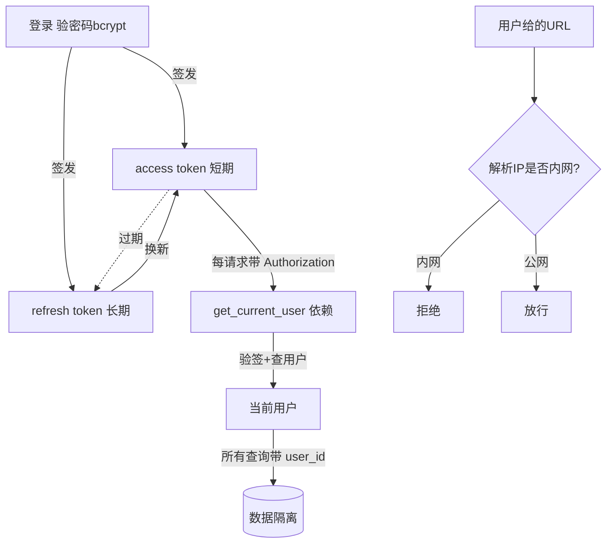

# 账号鉴权与安全（JWT · 加密 · SSRF · 多租户隔离）— 设计与面试

> 多用户系统的安全四件套：JWT 鉴权、密码/密钥加密、多租户数据隔离、SSRF 防护。
> 对应能力域：**工程化 / 安全**。代码：`core/security.py`、`core/dependencies.py`、`web_crawler.py` / `mcp/connection.py`（SSRF）。加密细节见 `01-LLM应用工程/配置加密·连接池·统一响应异常.md`。

---

## 0. 能力定位（对应招聘要求）

- 对应 JD：**「鉴权 / JWT」「数据安全」「多租户」「Web 安全（OWASP）」**。
- 角色：保证「多用户系统数据不串、不被未授权访问、不被攻击」的安全底座。

---

## 1. 解决什么问题

多用户 + 用户托管敏感信息（API Key）+ 用户可控外部请求（网页导入/MCP），带来四类安全需求：登录态怎么验（JWT）、密码/Key 怎么存（加密）、用户数据怎么不串（隔离）、用户给的 URL 会不会被用来打内网（SSRF）。

---

## 2. 数据流

---

## 3. 核心设计与实现（后端）

### 3.1 JWT 双令牌鉴权（`security.py` + `dependencies.py`）

- 登录用 **bcrypt** 校验密码（加盐哈希，只验证不还原）。
- 签发 **access token（短期）+ refresh token（长期）**，payload 带 `type` 区分、`sub` 存用户 id、HS256 签名。
- 每个业务接口靠 `get_current_user` 依赖：从 `Authorization` 头取 token → 验签 + 查用户 → 注入当前用户；失败自动 401。
- access 过期用 refresh 换新 access，避免频繁重登。
- **为什么无状态**：JWT 自带签名，服务端验签即可，不用查 session 表——易水平扩展、无服务端会话存储。

### 3.2 敏感信息加密（详见加密篇）

- **密码 bcrypt 哈希**（不可逆，只验证）；**API Key Fernet 对称加密**（可逆，调用要还原）、接口返回掩码。「能还原的用加密、只验证的用哈希」。密钥在 `.env` 不进 git。

### 3.3 多租户数据隔离（贯穿全项目）

所有业务表带 `user_id` 外键；**所有查询强制带 user_id 过滤**——repository 层查询都 `where user_id = current_user`，service 层 `_get_or_404` 也校验归属。ES 检索 filter 带 user_id、Neo4j 查询带 user_id、向量召回带 user_id。任何一处漏了 user_id 都是越权漏洞，所以做成「查询默认带 user_id」的固定模式。
> 面试一句话：多租户隔离靠「所有业务表带 user_id + 所有查询（PG/ES/Neo4j/向量）强制带 user_id 过滤」，把隔离做成固定模式而非个别接口判断，避免漏判越权。

### 3.4 SSRF 防护（`web_crawler.py` / `mcp/connection.py`）

凡是「用户能控制服务器去访问哪个 URL」的功能（网页导入、MCP server 连接），都做 SSRF 校验（`_is_safe_url`）：
- 只允许 http/https；
- **解析域名的所有 IP**，任一落在 private（10/172.16/192.168）/ loopback（127）/ link-local（169.254）/ reserved / multicast 就拒绝。
- 防的是：攻击者用「导入网页」让服务器去请求 `http://127.0.0.1:内部端口` 探测内网服务，或请求 `169.254.169.254` 偷云厂商临时凭证。
- MCP 因是用户自配的可信工具，提供 `mcp_allow_private_url` 开关可放行私网（默认关，web 抓取始终严格）。

### 3.5 其他安全措施

- 统一异常处理不向前端暴露异常栈（见响应异常篇）。
- 文件上传限大小、限类型。
- 公开分享页（见分享篇）用不可猜的 token + 快照，不暴露原始接口。

---

## 4. 关键设计取舍

| 决策点 | 选了什么 | 备选 | 为什么 |
|--------|---------|------|--------|
| 鉴权 | JWT 无状态双令牌 | session + cookie | 无状态易扩展，双令牌平衡安全和体验 |
| 密码 | bcrypt 哈希 | 加密/明文 | 只验证不还原，不可逆更安全 |
| API Key | Fernet 加密 + 掩码 | 明文/哈希 | 可逆（要还原调用）+ 真加密 |
| 隔离 | 全查询带 user_id | 应用层零散判断 | 固定模式防漏判越权 |
| SSRF | 解析所有 IP 校验 | 只看域名/不校验 | 域名可解析到内网，必须校验解析后 IP |
| MCP 私网 | 开关默认关 | 全放/全拦 | 可信工具可选放行，默认安全 |

---

## 5. 踩坑与解决

- **漏带 user_id 越权**：解法：repository 查询固定带 user_id，做成模式而非个别判断。
- **域名解析到内网绕过 SSRF**：解法：校验 `getaddrinfo` 解析出的**所有 IP**，不只看域名字面。
- **代理 fake-ip 把公网 MCP 误判内网**（198.18.x.x 保留段）：解法：加 mcp_allow_private_url 开关放行。
- **access token 过期频繁重登**：解法：refresh token 换新。
- **异常栈泄露给前端**：解法：全局异常处理统一结构（见响应异常篇）。

---

## 6. 面试问答

**Q1（鉴权）：为什么用 JWT？双令牌干嘛？**
JWT 无状态——自带签名，服务端验签即可不用查 session 表，易水平扩展。双令牌：access 短期（泄露损失小）+ refresh 长期（免频繁登录），access 过期用 refresh 换新。

**Q2（隔离）：多用户数据怎么不串？**
所有业务表带 user_id，所有查询（PG/ES/Neo4j/向量召回）强制带 user_id 过滤，做成固定模式而非个别接口判断，避免某处漏判导致越权。

**Q3（安全）：SSRF 是什么？怎么防的？**
服务端请求伪造——诱导服务器去请求攻击者指定地址（探内网、偷云元数据 169.254.169.254）。凡用户可控 URL 的功能（网页导入、MCP）都校验：解析域名的所有 IP，任一是内网/回环/保留段就拒绝。关键是校验解析后的 IP 不只看域名字面。

**Q4（加密）：密码和 API Key 存储有什么不同？**
密码 bcrypt 哈希（只验证不还原，不可逆更安全）；API Key Fernet 对称加密（调用要还原明文，可逆）+ 接口返回掩码。能还原的用加密、只验证的用哈希。

**Q5（进阶）：JWT 怎么吊销？无状态的缺点？**
无状态的代价是 token 签发后到期前难主动吊销（不查库就不知道是否被注销）。常见方案：短 access + 黑名单（Redis 存已吊销 token，牺牲一点无状态性）/ 缩短 access 有效期。本项目靠短 access + refresh 缓解。

**Q6（隔离进阶）：为什么不用数据库行级安全（RLS）？**
PostgreSQL 支持 RLS（行级安全策略，DB 层强制隔离）更彻底。本项目在应用层强制 user_id 过滤（够用且直观），RLS 可作为更强保障的优化方向。

---

## 7. 相关论文 / 概念

**① JWT（JSON Web Token，RFC 7519）**
无状态鉴权标准：`header.payload.signature` 三段，payload 放声明（用户 id、过期时间），签名防篡改。优点无状态易扩展，缺点是难主动吊销（衍生出黑名单、短有效期等方案）。**access/refresh 双令牌**是平衡安全与体验的常见模式。

**② 密码存储的演进**
明文（绝不可）→ 简单哈希 MD5/SHA（怕彩虹表）→ 加盐哈希 → **自适应慢哈希 bcrypt（Provos & Mazières 1999）/ scrypt / Argon2**（可调计算成本，抗 GPU 暴力破解，Argon2 是 2015 密码哈希竞赛冠军）。本项目用 bcrypt。

**③ 对称 vs 非对称加密**
对称（AES，一个密钥加解密，快）适合大量数据/可逆存储；非对称（RSA/ECC，公私钥）适合密钥交换/签名。本项目 API Key 用对称的 Fernet（AES-128-CBC + HMAC）。

**④ OWASP Top 10 与 SSRF**
OWASP 是 Web 安全权威组织，其 Top 10 列出最常见漏洞。**SSRF 在 2021 版被单列为 A10**（随云原生兴起危害上升，典型是偷云元数据）。多租户/用户可控请求场景必须防。

**⑤ 多租户隔离模型**
SaaS 经典三档：独立数据库 / 独立 schema / 共享表 + 租户字段（成本递减、隔离性递减）。本项目用最轻的「共享 + user_id 过滤」（个人数据量小）。PostgreSQL RLS 可在 DB 层强制隔离作为加强。

> 一句话脉络：鉴权用 JWT（RFC 7519，无状态+双令牌）；密码哈希从 MD5 演进到 bcrypt/Argon2 自适应慢哈希；SSRF 是 OWASP A10 必防（校验解析后 IP）；多租户用「共享表 + user_id 过滤」最轻档，可升级到 PG RLS。