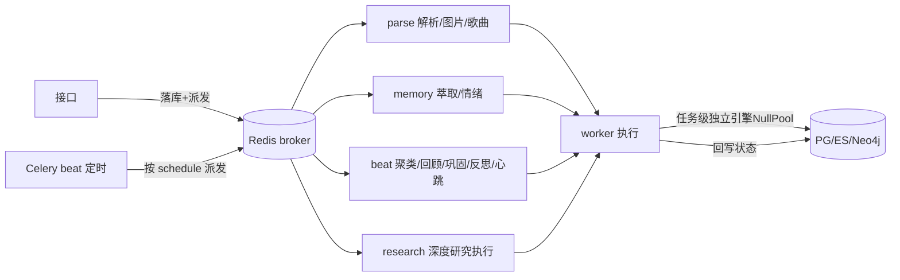

# Celery 异步多队列 — 设计与面试

> 把文档解析、记忆萃取、社区聚类、深度研究等耗时操作丢到后台异步跑，接口立即返回；按域拆多队列互不干扰。
> 对应能力域：**工程化 / 异步任务 / 分布式**。代码：`celery_app.py`（队列 + beat）+ `tasks/*`（各域任务）+ `db/postgres.create_task_engine`。

---

## 0. 能力定位（对应招聘要求）

- 对应 JD：**「Celery / 异步任务队列」「分布式任务」「定时调度」「高并发解耦」**。
- 角色：所有耗时操作的承载层——没有它，上传文档、对话萃取记忆都会卡住接口。

---

## 1. 解决什么问题

- **痛点**：文档解析、记忆萃取（多次调 LLM）、深度研究（几分钟）这些操作很慢，放在请求里同步跑会让接口超时、用户干等。
- **方案**：丢到 **Celery 异步队列**后台跑，接口落库 + 派发任务后立即返回，前端轮询状态。按任务特性拆多队列，避免重活堵轻活。

---

## 2. 架构

---

## 3. 核心设计与实现（后端）

### 3.1 按域拆队列（`celery_app.task_routes`）

四个队列按任务特性拆：
- **parse**：文档解析 / 图片描述 / 歌曲处理（IO + 解析）。
- **memory**：记忆三元组萃取 / 情绪分析（多次调 LLM）。
- **beat**：社区聚类 / 每日回顾 / 记忆巩固 / 反思 / **定时任务心跳**（轻量、定时，不可被重活堵）。
- **research**：定时任务的深度研究执行（最重，几分钟，单独队列）。

> 为什么拆：如果都挤一个队列，一个跑几分钟的深度研究会占住 worker，把「每分钟心跳」「快速解析」全堵住。按特性拆队列 + worker `-Q` 指定监听哪些，实现资源隔离（Bulkhead 隔离舱思想）。

### 3.2 异步任务的事件循环坑（重点踩坑）

Celery 任务是**同步入口**，但项目代码是 async 的。处理：
- 任务里用 `asyncio.run(...)` 跑异步逻辑。
- **每个任务用任务级独立 DB 引擎 + NullPool**（`create_task_engine`）：全局单例引擎的连接池绑定在**主进程的事件循环**上，Celery 每个任务用**新的事件循环**（asyncio.run 每次新建），复用全局池会报「事件循环已关闭/连接绑错循环」。NullPool 不缓存连接（用完即弃），避免跨循环复用。
- ES/Neo4j 客户端同理在任务内重置。

> 面试一句话：Celery 任务是同步入口、内部 asyncio.run 跑异步，但全局 DB 连接池绑在主循环、任务用新循环会报错——所以任务里用独立引擎 + NullPool（用完即弃不跨循环复用），ES/Neo4j 客户端也任务内重置。

### 3.3 Windows 的 --pool=solo

Windows 上 Celery 默认的 prefork pool 有权限问题（WinError 5）。开发时 worker 用 `--pool=solo`（单进程串行执行任务），最稳。任务内部仍 asyncio.run 跑异步，串行够用。生产 Linux 用默认 prefork / threads。

### 3.4 定时调度（beat_schedule）

Celery beat 按 crontab 定时派发：心跳每分钟、每日回顾 22:00、社区聚类 3:00、记忆巩固 4:00、反思 4:30（巩固之后）。**时区设 Asia/Shanghai**（enable_utc=False），否则按 UTC 算点会差 8 小时。

### 3.5 任务状态回写 + 失败处理

耗时任务（解析/萃取/研究）都有状态字段（pending/running/done/failed）。任务开始置 running、完成置 done、失败置 failed + 错误信息，前端轮询。失败保留部分结果（如研究的 partial 正文），可重试。

### 3.6 副作用失败不阻断主流程

「回答后异步萃取记忆」「touch 更新活跃时间」这类副作用，失败只记 warning 不影响主响应——`_dispatch_memory` 即范式（派发失败也不让对话失败）。

---

## 4. 关键设计取舍

| 决策点 | 选了什么 | 备选 | 为什么 |
|--------|---------|------|--------|
| 异步方案 | Celery + Redis | 自研调度器 / 线程池 | 成熟、多队列、定时、可靠投递 |
| 队列划分 | 按域拆 4 队列 | 单队列 | 重活不堵轻活，资源隔离 |
| 任务 DB | 任务级独立引擎 NullPool | 复用全局池 | 跨事件循环复用全局池会报错 |
| Windows pool | solo | prefork | prefork 有 WinError5 权限坑 |
| 时区 | Asia/Shanghai | UTC | 定时点按本地时间，否则差 8 小时 |
| 副作用失败 | 记 warning 不阻断 | 抛出 | 副作用不该影响主流程 |

---

## 5. 踩坑与解决

- **任务里「事件循环已关闭」/ 连接绑错循环**：全局池绑主循环、任务用新循环。解法：任务级独立引擎 + NullPool，ES/Neo4j 客户端任务内重置。
- **Windows worker WinError5**：解法：`--pool=solo`。
- **定时任务点差 8 小时**：UTC 时区。解法：timezone=Asia/Shanghai + enable_utc=False。
- **深度研究堵死心跳**：解法：research 独立队列。
- **异步萃取失败拖垮对话**：解法：副作用 try/except 记 warning 不阻断。

---

## 6. 面试问答

**Q1（核心）：为什么用 Celery？哪些操作走异步？**
文档解析、记忆萃取（多次调 LLM）、社区聚类、深度研究（几分钟）这些慢操作同步跑会超时。丢 Celery 后台跑，接口落库+派发立即返回，前端轮询状态。

**Q2（设计）：为什么拆多队列？**
按任务特性拆 parse/memory/beat/research。重活（几分钟的研究）和轻活（每分钟心跳）同队列的话重活会占住 worker 堵死轻活。拆队列 + worker -Q 指定监听，资源隔离（Bulkhead 思想）。

**Q3（踩坑，高频）：Celery 跑异步代码遇到什么坑？**
任务是同步入口、内部 asyncio.run 跑异步，但全局 DB 连接池绑在主进程事件循环，任务用新循环会报「连接绑错循环」。解法：任务里用独立引擎 + NullPool（用完即弃不跨循环复用），ES/Neo4j 客户端也任务内重置。

**Q4（细节）：beat 定时为什么要设时区？**
Celery 默认 UTC，定时点（如 22:00）会按 UTC 算，比北京时间差 8 小时。设 timezone=Asia/Shanghai + enable_utc=False 才按本地时间。

**Q5（Windows）：为什么 worker 用 solo pool？**
Windows 上 prefork pool 有权限问题（WinError5）。solo 单进程串行执行最稳，任务内 asyncio.run 跑异步串行够用。生产 Linux 用 prefork/threads。

**Q6（可靠性）：任务失败怎么处理？**
任务有状态字段，失败置 failed + 错误信息，保留部分结果（如研究 partial 正文），前端可触发重试。副作用类（异步萃取）失败只记 warning 不影响主流程。

---

## 7. 相关论文 / 概念

**① 异步任务队列模式**
Web 应用「快慢分离」的标准模式：请求只做快操作（落库），慢操作（解析、AI 调用、研究）丢任务队列后台异步处理，前端轮询/推送拿结果。**Celery** 是 Python 生态主流实现（broker 用 Redis/RabbitMQ，worker 执行，beat 定时）。

**② 生产者-消费者 / 消息队列**
任务队列本质是生产者-消费者模型：接口（生产者）把任务投进 broker（消息队列），worker（消费者）消费。解耦 + 削峰填谷 + 可水平扩展 worker。

**③ Bulkhead 隔离舱模式**
微服务韧性模式：把不同特性的请求/任务隔离到不同资源池，一个池满不影响其他（像船的隔离舱进水不沉船）。本项目按域拆队列就是 Bulkhead——重活池满不影响轻活池。

**④ 至少一次投递与幂等**
消息队列通常「至少一次投递」（可能重复消费）。所以任务最好幂等或去重。本项目记忆萃取用 MERGE 幂等、定时任务用锁去重（见调度篇）。

> 一句话脉络：异步任务队列是 Web「快慢分离」的标准模式（Celery 实现生产者-消费者）；按域拆队列是 Bulkhead 隔离舱韧性模式；要注意至少一次投递下的幂等，以及 asyncio + Celery 的事件循环坑。