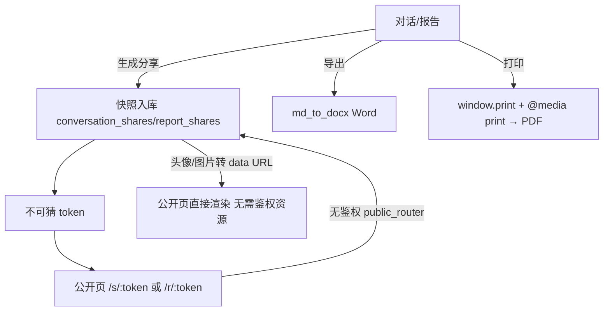

# 分享与导出（对话/报告快照 · 公开页 · Word/PDF）— 设计与面试

> 把对话或研究报告生成「只读公开链接」分享给没登录的人看；报告还能导出 Word / 打印 PDF。
> 对应能力域：**工程化 / 产品功能**。代码：`conversation_share_*` / `report_share` 相关 + 公开 `public_router` + `core/export/md_to_docx.py`（Word）+ 前端 `window.print()`（PDF）。

---

## 0. 能力定位（对应招聘要求）

- 对应 JD：**「分享/公开访问设计」「文件导出」「无鉴权安全」**。
- 角色：传播属性功能——让内容能给外部人看；体现「快照式分享」「无鉴权页安全」「文档格式转换」的工程考量。

---

## 1. 解决什么问题

- **分享痛点**：想把一段对话/一份报告发给别人看，但对方没账号、也不该看到我的其他数据、更不该能改。
- **导出痛点**：报告想存成 Word 归档、或打印成 PDF。

---

## 2. 数据流



---

## 3. 核心设计与实现（后端）

### 3.1 快照式分享（核心设计）

分享**不是把实时数据开放只读访问，而是生成一份快照**：
- 生成分享时，把对话/报告的内容**复制一份存进分享表**（conversation_shares / report_shares），带一个**不可猜的随机 token**。
- 公开页通过 token 读快照，**看到的是分享那一刻的内容**——之后原对话改了/删了不影响已分享的快照。
- 好处：① 原数据和分享解耦（改原数据不影响分享、删分享不影响原数据）；② 公开页只暴露快照内容，不碰原始接口和其他数据；③ 可单独管理分享（改标题、设过期、取消）。

> 面试一句话：分享用快照式——生成时把内容复制一份存进分享表带随机 token，公开页读快照而非实时数据，原数据和分享解耦、且公开页不触碰原始接口，安全又稳定。

### 3.2 无鉴权公开页（`public_router`）

公开页接口挂在**独立的无鉴权路由** `public_router`（`GET /public/shares/{token}`），不走 `get_current_user`。安全靠：
- **token 不可猜**（随机长 token，无法枚举）；
- **只返回快照内容**，不暴露任何需鉴权的数据或接口；
- 可设过期时间、可取消（取消后 token 失效）。

### 3.3 头像/图片转 data URL（无鉴权页的关键处理）

公开页没登录态，**拿不到需要鉴权才能访问的资源**（用户头像、对话里的图片，这些走鉴权文件接口）。解法：生成快照时把头像、图片**转成 base64 data URL** 内嵌进快照（PIL 压缩控大小）。这样公开页直接渲染 data URL，不需要再请求任何鉴权资源。群聊快照还扩展支持多发言人（sender_name/sender_avatar）。

### 3.4 Word 导出（`md_to_docx.markdown_to_docx_bytes`）

报告是 Markdown，用 **python-docx** 转 Word：逐行解析 Markdown（标题 #~###### / 列表 / 引用 > / 表格 | | / 代码块 ``` / 分隔线 / 行内 **加粗** `代码` [链接]）转成对应的 docx 元素。链接降级为纯文字（docx 超链接繁琐，正文以可读为先）。**解析失败降级为纯段落**，不追求像素级还原。返回字节流供下载。

### 3.5 PDF 导出（前端 window.print）

PDF **不在后端生成**，用前端 `window.print()` + `@media print` CSS——打印时只保留报告正文（`.research-print`）、隐藏应用其余部分，用户在打印对话框选「另存为 PDF」。**零后端依赖、中文渲染稳**（后端生成中文 PDF 要处理字体很麻烦）。技巧：把报告克隆到 body 顶层再打印，脱离页面的滚动/定高容器才能正常跨页分页。

---

## 4. 关键设计取舍

| 决策点 | 选了什么 | 备选 | 为什么 |
|--------|---------|------|--------|
| 分享形态 | 快照复制 | 实时只读访问 | 解耦原数据、公开页不碰原接口、可独立管理 |
| 公开页鉴权 | 无鉴权 + 不可猜 token | 临时鉴权 | 给无账号者看，token 不可猜 + 只暴露快照 |
| 头像/图片 | 转 data URL 内嵌快照 | 公开页请求鉴权资源 | 公开页无登录态拿不到鉴权资源 |
| Word 导出 | 后端 python-docx | 前端生成 | 后端解析 Markdown 转 docx 可靠 |
| PDF 导出 | 前端 window.print | 后端生成 PDF | 零依赖、中文稳，免后端字体处理 |
| 解析失败 | 降级纯段落 | 报错 | 导出不追求像素还原，能出就行 |

---

## 5. 踩坑与解决

- **公开页头像/图片裂图**（无登录态拿不到鉴权资源）：解法：快照里把头像/图片转 base64 data URL 内嵌。
- **公开页能被枚举/越权**：解法：不可猜随机 token + 只返快照 + 独立无鉴权路由不碰原接口。
- **后端生成中文 PDF 字体麻烦**：解法：PDF 改前端 window.print。
- **打印只出一页/被截断**：滚动/定高容器裁剪。解法：把正文克隆到 body 顶层再打印，脱离 overflow 容器。
- **静态路由冲突**（`/shares` 被 `/{report_id}` 抢）：解法：静态路由注册在动态路由之前。

---

## 6. 面试问答

**Q1（核心）：分享怎么设计的？为什么用快照？**
生成分享时把对话/报告内容复制一份存进分享表带不可猜 token，公开页读快照而非实时数据。好处：原数据和分享解耦（改原数据不影响分享）、公开页只暴露快照不碰原始接口和其他数据、可单独管理（改标题/过期/取消）。

**Q2（安全）：公开页不鉴权，怎么保证安全？**
挂独立无鉴权路由不走登录态；安全靠 token 不可猜（随机长 token 无法枚举）+ 只返回快照内容不暴露任何需鉴权数据/接口 + 可过期可取消。

**Q3（细节）：公开页的头像图片怎么显示？**
公开页没登录态，拿不到走鉴权的文件资源。所以生成快照时把头像、图片转成 base64 data URL 内嵌进快照（PIL 压缩），公开页直接渲染不需请求鉴权资源。

**Q4（导出）：Word 和 PDF 怎么导出的？**
Word 后端用 python-docx 逐行解析 Markdown 转 docx 元素（标题/列表/表格/代码/行内格式），解析失败降级纯段落。PDF 不后端生成，用前端 window.print + @media print 只留正文，选"另存为 PDF"——零依赖、中文稳，免后端字体处理。

**Q5（细节）：打印为什么要把正文克隆到 body 顶层？**
报告在页面里被滚动/定高容器包着，直接 print 会被 overflow 容器裁成一页。克隆到 body 顶层脱离这些容器，内容才能正常跨多页分页。

---

## 7. 相关论文 / 概念

**① 快照（Snapshot）模式**
「分享/发布时固化一份当前状态」是常见设计——文档分享、订单快照、版本发布都用。核心价值是**解耦「源」和「发布物」**：源变了发布物不变，保证已分享内容稳定、且发布物可独立管理和访问控制。

**② 能力 URL / 不可猜 token（Capability URL）**
用「持有不可猜的 URL/token 即有访问权」做轻量授权，不需登录。适合分享场景。安全前提是 token 足够随机不可枚举、且可吊销。GitHub Gist 私密链接、各类「分享链接」都是这个模式。

**③ data URI scheme（RFC 2397）**
把资源（图片）base64 编码内嵌进 `data:image/png;base64,...`，无需额外请求。代价是体积增大（base64 膨胀约 33%），适合小图标/头像。本项目用它解决公开页无鉴权拿不到资源的问题。

**④ 客户端 vs 服务端文档生成**
导出文档可在前端（window.print/jsPDF）或后端（python-docx/reportlab/wkhtmltopdf）生成。权衡：后端可控、格式统一但要处理字体（中文 PDF 痛点）；前端零依赖、所见即所得但受浏览器限制。本项目 Word 走后端（结构化可靠）、PDF 走前端（避开中文字体）。

> 一句话脉络：分享用快照模式（解耦源与发布物）+ 能力 URL（不可猜 token 轻量授权）+ data URI（解决无鉴权页资源）；导出按场景分工——Word 后端 python-docx 结构化、PDF 前端 print 避开中文字体坑。