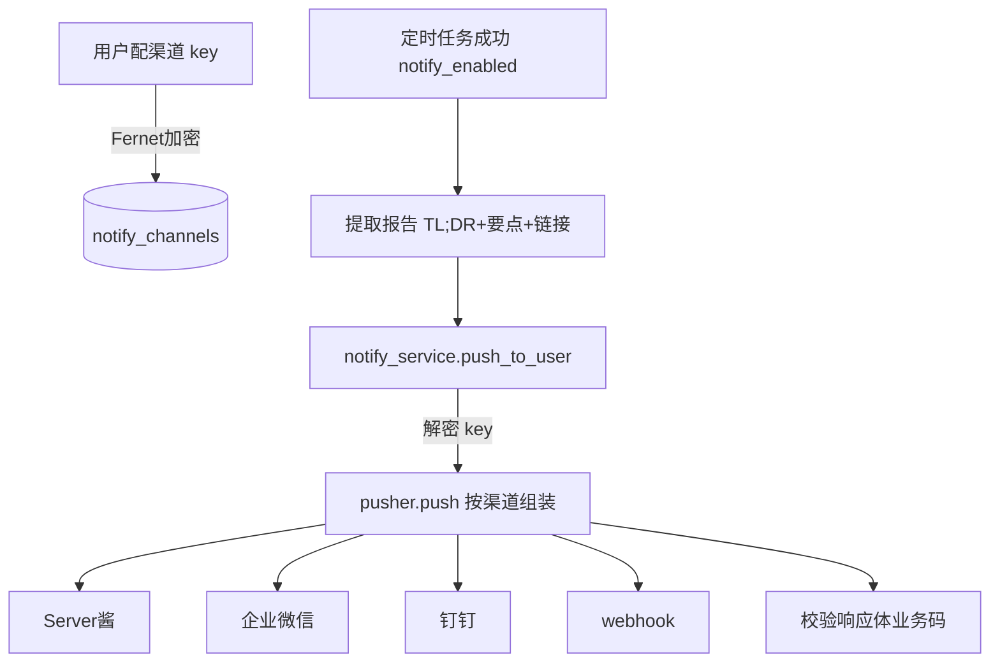

# 消息推送（Server酱 / 企业微信 / 钉钉 / webhook）— 设计与面试

> 定时研究任务跑完，把报告 TL;DR 推到用户手机。每个用户配自己的推送渠道 key，各推各的。
> 对应能力域：**工程化 / 第三方集成 / 通知**。代码：`core/notify/pusher.py`（渠道适配）+ `notify_service.py`（CRUD + 加密）+ `notify_channel_model`。

---

## 0. 能力定位（对应招聘要求）

- 对应 JD：**「第三方服务集成」「消息通知 / webhook」「多渠道适配」**。
- 角色：Agent 闭环的「最后一公里」——任务跑完结果主动送达用户，而非等用户来查。

---

## 1. 解决什么问题

- **痛点**：定时任务在后台跑完，结果躺在系统里，用户不知道。希望跑完**主动推到手机**（微信/企业微信/钉钉）。
- **方案**：接入几家「个人可用、配置简单」的推送服务（Server酱推微信、企业微信群机器人、钉钉群机器人、通用 webhook），每个用户配自己的渠道 key，任务成功后异步推 TL;DR。

---

## 2. 数据流

---

## 3. 核心设计与实现（后端）

### 3.1 渠道适配：统一 (title, content) → 各家 payload（`pusher.push`）

四家渠道本质都是「POST 一个 JSON 到一个 URL，无服务端鉴权（靠 URL 里的 key）」，差异在 payload 格式：
- **Server酱**：`data={title, desp}`，URL 按 key 形态选（见 3.2）。
- **企业微信群机器人**：`{msgtype:markdown, markdown:{content}}`。
- **钉钉群机器人**：`{msgtype:markdown, markdown:{title, text}}`。
- **通用 webhook**：`{title, content}`。
统一入口 `push(channel_type, target, title, content)` 按类型分发组装。单次推送独立 try/except，失败返回 `(False, 原因)` 由上层降级，不抛出。

### 3.2 Server酱按 key 形态选域名（细节）

Server酱有版本差异，**SendKey 形态决定推送地址**：
- Server酱³（`sctp<uid>t<token>`）→ `https://<uid>.push.ft07.com/send/<key>.send`（用正则提取 uid）。
- Turbo 版（`SCT...`）→ `https://sctapi.ftqq.com/<key>.send`。
用正则匹配 key 前缀自动选对地址。

### 3.3 校验响应体而非只看 HTTP 状态（重点踩坑）

**这些推送服务即使业务失败也常返回 HTTP 200**，真正结果在响应体里——`raise_for_status()` 看不出失败。所以 `_check_body` 按渠道校验业务码：
- Server酱看 `code`（0 成功）；
- 企业微信/钉钉看 `errcode`（0 成功）；
- 非 JSON（通用 webhook 返回纯文本）→ HTTP 2xx 即成功。

> 面试一句话：推送服务即使失败也常返回 HTTP 200，所以不能只看状态码，要按渠道解析响应体的业务码（Server酱的 code、企微钉钉的 errcode）才知道真投递成功没。

### 3.4 每用户配自己的 key + Fernet 加密（`notify_service`）

- `notify_channels` 表：channel_type + **target（key/url，Fernet 加密存）** + enabled。每个用户配自己的渠道，**各推各的**（不是系统统一一个推送号）。
- key 是敏感信息，Fernet 加密存储、接口返回掩码（同 API Key 处理）。
- 提供 test_push 测试推送、push_to_user（取用户所有启用渠道逐个推）。

### 3.5 接入定时任务（`agent_task._notify_user`）

任务成功且 `notify_enabled` → `_extract_summary` 从报告 Markdown 提取 TL;DR（引用块）+ 核心要点前几条 + 报告链接 → `push_to_user` 推到用户所有启用渠道。**整步降级**——推送失败只记 warning，绝不影响任务本身（任务已成功落库）。

---

## 4. 关键设计取舍

| 决策点 | 选了什么 | 备选 | 为什么 |
|--------|---------|------|--------|
| 渠道 | Server酱/企微/钉钉/webhook | 自建推送/SMTP | 个人可用、配置简单、免维护推送基建；不做 SMTP |
| key 归属 | 每用户配自己的 | 系统统一推送号 | 各推各的，隐私 + 不需企业级推送账号 |
| key 存储 | Fernet 加密 + 掩码 | 明文 | 敏感信息加密（同 API Key）|
| 成功判定 | 校验响应体业务码 | 只看 HTTP 200 | 失败也常返 200，必须看业务码 |
| 推送失败 | 降级不影响任务 | 失败重试/抛出 | 任务已成功，推送是附加，不该拖累 |
| Server酱地址 | 按 key 形态正则选 | 写死一个 | 版本不同地址不同 |

---

## 5. 踩坑与解决

- **推送"成功"但手机没收到**：HTTP 200 不代表投递成功。解法：`_check_body` 按渠道解析业务码（code/errcode）。
- **Server酱地址不对**：版本不同地址不同。解法：按 SendKey 前缀正则选域名。
- **推送失败拖累定时任务**：解法：推送整步 try/except 降级，只记 warning。
- **key 明文泄露风险**：解法：Fernet 加密存储 + 返回掩码。
- **通用 webhook 返回纯文本无法解析**：解法：非 JSON 响应按 HTTP 2xx 判成功。

---

## 6. 面试问答

**Q1（核心）：消息推送怎么做的？**
接 Server酱（推微信）/企业微信/钉钉群机器人/通用 webhook 四家。本质都是 POST JSON 到一个带 key 的 URL，统一入口按渠道组装 payload。每个用户配自己的渠道 key（Fernet 加密），定时任务成功后异步推报告 TL;DR。

**Q2（踩坑，高频）：推送怎么判断成功？**
不能只看 HTTP 状态码——这些服务业务失败也常返回 200，真结果在响应体。要按渠道解析业务码：Server酱看 code、企微钉钉看 errcode，0 才是真成功；通用 webhook 非 JSON 则 2xx 即成功。

**Q3（设计）：为什么每个用户配自己的 key 不用统一推送号？**
各推各的——用户推到自己的微信/企微，隐私且不需要企业级统一推送账号。key 是敏感信息，Fernet 加密存、返回掩码。

**Q4（健壮性）：推送失败会影响任务吗？**
不会。推送是任务成功后的附加动作，整步 try/except 降级只记 warning。任务本身已成功落库，不能因推送失败而标失败。

**Q5（细节）：为什么不做邮件 SMTP？**
SMTP 要配邮件服务器/授权码、易进垃圾箱、个人配置麻烦。Server酱/群机器人这些对个人更友好、配置简单、即时到手机。按需选了轻量方案。

---

## 7. 相关论文 / 概念

**① Webhook 与回调推送**
Webhook 是「事件发生时主动 POST 到预设 URL」的回调机制，是系统间集成的常见方式（相对轮询，是推而非拉）。Server酱/企微/钉钉群机器人本质都是 webhook——给你一个 URL，POST 消息即推送。

**② 适配器模式（Adapter Pattern）**
多个外部渠道接口各异，用统一接口（`push(channel_type, ...)`）+ 按类型分发组装，屏蔽差异。新增渠道只加一个分支。这是适配器/策略模式的应用。

**③ 优雅降级（Graceful Degradation）**
非核心功能（推送）失败不影响核心（任务）。本项目推送整步降级，体现「核心链路不被附加功能拖累」的可用性原则。

**④ 幂等性与「至少一次」**
通知系统常面临重复推送问题（重试导致）。本项目推送是任务成功后一次性触发、失败不重试（避免重复打扰），简单可靠；要可靠送达可加去重 + 重试。

> 一句话脉络：推送基于 webhook 回调机制（推而非拉），用适配器模式统一多渠道差异；判成功要看响应体业务码而非 HTTP 状态；非核心功能优雅降级不拖累任务。