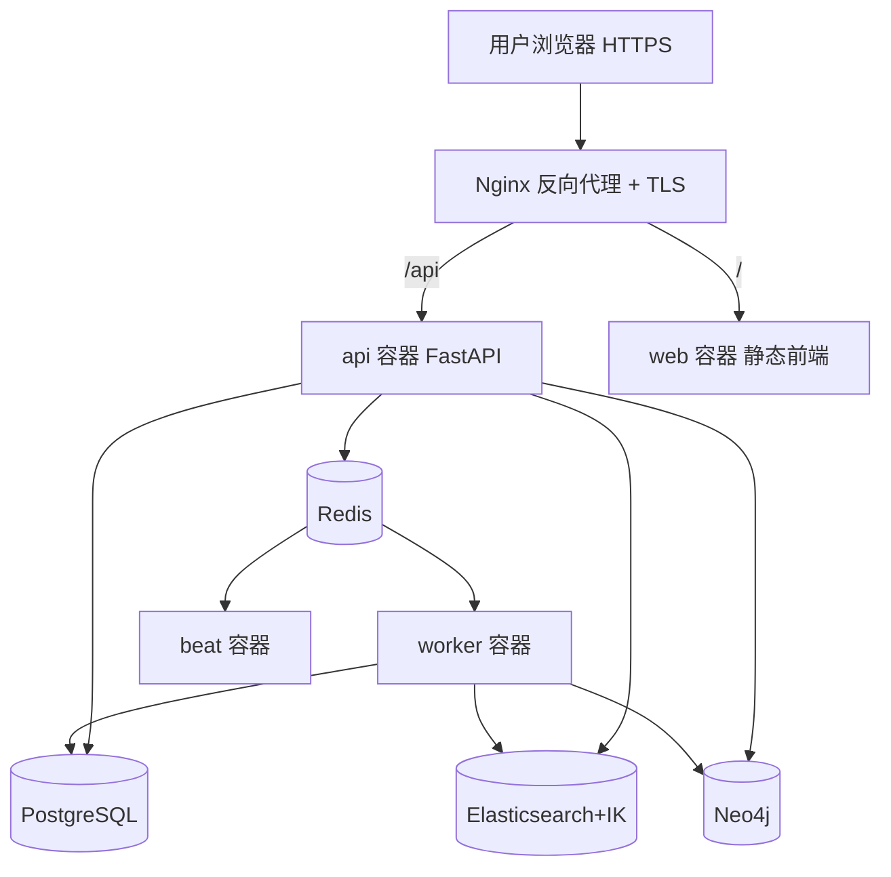

# 部署 · HTTPS · 踩坑集 — 设计与面试

> Docker Compose 部署到腾讯云、Nginx 反代 + HTTPS，以及全项目踩过的工程坑汇总。
> 对应能力域：**工程化 / 部署运维**。部署形态：腾讯云轻量 + Docker Compose + Nginx + Let's Encrypt HTTPS（`https://cometxrzs.top`）。

---

## 0. 能力定位（对应招聘要求）

- 对应 JD：**「Docker / 容器化部署」「Nginx 反向代理」「HTTPS」「问题排查」**。
- 角色：把项目真正跑起来、对外可访问的落地层；踩坑集体现真实工程经验。

---

## 1. 解决什么问题

把「四存储 + api + worker + beat + web」一套服务在云服务器上稳定跑起来、对外 HTTPS 访问，并解决部署过程中暴露的各类工程问题。

---

## 2. 部署架构

---

## 3. 核心设计与实现（部署）

### 3.1 Docker Compose 编排

一套 compose 起：四存储（PostgreSQL / Elasticsearch 装 IK 分词 / Neo4j / Redis）+ api（FastAPI）+ worker（Celery）+ beat（Celery 定时）+ web（前端构建产物）。改后端 `up -d --build api`、改前端 `up -d --build web`。开发期存储用容器、应用本地起；部署期全容器化。

### 3.2 Nginx 反向代理 + HTTPS

- Nginx 统一入口：`/api` 转后端、`/` 转前端静态。
- HTTPS：域名备案 + Let's Encrypt 证书，`cometxrzs.top` 绿锁。
- **`client_max_body_size 100m`**：修文档/图片上传 413（默认 1m 太小）。
- **`X-Accel-Buffering: no` / `proxy_buffering off`**：SSE 流式必须关 Nginx 缓冲，否则不是真流式（见 SSE 篇）。

### 3.3 Celery worker 启动

worker `-Q` 要包含所有用到的队列：`default,parse,memory,beat,research`。Windows 开发用 `--pool=solo`；Linux 生产用 prefork/threads。beat 单独起。改了 tasks/celery_app 要重启 worker + beat。

### 3.4 迁移管理

新建 model 跑 Alembic 迁移；部署时按迁移链顺序 upgrade。`alembic.ini` 保持纯 ASCII（Windows GBK 读中文报错）。新建 model 要在 migrations/env.py import 否则 autogenerate 检测不到。

---

## 4. 全项目踩坑集（面试可挑讲）

> 这是分散在各模块的真实踩坑汇总，面试「你踩过什么坑」可挑印象深的讲。

| 坑 | 现象 | 根因 | 解法 |
|----|------|------|------|
| **Celery 事件循环** | 任务报「事件循环已关闭」 | 全局 DB 池绑主循环，任务用新循环 | 任务级独立引擎 + NullPool，客户端任务内重置 |
| **Windows worker** | WinError5 权限错 | prefork pool Windows 不兼容 | `--pool=solo` |
| **SSE 不流式** | 部署后憋一下全出 | Nginx 缓冲响应 | `X-Accel-Buffering: no` + proxy_buffering off |
| **上传 413** | 大文件上传失败 | Nginx client_max_body_size 默认 1m | 调到 100m |
| **重复「用户」节点** | 图谱多个同名实体 | 第二层去重同名也问 LLM，非确定性 | 同名快路径直接复用 + 历史合并接口 |
| **ES kb_id 过滤失效** | 多库检索不准 | 动态映射把 kb_id 推成 text，不可原地改 | 启动自检 + reindex 自愈 |
| **中文 BM25 差** | 检索按单字切 | ES 默认分词 | 装 IK 插件 |
| **MCP 每轮握手慢** | 首字延迟高 | 单聊每轮预开 MCP 会话 | 单聊无状态版只在真调用时连 |
| **MCP 公网被 SSRF 拦** | 不允许访问该地址 | 代理 fake-ip(198.18.x.x)被判内网 | mcp_allow_private_url 开关 |
| **定时任务重复/重叠跑** | 同任务并发 | 多 beat 触发 / interval<耗时 | SKIP LOCKED 认领 + Redis 锁 |
| **定时点差 8 小时** | 任务在错误时间跑 | Celery 默认 UTC | timezone=Asia/Shanghai |
| **推送"成功"没收到** | 状态 200 但没推送 | 业务失败也返 200 | 校验响应体业务码 |
| **公开页图片裂图** | 分享页头像/图不显示 | 无登录态拿不到鉴权资源 | 快照转 data URL 内嵌 |
| **多模态大图 400** | 看图接口报错 | base64 太大 | 先压缩缩放 |
| **网页抓取 521/403** | 导入网页失败 | 反爬拦截 | 真实浏览器 UA + 重试 |

### 真人模式调优的教训（方法论坑）

调真人模式去 AI 味时，加 frequency/presence penalty + 高温度**反而更糟**（penalty 逼模型用生僻词、说更多，与"短口语"冲突）——回滚后改用「调 system prompt 顺序（真人风格放最后压住背景块）+ 补正经话题 few-shot」才有效。教训：**改前想清楚参数的作用方向，别想当然；改完小步验证**。

---

## 5. 面试问答

**Q1：项目怎么部署的？**
Docker Compose 一套起四存储（PG/ES+IK/Neo4j/Redis）+ api/worker/beat/web，腾讯云轻量服务器，Nginx 反代 + Let's Encrypt HTTPS。改后端/前端分别 `up -d --build api/web`。

**Q2：部署 SSE 流式遇到什么坑？**
Nginx 默认缓冲后端响应，导致 SSE 不流式（前端憋一下全出）。响应头加 X-Accel-Buffering: no + Nginx proxy_buffering off 才是真流式。

**Q3：印象最深的坑？**（挑一个讲深）
比如「重复用户节点」：第二层实体去重早期同名也问 LLM，LLM 非确定性 + 倾向不合并，导致「用户」反复被判为不同建重复节点。修复加同名快路径（同名直接复用不问 LLM）+ 历史合并接口。体现了「LLM 非确定性要用规则兜住稳定 case」的认知。

**Q4：Celery 部署注意什么？**
worker -Q 要含所有队列（default/parse/memory/beat/research），改 tasks/celery 要重启 worker+beat，时区设 Asia/Shanghai，Windows 用 solo pool，新建 model 跑迁移。

**Q5：为什么开发期存储用容器、应用本地起？**
存储（PG/ES/Neo4j/Redis）容器起省配置、隔离干净；应用（api/worker/web）本地起方便热重载、断点调试。部署期才全容器化。

---

## 6. 相关概念

**① 容器化与编排**：Docker 把应用 + 依赖打包成镜像，Compose 编排多容器（定义服务/网络/卷）。好处是环境一致（「在我机器能跑」问题）、一键起整套。

**② 反向代理（Reverse Proxy）**：Nginx 作为统一入口，按路径转发到后端服务、终结 TLS、做缓冲/限流/静态托管。是 Web 部署标准组件。

**③ TLS/HTTPS 与 Let's Encrypt**：HTTPS 靠 TLS 加密传输 + 证书验证身份。Let's Encrypt 提供免费自动化证书。麦克风/地理位置等浏览器 API 要求 HTTPS（这也是 ASR 上线要 HTTPS 的原因）。

**④ 数据库迁移（Migration）**：Alembic 管理 schema 版本演进，迁移脚本可升降级、按链顺序应用，保证多环境 schema 一致。

> 一句话脉络：部署用 Docker Compose 容器化 + Nginx 反代 + Let's Encrypt HTTPS；踩坑集中在「异步事件循环、SSE 缓冲、LLM 非确定性、ES 动态映射、调度并发」几类——都是 AI 应用工程化的典型坑。