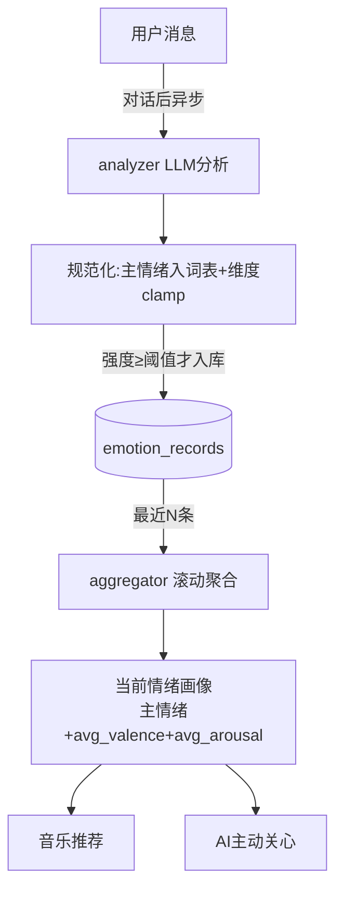

# 情绪计算（valence-arousal 二维情绪）— 设计与面试

> 每轮对话后异步分析用户情绪，用 valence（愉悦度）-arousal（激活度）二维 + 受控情绪词表表示，滚动聚合成「当前情绪画像」，供音乐推荐、AI 关心消费。
> 对应能力域：**情绪计算 / 个性化**。代码：`core/emotion/`（analyzer / aggregator / ontology）。

---

## 0. 能力定位（对应招聘要求）

- 对应 JD：**「情感计算 / 情绪识别」「LLM 结构化输出」「个性化」**。
- 角色：给系统加「情绪感知」——知道用户此刻什么心情，是音乐推荐和 AI 主动关心的数据基础。差异化亮点。

---

## 1. 解决什么问题

- **痛点**：助手只懂内容不懂情绪。想让它感知用户心情（开心/低落/焦虑），据此推合适的音乐、说合适的关心话。
- **方案**：每轮对话后异步用 LLM 分析用户情绪，但不只打个「开心/难过」标签，而是用 **valence-arousal 二维连续坐标**表示（情绪可计算、可算距离），滚动聚合成当前情绪画像。

---

## 2. 数据流

---

## 3. 核心设计与实现（后端）

### 3.1 为什么用 valence-arousal 二维而非情绪标签

只打「开心/难过」离散标签，**无法计算情绪之间的距离和关系**。心理学的 valence-arousal 模型把情绪放到二维连续空间：
- **valence（效价/愉悦度）**：-1（极不愉悦）~ +1（极愉悦）。
- **arousal（激活度/唤醒度）**：0（平静）~ 1（亢奋）。
比如「兴奋」是高 valence + 高 arousal，「平静满足」是高 valence + 低 arousal，「焦虑」是低 valence + 高 arousal，「抑郁」是低 valence + 低 arousal。
**这样情绪可量化、可算距离**——音乐推荐才能算「歌的情绪坐标和用户当前情绪坐标的距离」选歌（见音乐篇）。同时保留一个**受控情绪词表**的主情绪标签（便于展示和理解）。

> 面试一句话：不用离散情绪标签而用 valence-arousal 二维连续坐标，因为坐标可计算距离——音乐推荐能算「歌的情绪和用户情绪的欧氏距离」选歌，离散标签做不到。同时保留受控词表的主情绪标签便于展示。

### 3.2 情绪分析（`analyzer.analyze_emotion`）

LLM 对单段用户文本分析，输出结构化 JSON：emotion_type（主情绪）、intensity（强度）、valence、arousal、keywords、trigger（触发源）、summary。规范化处理：
- **主情绪归一到受控词表**（`normalize_emotion`），越界归默认；
- **维度值 clamp 到合法区间**（valence [-1,1]、arousal [0,1]、intensity [0,1]）；
- 缺失维度用该情绪的**参考坐标**（reference_coords）兜底。

健壮性：LLM 调用 + json_repair 解析带**有限重试**（情绪对结果敏感），连续失败返回**中性兜底**不抛异常。

### 3.3 强度阈值过滤（入库前）

弱情绪（intensity < `emotion_min_intensity`）**丢弃不入库**——日常中性闲聊没必要记一堆"中性"噪声，只留有意义的情绪波动。

### 3.4 滚动聚合画像（`aggregator.aggregate_profile`）

当前情绪画像取**最近 N 条**（`emotion_profile_window`）情绪记录滚动聚合：
- avg_valence / avg_arousal：算术平均（反映近期整体情绪基线）；
- dominant_emotion：出现次数最多的主情绪（并列取累计强度更高者）。
- 中性记录也纳入统计，反映真实基线。
取最近 N 条而非全部，是为了反映「当前/近期」情绪而非历史平均。

### 3.5 异步执行 + 与记忆萃取并存

情绪分析走 Celery memory 队列异步（对话后台），和记忆萃取并行不阻塞回答。情绪记录单独存 PG（emotion_records），萃取的陈述节点也并存情绪字段（图谱里的情绪标注）。

---

## 4. 关键设计取舍

| 决策点 | 选了什么 | 备选 | 为什么 |
|--------|---------|------|--------|
| 情绪表示 | valence-arousal 二维 + 词表标签 | 纯离散标签 | 坐标可计算距离（音乐推荐需要），标签便于展示 |
| 维度规范化 | clamp + 参考坐标兜底 | 信任 LLM 输出 | LLM 可能给越界/缺失值 |
| 入库 | 强度阈值过滤弱情绪 | 全入库 | 滤掉中性闲聊噪声 |
| 画像 | 最近 N 条滚动聚合 | 全历史平均 | 反映当前情绪而非历史均值 |
| 执行 | 异步 + 有限重试 | 同步 / 一次失败放弃 | 不阻塞对话；情绪敏感要重试 |
| 失败 | 中性兜底 | 抛异常 | 情绪是附加能力不该炸主流程 |

---

## 5. 踩坑与解决

- **LLM 给越界/缺失维度值**：解法：clamp 到合法区间 + 缺失用参考坐标兜底。
- **中性闲聊噪声入库**：解法：强度阈值过滤弱情绪。
- **情绪分析失败影响对话**：解法：异步执行 + 中性兜底不抛异常。
- **情绪 JSON 解析失败**：解法：json_repair + 有限重试 + 中性兜底。
- **画像被历史情绪拖累**：解法：只取最近 N 条滚动聚合。

---

## 6. 面试问答

**Q1（核心）：情绪怎么表示的？为什么不用标签？**
用 valence（愉悦度 -1~1）- arousal（激活度 0~1）二维连续坐标 + 受控词表的主情绪标签。不用纯离散标签是因为坐标能算距离——音乐推荐要算「歌的情绪坐标和用户当前情绪的欧氏距离」选歌，离散标签算不了。

**Q2（原理）：valence-arousal 怎么对应具体情绪？**
二维空间四象限：高 valence+高 arousal=兴奋、高 valence+低 arousal=平静满足、低 valence+高 arousal=焦虑、低 valence+低 arousal=抑郁。任何情绪都能定位到这个平面上的一个点。

**Q3（工程）：怎么保证情绪分析的稳定性？**
LLM 输出规范化：主情绪归一到受控词表、维度 clamp 到合法区间、缺失用参考坐标兜底；调用带有限重试 + json_repair 解析；连续失败返回中性兜底不抛异常；异步执行不阻塞对话。

**Q4（设计）：当前情绪画像怎么算？**
取最近 N 条情绪记录滚动聚合：avg_valence/arousal 算术平均、主情绪取出现最多的。取最近 N 条而非全历史，反映当前/近期情绪而非历史平均。

**Q5（细节）：为什么弱情绪不入库？**
日常中性闲聊会产生一堆"中性、强度低"的记录，是噪声。设强度阈值，只留有意义的情绪波动入库，画像更准。

---

## 7. 相关论文 / 概念

**① 情感的维度模型：Russell 环形情感模型（Circumplex Model of Affect，Russell 1980）**
心理学经典模型，提出情感可由两个独立维度描述：**valence（愉悦-不愉悦）** 和 **arousal（激活-平静）**，所有情绪分布在这两维构成的环形空间上。这是「用二维坐标表示情绪」的理论根基。相对「离散基本情绪论」（Ekman 的快乐/悲伤/愤怒/恐惧/惊讶/厌恶六种基本情绪），维度模型的优势是**连续、可计算、可表达情绪间的渐变和距离**。本项目正是用 Russell 模型的 valence-arousal 二维。

**② 情感计算（Affective Computing，Picard 1997，MIT）**
让计算机识别、理解、表达情感的研究领域。本项目的情绪识别 + 据情绪推荐音乐/关心，属情感计算的应用。

**③ 文本情感分析（Sentiment Analysis）的演进**
从「正负二分类」→「细粒度多类别」→「维度回归（预测 valence/arousal 连续值）」。传统用词典/机器学习，现在 LLM 能直接做结构化情绪分析（输出维度值 + 标签 + 触发源），本项目即用 LLM。

**④ 受控词表 + 维度的混合表示**
纯维度不直观（用户看不懂 valence=0.7），纯标签不可计算。本项目「受控词表标签（展示/理解）+ valence-arousal 坐标（计算）」是两者结合，兼顾可读和可算。

> 一句话脉络：情绪表示用 Russell 环形情感模型的 valence-arousal 二维（连续可计算，优于离散基本情绪论）；属情感计算（Picard）的应用；文本情感分析从分类演进到维度回归，本项目用 LLM 直接做结构化情绪分析 + 受控词表标签辅助展示。