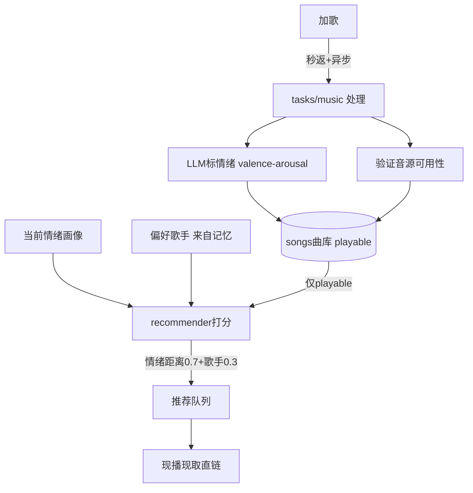

# 情绪化音乐推荐 — 设计与面试

> 按「当前情绪 + 偏好歌手」给用户推歌：算歌曲情绪坐标和用户情绪坐标的距离 + 偏好加权打分选歌；自建曲库 + LLM 情绪标注 + 多层音源降级。
> 对应能力域：**个性化推荐 / 情绪应用**。代码：`core/music/recommender.py`（打分）+ `mood_tagger`（LLM 标注）+ `migu_client`（音源）+ `tasks/music.py`（异步处理）。

---

## 0. 能力定位（对应招聘要求）

- 对应 JD：**「推荐算法 / 个性化」「多信号融合排序」「外部 API 集成」「异步处理」**。
- 角色：消费情绪画像做个性化推荐，是「情绪感知 → 行动」的闭环；也体现推荐打分、音源降级、异步处理等工程。

---

## 1. 解决什么问题

- **痛点**：想根据用户**当前心情**推合适的音乐（难过时舒缓、兴奋时燃），而不是随机或只按热度。
- **方案**：自建带情绪标注的曲库（LLM 标 valence-arousal），推荐时算「歌的情绪坐标」和「用户当前情绪坐标」的距离 + 偏好歌手加权打分选歌；音源做三层降级保证可播。

---

## 2. 数据流

---

## 3. 核心设计与实现（后端）

### 3.1 推荐打分：情绪距离 + 偏好加权（`recommender.score_songs`）

核心是**情绪坐标距离**。每首歌有 valence-arousal 坐标（LLM 标注），用户有当前情绪坐标（情绪画像）：
- **情绪匹配度** = `1 - 归一化欧氏距离`（歌和用户情绪坐标越近越高）。valence-arousal 空间最大距离是 `sqrt(5)`（valence 跨度 2、arousal 跨度 1），用它归一化到 0~1。
- **综合分** = `0.7 · 情绪匹配 + 0.3 · 偏好歌手命中`。偏好歌手来自记忆图谱（用户常听的歌手，子串双向匹配）。
- 按综合分降序，取 top 带少量随机（换批），生成推荐语。**纯打分不调 LLM**，快。

> 面试一句话：推荐是 valence-arousal 空间的距离打分——算每首歌情绪坐标和用户当前情绪坐标的归一化欧氏距离作匹配度（0.7 权重），叠加偏好歌手命中（0.3），降序选歌。情绪可计算距离正是用二维坐标而非标签的价值所在。

### 3.2 LLM 情绪标注（`mood_tagger`，复用情绪词表）

加歌时用 LLM 给歌曲标 valence-arousal + mood_tags（复用情绪模块的受控词表），让歌曲进入同一个情绪坐标空间，才能和用户情绪算距离。

### 3.3 音源三层降级（保证可播）

音乐能不能播是体验关键，三层降级：
1. **本地上传 mp3**（最稳，VIP 歌降级到这）；
2. **咪咕免费音源现播现取**（搜索 → 取免费 mp3 直链 → 现播现取，不存储）；
3. **仅展示**（无音源的明确标记 playable=False，不推荐、不可点播）。
推荐队列**只推 playable 的歌**，切歌时自动跳过无音源的。

### 3.4 歌曲处理异步化（`tasks/music.py`）

加歌涉及补封面/歌词/专辑 + LLM 情绪标注 + 音源验证，慢。所以**加歌秒返回 + 异步处理**：入库即返回（status=pending），派 Celery 任务（parse 队列）做处理，完成回写 playable/tag_status，前端 pending 轮询。不让用户加歌时干等。

### 3.5 偏好歌手来自记忆（模块协同）

偏好歌手不是单独维护，而是**从记忆图谱取**——用户聊过"喜欢周杰伦"会被萃取成记忆实体，推荐时查出来作偏好。情绪（情绪模块）+ 偏好（记忆模块）两个信号融合，体现模块协同。

---

## 4. 关键设计取舍

| 决策点 | 选了什么 | 备选 | 为什么 |
|--------|---------|------|--------|
| 推荐依据 | 情绪坐标距离 + 偏好加权 | 协同过滤 / 热度 | 个人场景无海量行为数据，情绪+偏好直接可用 |
| 情绪匹配 | valence-arousal 欧氏距离 | 标签匹配 | 坐标可算连续距离，比标签精细 |
| 打分 | 纯规则不调 LLM | LLM 选歌 | 快、可控、省调用 |
| 音源 | 三层降级 | 单一源 | 保证可播，免费优先 |
| 歌曲处理 | 加歌秒返 + 异步 | 同步处理 | 标注+音源验证慢，不让用户等 |
| 偏好来源 | 从记忆图谱取 | 单独维护 | 复用记忆，模块协同 |

---

## 5. 踩坑与解决

- **推荐了不能播的歌**：解法：推荐队列只推 playable，切歌跳过无音源。
- **加歌卡很久**：标注+音源验证慢。解法：秒返回 + 异步处理 + pending 轮询。
- **VIP 歌取不到音源**：解法：降级到本地上传/仅展示。
- **歌曲不在情绪空间无法推荐**：解法：加歌时 LLM 标 valence-arousal 进同一坐标空间。

---

## 6. 面试问答

**Q1（核心）：音乐推荐怎么做的？**
按当前情绪 + 偏好歌手打分。每首歌有 valence-arousal 坐标（LLM 标），用户有当前情绪坐标。算两者归一化欧氏距离作情绪匹配度（0.7 权重）+ 偏好歌手命中（0.3），降序选歌。纯打分不调 LLM。

**Q2（设计）：为什么情绪用坐标推荐有优势？**
坐标能算连续距离——难过（低 valence）时推情绪坐标也偏低/舒缓的歌、兴奋时推高激活的歌，是平滑匹配而非离散标签硬配。这正是 valence-arousal 二维表示的价值。

**Q3（工程）：音源怎么保证能播？**
三层降级：本地上传 mp3（最稳）> 咪咕免费现播现取直链 > 仅展示（无音源标记不可播）。推荐只推 playable 的，切歌自动跳过无音源的。

**Q4（异步）：加歌为什么异步？**
加歌要补封面/歌词 + LLM 情绪标注 + 音源验证，慢。所以入库即秒返回（pending），派 Celery 任务后台处理，完成回写状态，前端轮询。不让用户干等。

**Q5（协同）：偏好歌手哪来的？**
从记忆图谱取——用户聊过"喜欢某歌手"会被萃取成记忆实体，推荐时查出来。情绪信号（情绪模块）+ 偏好信号（记忆模块）融合，模块协同。

**Q6（推荐进阶）：这算什么推荐？和协同过滤区别？**
属基于内容/上下文的推荐——用歌曲属性（情绪坐标）和用户上下文（当前情绪、偏好）匹配，不需要海量用户行为数据。协同过滤靠"和你相似的人喜欢什么"，需要规模化行为数据，个人场景不适用。

---

## 7. 相关论文 / 概念

**① 推荐系统的两大范式**
- **协同过滤（Collaborative Filtering）**：靠用户-物品交互矩阵，"喜欢相似物品的人"或"相似用户喜欢的物品"。需要规模化行为数据，有冷启动问题。
- **基于内容/上下文（Content-based / Context-aware）**：用物品属性和用户画像/上下文匹配。本项目属此——歌曲情绪坐标（内容）+ 用户当前情绪和偏好（上下文）匹配，个人场景无需海量数据。

**② 音乐情感识别（Music Emotion Recognition, MER）**
给音乐标情感的研究领域，常用的正是 **valence-arousal 二维模型**（Russell 环形模型，见情绪篇）——把歌曲映射到情绪平面。本项目用 LLM 给歌标 valence-arousal 即此，让歌和用户情绪在同一空间可比。

**③ 情境感知推荐（Context-Aware Recommendation）**
把「情境」（时间、地点、**情绪**、活动）纳入推荐。情绪是重要情境信号——心情驱动的音乐推荐是 context-aware recommendation 的典型。

**④ 多信号融合排序**
推荐排序常融合多个信号（相关度、偏好、时效、多样性）加权。本项目融合「情绪匹配 + 偏好歌手」两信号加权，是轻量的多信号融合。

> 一句话脉络：音乐推荐属基于内容/情境感知推荐（非协同过滤，适合无海量行为数据的个人场景）；用音乐情感识别（MER）的 valence-arousal 表示让歌和用户情绪同空间可比；按情绪距离 + 偏好做多信号融合打分。