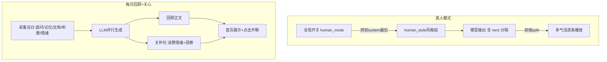

# 真人对话模式 · AI 主动关心 · 每日回顾 — 设计与面试

> 三个让 AI「更像人、更主动」的能力：真人对话模式（像微信朋友聊天）、AI 主动关心（今日回顾加前瞻关怀句）、每日回顾（汇总当日动态成简报）。
> 对应能力域：**个性化 / 拟人化交互**。代码：`prompts/human_style.jinja2`、`daily_review_service.py`、`chat_service` 真人模式拼装。

---

## 0. 能力定位（对应招聘要求）

- 对应 JD：**「提示词工程 / 拟人化」「主动式 AI / 个性化交互」「LLM 摘要」**。
- 角色：把助手从「问答机器」往「有温度的伙伴」推；体现提示词工程、主动交互、异步生成等。

---

## 1. 解决什么问题

- **真人对话模式**：默认 AI 腔太重（结构化、客服腔、爱总结）。想让它像微信朋友一样口语、短句、自然。
- **每日回顾**：用户每天用了这么多功能，想要个汇总——今天提问了啥、记了啥、听了啥。
- **AI 主动关心**：不只被动答，还能基于了解主动说句关心的话、引导开聊。

---

## 2. 数据流

---

## 3. 核心设计与实现（后端）

### 3.1 真人对话模式（全局开关 + 提示词 + 多气泡）

- **全局开关** `agent_configs.human_mode`（用户级，单聊群聊统一）。初版做成每角色，因「每角色都设很奇怪」回退为全局。
- **风格提示词** `human_style.jinja2`：核心原则（口语短句、像微信）+ 不要做（markdown/客服腔/AI 身份/堆 emoji）+ 分条规则 + few-shot。**关键：拼在 system prompt 最末尾**（越靠后权重越大，压住前面的记忆/时效背景块，不让它回到助手腔——这是调优出来的，详见踩坑）。
- **多气泡 render-split**：模型在断句处输出 `[[next]]`，前端 split 成多气泡逐条延时播放（拟真"正在输入"节奏），cap 3 条。
- 真人模式隐藏过程条（正在理解问题…）+ 隐藏底部操作排（复制/赞踩/时间），更像聊天。

### 3.2 真人模式去 AI 味的调优历程（诚实的方法论）

去 AI 味踩了弯路，值得讲：
- **提示词瘦身**：原模板被反复打补丁后臃肿重复，重写成精简版（弱模型对大段重复负向指令易抓错重点）。
- **采样参数实验后回滚**：曾加 frequency/presence penalty + 高温度，**反而更糟**——penalty 逼模型用生僻词、说更多，与"短口语"冲突。回滚。
- **system prompt 顺序调整（有效）**：把风格段挪到最末尾压住背景块。
- **补"聊正经事别播报"few-shot**：闲聊像真人但一问新闻就大段播报，根因是事实问题触发"答题模式"+ 缺"正经话题用人话聊"的样板，补 few-shot 解决。
> 教训：改前想清参数作用方向别想当然；提示词顺序（recency）对强模型影响大；few-shot 是塑造输出最有效手段。**诚实局限**：拟人度天花板在模型本身，弱模型怎么调都有 AI 味。

### 3.3 每日回顾（`daily_review_service`）

汇总当日动态成简报：
- **采集**：当日用户提问、主动记住、新文档、听的歌、情绪画像（群聊只算本人发言，多租户隔离）。
- **生成**：LLM 生成回顾正文 + 关怀句，**两次 LLM 调用并行**（gather，纯 httpx 无 session 依赖）。
- **性能优化（首屏不等 LLM）**：`get_or_generate` 先秒回「即时统计文案/旧回顾」，派后台任务异步重生成完整正文，返回 `generating=True` 前端轮询拿最终结果。无活动则即时兜底不调 LLM；活动统计没变则复用旧回顾。
- 双触发：进仪表盘按需 + Celery beat 每天 22:00 批量。

### 3.4 AI 主动关心（`_call_care`）

强化每日回顾——独立 prompt（daily_care.jinja2）消费**情绪画像 + 「AI 眼中的你」洞察 top3 + 当日记忆/提问**，生成一句 ≤40 字的前瞻关怀句。首页关怀条 + 「聊聊」按钮跳对话主动开场（greeting 落库进历史，模型能接住）。体现「AI 基于对你的了解主动关心」——消费了情绪、记忆、反思洞察多个模块的产出。

---

## 4. 关键设计取舍

| 决策点 | 选了什么 | 备选 | 为什么 |
|--------|---------|------|--------|
| 真人开关 | 全局 user 级 | 每角色 | 每角色都设很奇怪，回退全局 |
| 风格注入 | 拼 system 最末尾 | 中间 | recency：最后的指令权重大，压住背景块 |
| 多气泡 | 模型输出 [[next]] 前端 split | 改流式协议 | 不改协议，前端拆分轻量 |
| 去 AI 味 | 提示词 + 顺序 + few-shot | 采样参数 | penalty+高温反效果（回滚）|
| 回顾生成 | 首屏秒回 + 后台异步重生成 | 同步等 LLM | 不让首屏干等 LLM |
| 关怀 | 消费情绪+记忆+洞察 | 通用模板 | 基于真实了解才像"关心" |

---

## 5. 踩坑与解决

- **真人模式加 penalty+高温反而更啰嗦**：penalty 逼用生僻词、说更多，与短口语冲突。解法：回滚，改提示词顺序 + few-shot。
- **一聊正经事就大段播报**：事实问题触发答题模式 + 缺样板。解法：补"聊正经事别播报"few-shot。
- **风格被记忆/背景块冲淡回助手腔**：解法：风格段拼到 system 最末尾（recency）。
- **首页加载等 LLM 生成回顾慢**：解法：秒回即时文案 + 后台异步重生成 + 轮询。
- **群聊回顾算进别人发言**：解法：群聊只取本人 sender_user_id 的发言。
- **短回复多气泡一次性蹦出**：解法：动画由 fromHistory（是否本次生成）驱动而非 streaming。

---

## 6. 面试问答

**Q1（核心）：真人对话模式怎么实现的？**
全局开关 human_mode，开启注入 human_style 风格提示词（口语短句、禁 markdown/客服腔/AI 身份）+ 多气泡（模型输出 [[next]] 前端 split 逐条播放）。关键是风格段拼在 system prompt 最末尾——越靠后权重越大，压住前面的记忆/时效背景块不让回助手腔。

**Q2（调优，诚实）：去 AI 味踩过什么坑？**
加 frequency/presence penalty + 高温度反而更糟——penalty 逼模型用生僻词说更多，与短口语冲突，回滚了。有效的是：提示词瘦身、把风格段挪到最末尾（recency）、补"聊正经事别播报"的 few-shot。教训是改前想清参数作用方向，提示词顺序对强模型影响大。诚实说拟人天花板在模型本身。

**Q3（每日回顾）：怎么生成的？怎么不卡首页？**
采集当日提问/记忆/文档/听歌/情绪，LLM 生成正文+关怀句（两次调用并行）。首屏不等 LLM：先秒回即时统计文案/旧回顾，派后台任务异步重生成完整正文，返回 generating=True 让前端轮询拿最终结果。

**Q4（主动关心）：AI 主动关心消费了什么？**
独立 prompt 消费情绪画像 + 「AI 眼中的你」反思洞察 top3 + 当日记忆/提问，生成一句前瞻关怀句。体现"基于对你的了解主动关心"——协同了情绪、记忆、反思多个模块的产出。

**Q5（多气泡）：为什么不改流式协议做多气泡？**
让模型在断句处输出 [[next]] 分隔符，前端 split 成多气泡逐条播放即可，不动流式协议，轻量。动画由"是否本次生成"驱动（历史消息直接全显，本次生成才逐条播）。

---

## 7. 相关论文 / 概念

**① 角色扮演 / 拟人化对话（character.ai 类）**
让 LLM 稳定扮演有性格的角色、像真人聊天，是对话式 AI 的一个方向。核心靠 persona prompt + few-shot 引导语气，难点是多轮人设一致性和"AI 腔"。本项目真人模式即此，诚实结论是拟人度受模型本身能力限制。

**② 提示词的位置效应（Recency / Primacy）**
LLM 对 prompt 不同位置的指令敏感度不同——靠后的指令（recency）往往权重更大。本项目把真人风格段放 system 最末尾压住背景块，正是利用 recency。这也关联"Lost in the Middle"（Liu et al. 2023）现象：长上下文中间的信息易被忽略，首尾更受重视。

**③ Few-shot 塑造输出风格**
见角色卡篇——few-shot 是稳定输出格式/风格最有效的手段。本项目用 few-shot 教真人模式怎么说话、怎么聊正经事不播报。

**④ 主动式 AI（Proactive Agent）**
从"被动应答"到"主动发起"是 Agent 的演进方向——基于对用户的了解主动关心、提醒、推荐。本项目 AI 主动关心消费情绪/记忆/洞察主动开场，是 proactive agent 的轻量实践。

**⑤ 采样参数与文本多样性**
temperature（随机性）、frequency_penalty（降重复词）、presence_penalty（鼓励新话题）控制生成多样性。本项目踩坑印证：penalty 鼓励"不重复用词"会让输出变长变花，和"短口语"目标冲突——参数要匹配目标。

> 一句话脉络：真人模式是拟人化对话（character.ai 方向，靠 persona+few-shot），用了提示词位置效应（recency，关联 Lost in the Middle）把风格放最后；主动关心是 proactive agent 实践；调优踩坑印证采样参数要匹配目标（penalty 与短口语冲突）。