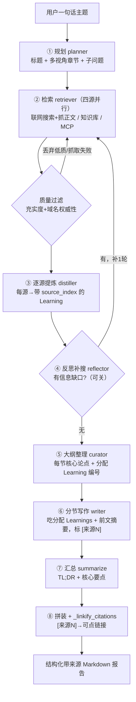
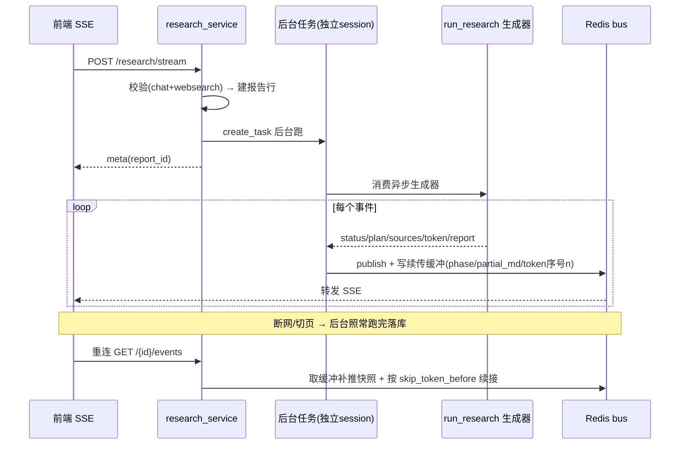

# 深度研究 → 报告（Deep Research，含 v2 重构）— 设计与八股（后端）

> V0.0.4 核心特性：给一句话研究主题，Comet 自主完成「规划 → 多源检索 → 提炼 → 撰写 → 汇总」，产出结构化、带可点来源的 Markdown 报告。引擎是**纯异步生成器**，与传输层解耦——在线发起经 Redis bus 流式 + 断线续传，定时任务直接复用同一引擎。v1 跑通后做了 v2 质量重构（对标 GPT Researcher / STORM）+ 来源质量过滤 + 研究指令润色。本篇只讲后端。

---

## 一、功能定位与需求

- **一句话 → 一份报告**：用户给主题，系统自主规划提纲、多角度检索、分章节写作、汇总 TL;DR + 核心要点，带可点来源链接。
- **多源检索**：联网搜索 + 并发抓正文（主力）/ 用户知识库 / MCP 工具增强。
- **实时进度 + 断线续传**：边跑边推「搜什么/读哪篇/写到哪节」的活动流；后台生成、Redis 通道广播，切页/断网不影响跑完落库，重连续接。
- **报告可用**：默认归档「深度研究报告」库，可看/下载 md/导出 Word/打印 PDF/分享/存任意库。
- **引擎解耦**：纯异步生成器 `run_research`，在线（research_service + bus）与离线（定时任务 worker）共用。

---

## 一点五、流程图

### v2 八步流水线（一句话 → 报告）

> **为什么这么做**：v1 是「规划→检索→把原始网页直接塞进写作」，噪声大、引用乱、章节割裂。v2 对标 GPT Researcher/STORM 补了**③逐源提炼**（引用对齐提前、噪声当场过滤）和**⑤大纲优先+证据分配**两个 benchmark 验证有效的环节，是架构差异而非 prompt 微调。

### 在线流式 + 断线续传（生成与传输解耦）

---

## 二、数据模型与迁移

### 表 `research_reports`（迁移 `979c6e3c897f`）

| 字段 | 类型 | 说明 |
|------|------|------|
| `id` | UUID 主键 | |
| `user_id` | UUID 外键 users 级联 | 数据隔离 |
| `topic` | Text | 用户原始一句话需求 |
| `title` | String(255) 可空 | 生成的标题 |
| `status` | String(16) | pending/planning/searching/writing/summarizing/done/failed |
| `report_md` | Text 可空 | 最终 Markdown |
| `outline` | JSONB 可空 | 提纲 + 查询 |
| `sources` | JSONB 可空 | 来源列表 [{index,type,title,url}] |
| `error_msg` | Text 可空 | 失败原因（保留部分正文便于排查） |
| `task_id` | UUID 可空 | 关联定时任务（②）；手动研究为空 |
| `created_at`/`updated_at` | DateTime(tz) | |

---

## 三、核心实现与代码路径

### 3.1 引擎模块 `core/agent/research/`

- `models.py`：中间数据模型——`ResearchPlan`/`PlanSection`(含 `sub_questions`)、`Source`(带引用号)、`Learning`(v2 逐源提炼要点：text + source_index + date_hint + relevance)、`CuratedSection`(大纲整理：heading + thesis + learning_ids)。
- `planner.py`：LLM 把主题拆成标题 + 多视角章节 + 子问题，失败兜底单章节。
- `retriever.py`：四源汇聚——`gather_web_sources`(多查询结构化搜索→URL 去重→并发抓正文，超时/截断/摘要兜底) / `gather_kb_sources`(知识库按文档聚合，剔除「深度研究报告」库防自循环) / `gather_mcp_sources`(强模型+已配 MCP 才跑，有界工具循环+整步超时) / `assign_indices`(统一编引用号，支持多轮续编)。
- `distiller.py`（v2）：逐源提炼，每个来源 → 若干带 `source_index` 的 `Learning`，引用对齐提前、噪声过滤、相关度低于阈值丢弃。
- `reflector.py`（v2）：看大纲 + 已有 Learnings 找信息缺口 → 生成补充查询（限 1 轮，可配 0 关）。
- `curator.py`（v2）：把全部 Learnings 编排成最终大纲——每节配核心论点 thesis + 分配的 Learning 编号。
- `writer.py`：`write_section_stream`(分节流式写作，吃分配的 Learnings + 前文摘要避免重复) + `summarize`(TL;DR + 核心要点)。
- `engine.py`：纯异步生成器 `run_research`，编排 8 步并产出 `status/plan/sources/progress/section_start/token/section_done/report/error` 事件；`_linkify_citations` 把 `[来源N]` 转带短标题的可点链接。
- `prompts/`：plan / distill / gap_check / curate_outline / write_section / summarize / optimize_topic 等 jinja2。

### 3.2 v2 八步流水线（engine.run_research）

1. **规划**（多视角子问题）→ 2. **检索**（四源并行，续编引用号）→ 3. **逐源提炼 distiller**（原始资料 → 带来源号 Learning）→ 4. **反思补搜 reflector**（找缺口补一轮检索+提炼，可关）→ 5. **大纲整理 curator**（Learnings → 每节核心论点 + 证据分配）→ 6. **分节写作**（吃分配 Learnings + 前文摘要）→ 7. **汇总**（TL;DR + 核心要点）→ 8. **拼装 + 引用映射**。

`_pump` 辅助：把一个会上报 progress 的异步任务边执行边透出细粒度活动事件（asyncio.Queue），供前端活动流展示。

### 3.3 来源质量过滤（retriever）

`gather_web_sources` 抓取后 `_rank_and_filter_web`：① 丢弃正文少于 `research_min_source_chars=120` 的源（抓取失败/登录墙）；② 按 `_quality_score`（正文充实度 0~1 + 域名权威性启发式：`_AUTHORITATIVE_TLDS`/`_AUTHORITATIVE_DOMAINS` 加分、`_LOW_QUALITY_HINTS` 内容农场降权）排序。仅作用联网源；知识库/MCP 视为可信不过滤。开关 `research_source_quality_filter` 默认开。

### 3.4 业务服务 `research_service.py`

- `stream_research`：前置校验（需配 chat 模型 + websearch 模型）→ 建报告行 → 后台任务跑引擎（独立 session）→ 经 bus 广播 + 写续传缓冲 → 本 SSE 连接只订阅转发。
- `resume_events`：断线重连续传——生成中补推快照 + 续接 token，已结束回放最终报告。
- `optimize_topic`：研究指令一键润色（复用默认对话模型 + `optimize_topic.jinja2`），深度研究与定时任务共用。
- 管理：列表/详情/删除/`save_to_kb`（报告 md 作为文档存入知识库，默认「深度研究报告」库）。

### 3.5 控制器 `research_controller.py`

`/research/stream`(SSE) / `/{id}/events`(续传) / 列表 / 详情 / 删除 / `save-to-kb` / `optimize-topic` / `share` / `export/docx`。注意 `/research/shares` 等静态路由注册在 `/{report_id}` 之前避免 uuid 冲突。

### 3.6 时效修复

联网查询自动追加当前年月（`gather_web_sources._augment`，主题已含具体年份则尊重）；写作 prompt 注入 today + 时效校验；剔除自产报告库防「研究→存库→检索→自循环」。

---

## 四、设计取舍（已定决策）

| 决策 | 选择 | 理由 |
|------|------|------|
| 引擎形态 | **纯异步生成器**，与传输解耦 | 在线（bus 流式+续传）与离线（定时 worker）共用一套 |
| v2 vs prompt 调参 | **架构重构**（加提炼/反思/整理三步） | 检索业界第一梯队后定位 v1 瓶颈是缺环非模型/prompt |
| 引用对齐 | 提前到**逐源提炼**阶段绑 source_index | 写作直接用带号 Learning，`[来源N]` 天然正确 |
| 反思补搜 | 限 1 轮、可配 0 | 深度与成本平衡 |
| 来源质量 | 确定性打分（充实度+域名权威性），无额外 LLM | 快、稳，把预算落在可信源 |
| 报告归档 | 默认专门「深度研究报告」库 | 不污染其他库；并剔除该库防自循环 |
| 引用展示 | `[来源N]` → 带短标题可点链接 | 手机无需悬停也懂跳转目标 |

---

## 五、易踩坑点

1. **自循环**：报告存进知识库后，下次研究若检索到自产报告当权威源回灌，会复读旧结论丢时效。`gather_kb_sources` 剔除「深度研究报告」库命中。
2. **时效**：模型不自知信息过时，查询不加年月会答旧数据。查询追加当前年月 + 写作时效校验。
3. **抓取脆**：公众号/登录墙/Cloudflare 抓不到。换真实浏览器 UA + 重试，抓不到用搜索摘要兜底，再叠质量过滤丢弃太短的。
4. **搜索 429**：并发限流（`research_search_concurrency`）+ 429 退避重试。
5. **断线续传一致性**：后台生成用独立 session，事件经 bus；token 带序号 `i`，续传按 `skip_token_before` 去重。
6. **诚实局限**：联网质量受 provider 限制（千帆不按时间排、营销号多、Tavily 中文弱），质量过滤只能减少明显垃圾，强时效场景仍需配更专注的 MCP 源。

---

## 六、面试问答（八股）

**Q1：深度研究的数据流是怎样的？引用怎么做到准确？**
用户一句话 → planner 拆成标题+多视角子问题 → retriever 四源检索拿到带引用号的 Source → （v2）distiller 把每个 Source 提炼成带 `source_index` 的 Learning → reflector 找缺口补一轮 → curator 把 Learnings 编排成大纲并给每节分配 Learning 编号 → writer 吃分配的 Learnings 分节写作、正文里标 `[来源N]` → 汇总 → engine 拼装时 `_linkify_citations` 把 `[来源N]` 映射成可点链接。引用准确的关键是**把引用对齐提前到提炼阶段**：Learning 一生成就绑死 source_index，写作直接用带号要点，而不是让模型写完再回头标引用（那样最容易标错）。

**Q2：v1 和 v2 的区别？为什么不是调 prompt/换模型？**
v1 是线性「规划→检索→把原始网页正文直接塞进写作」，问题是噪声大、token 爆、引用乱、章节各写各的。检索 GPT Researcher（CMU benchmark 第一）和 STORM 后定位为**架构缺了制胜环节**：缺「逐源提炼」（边检索边把每源压成带来源号的要点）和「大纲优先+证据分配」。v2 加了 distiller/reflector/curator 三步，把「原始资料直接写」换成「提炼成要点→编排大纲→按证据写」。这是 benchmark 验证有效的架构差异，不是 prompt 微调能补的。

**Q3：引擎为什么做成纯异步生成器？**
为了与传输层解耦、一套引擎两处复用。在线发起时由 research_service 在后台任务里消费生成器，事件经 Redis bus 广播给前端（支持断线续传）；定时任务时由 Celery worker 直接消费同一个生成器落库，不需要 bus。引擎只管「产出事件」，不关心事件怎么传，职责单一。

**Q4：断线续传怎么实现？**
生成动作跑在独立 session 的后台任务里，事件经 Redis 频道广播，并写一份「续传缓冲」（phase/title/plan/sources/steps/partial_md/token 序号 n）。前端 SSE 连接只订阅转发。客户端断开不影响后台跑完落库；重连时 `resume_events` 先从缓冲补推快照，再按 token 序号 `skip_token_before` 去重续接；若已结束则直接回放最终报告。

**Q5：来源质量过滤怎么做的？为什么不用 LLM 打分？**
联网源抓取后做一步确定性过滤：丢弃正文过短的（抓取失败/登录墙），再按「正文充实度 + 域名权威性启发式（权威 TLD/知名站点加分、内容农场降权）」排序。用确定性启发式而非 LLM 是因为：① 快、零额外 token 成本；② 排序的意义是让下游有限的提炼预算落在可信源上，不需要精确打分。只作用联网源，知识库（用户自己的）和 MCP（专注工具）视为可信不过滤。

**Q6：怎么防止「研究→存库→再研究检索到自己」的自循环？**
报告默认存进专门的「深度研究报告」知识库。`gather_kb_sources` 检索知识库时，先算出该库的 kb_id 并把命中它的结果剔除——避免把自己产出的旧报告当权威源回灌，导致模型复读旧结论、丢失时效性。
