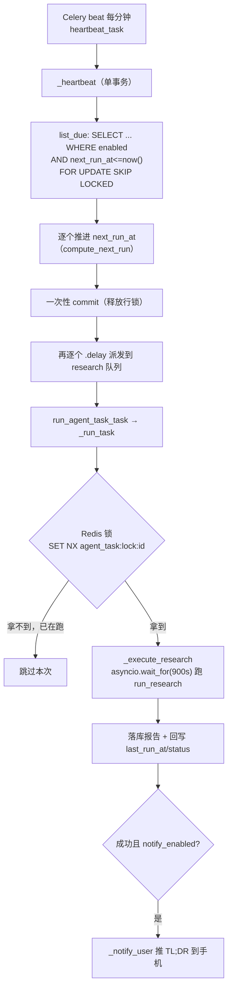
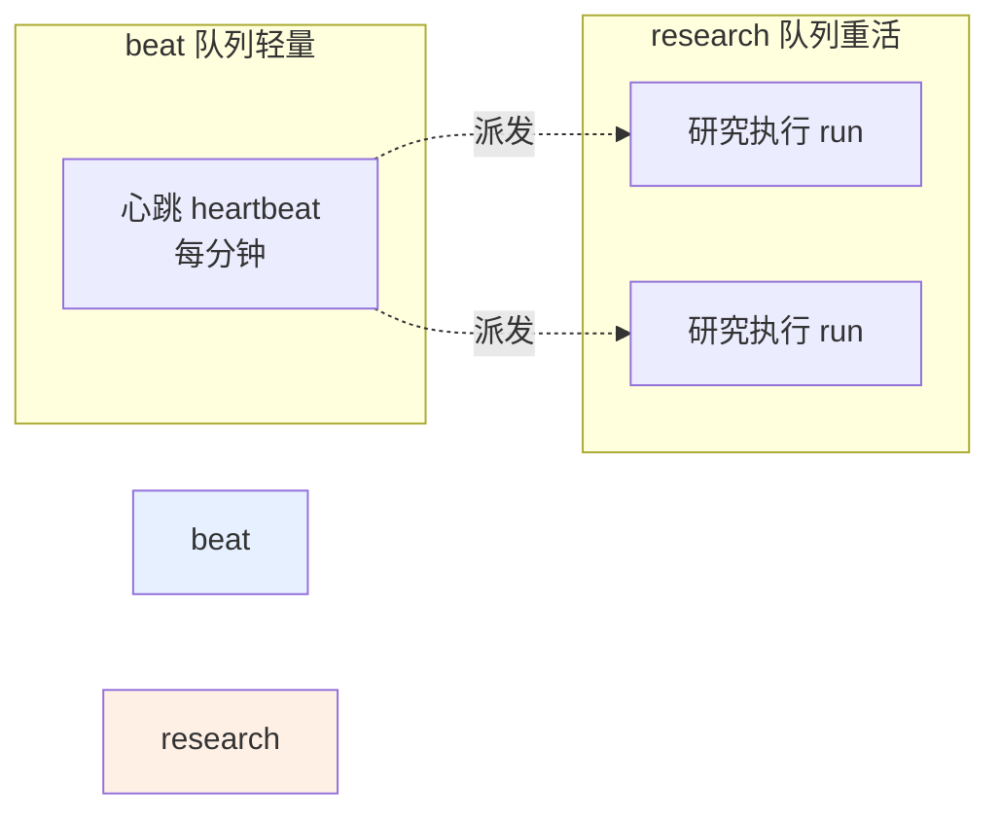

# 定时 / 主动任务 — 设计与八股（后端）

> V0.0.4 主线第二环：建一个任务（一句话研究指令 + 触发规则），到点系统自动跑深度研究并落库报告；对话里随口说「每天9点查X」也能自动建任务；结果汇进首页 Agent 简报 + 未读红点 + 失败重试。本篇含调度心跳、健壮性加固、对话内建工具、首页简报、任务中心。只讲后端。

---

## 一、功能定位与需求

- **到点自跑**：触发规则（每天 HH:MM / 每周几 / 每隔 N 小时），到点自动跑研究引擎落库。
- **动态调度**：用户增删任务即时生效，不重启 beat（不引 celery-sqlalchemy-scheduler）。
- **对话内建任务**：对话中说「每天9点帮我查X」，强模型自动调内置工具建任务。
- **结果送达**：首页 Agent 简报 + 菜单未读红点 + 任务运行历史 + 失败重试。
- **健壮**：研究执行不堵调度心跳、单任务不重叠跑、有整体超时、防重复触发。

---

## 一点五、流程图

### 调度心跳 → 执行（每分钟扫表）

> **为什么先推进 next_run_at 再派发、且在单事务里**：`FOR UPDATE SKIP LOCKED` + 同事务推进，保证即便误起多个 beat 也不会双抢、尾部任务不会被下一分钟心跳重复扫到；先 commit 推进再派发，避免「派发了却没推进 → 重复触发」。

### 队列拆分（心跳不被重活堵）

> **为什么拆**：单队列/solo 下一个多分钟的研究会卡住每分钟心跳 → 所有定时任务全停。拆开后心跳永远有空闲 worker 跑，重活在独立队列排队。

---

## 二、数据模型与迁移

### 表 `agent_tasks`（迁移 `e004fbfb8ac6`；后补 `notify_enabled` 于 `2628f0e24602`）

| 字段 | 类型 | 说明 |
|------|------|------|
| `id`/`user_id` | UUID | 级联 users |
| `name` | String(128) | 任务名 |
| `instruction` | Text | 自然语言研究指令/主题 |
| `kb_ids` | JSONB 可空 | 检索范围，空=默认 |
| `trigger_type` | String(16) | daily / weekly / interval |
| `trigger_time` | String(8) 可空 | "HH:MM"（daily/weekly） |
| `trigger_weekday` | Integer 可空 | 0=周一..6=周日（weekly） |
| `trigger_interval_hours` | Integer 可空 | interval 用 |
| `enabled` | Boolean 索引 | 启停 |
| `notify_enabled` | Boolean | 跑完是否推送（server_default true） |
| `last_run_at`/`last_status` | | 最近运行时间/状态(running/done/failed) |
| `next_run_at` | DateTime(tz) 索引 | 下次运行时间 |

- **运行历史不另建表**：复用 `research_reports.task_id` 关联（手动研究 task_id 为空）。
- **未读红点基准**：`users.briefing_seen_at`（迁移 `45e5059b4825`）。

---

## 三、核心实现与代码路径

### 3.1 服务 `agent_task_service.py`

- CRUD + `compute_next_run`（时区感知 Asia/Shanghai，按 trigger 算下次时间）。
- `run_now`（派 Celery 立即跑一次，不改 next_run_at）。
- `list_runs`（复用 ResearchReportRepository.list_by_task）/ `unread_count`（count_unread_scheduled：task_id 非空 + done + created_at > briefing_seen_at）/ `mark_seen`（更新时间戳清红点）。

### 3.2 调度与执行 `tasks/agent_task.py`

- **心跳 `heartbeat_task`**（celery beat 每分钟）：`_heartbeat` 在一个事务内 `list_due`（FOR UPDATE SKIP LOCKED 原子认领）→ 推进所有到期任务的 next_run_at → 一次提交 → 再逐个 `.delay` 派发。先提交再派发，避免「派发了却没推进」；单事务推进避免尾部任务被另一心跳重复触发。
- **执行 `run_agent_task_task`**：`_run_task` → Redis 锁（`agent_task:lock:{id}`，SET NX + TTL 自愈，防 interval<耗时 或「立即运行」撞定时重叠跑）→ `_do_run`：建报告行+标 running → `_execute_research`（消费 `run_research` 生成器，`asyncio.wait_for(research_task_timeout=900s)` 整体硬超时）落库 → 回写任务状态（`last_run_at=datetime.now(TZ)`）→ 成功且 notify_enabled 则 `_notify_user` 推送 TL;DR。

### 3.3 队列拆分（健壮性加固）

`celery_app.py` task_routes 按任务名精确路由：`agent_task.heartbeat` → `beat`（轻量时钟），`agent_task.run` → **独立 `research` 队列**（重活）。避免长研究堵死每分钟心跳。worker `-Q` 需含 `research`（docker threads 并发可并存；Windows solo 建议另起 `-Q research` worker）。

### 3.4 对话内建任务（③）

`core/agent/tools/builtin/schedule.py` 的 `create_scheduled_task` 内置工具，调用复用 `AgentTaskService.create`，解析自然语言里的触发时机 + 内容，回复首次运行时间。强模型 function calling 自动可用。

### 3.5 首页简报（④）

`DashboardService.agent_briefing` 取最近 5 条已完成研究（task_id 非空标 scheduled）；`GET /api/dashboard/agent-briefing`；HomePage「🤖 今日 Agent 简报」卡。

### 3.6 控制器 `agent_task_controller.py`

CRUD + `/{id}/enabled` + `/{id}/run` + `/{id}/runs` + `/unread-count` + `/mark-seen`。注意 `/unread-count`、`/mark-seen` 静态路由注册在 `/{task_id}` 之前避免 uuid 冲突。

---

## 四、设计取舍（已定决策）

| 决策 | 选择 | 理由 |
|------|------|------|
| 调度方式 | 自写 beat 每分钟心跳扫表 | 动态任务即时生效，不引调度器依赖、不重启 beat |
| 触发规则 | 只做 daily/weekly/interval | 不上完整 cron，够用 |
| 运行历史 | 复用 research_reports.task_id | 不另建表 |
| 研究执行队列 | 独立 `research` 队列 | 不堵调度心跳 |
| 单任务并发 | Redis 锁（NX+TTL 自愈） | 防重叠跑；进程被杀也能自动解锁 |
| 整体超时 | asyncio.wait_for（非 celery time_limit） | 跨平台（Windows 无 SIGALRM） |
| 防重复触发 | FOR UPDATE SKIP LOCKED + 单事务推进 | 原子认领，多 beat 也不双触发 |
| 未读红点 | users.briefing_seen_at 时间戳 | 不给每条报告加字段 |
| 失败重试 | 复用 run_now | 不另加接口 |

---

## 五、易踩坑点

1. **NOT NULL 列加 server_default**：`notify_enabled` 加列时设 `server_default=sa.true()`，否则存量行迁移失败。
2. **心跳被重活堵**：solo/单队列下长研究会卡住每分钟心跳→定时全停。必须拆队列 + 并发≥2 或独立 worker。
3. **时区**：`compute_next_run` 用 `datetime.now(TZ)`，`last_run_at` 也必须 `datetime.now(TZ)`（曾用裸 `datetime.now()` 造成时区混用）。`next_run_at <= func.now()` 比较：tz-aware 列 + Postgres now() 正确。
4. **超时后落库脏 session**：硬超时取消会让原 session 中断，失败落库改用全新 session。
5. **Redis 不可用**：拿锁失败时选择可用性优先（不漏跑用户任务），记 warning。

---

## 六、面试问答（八股）

**Q1：动态定时任务怎么实现，为什么不用 cron / celery-beat 静态配置？**
用 Celery beat 注册一个「每分钟心跳」任务，心跳扫 `agent_tasks` 表找 `enabled 且 next_run_at <= now()` 的，派发执行并推进 next_run_at。用户增删任务直接改表即时生效，不用重启 beat、不用引 celery-sqlalchemy-scheduler。把动态调度收敛成「一个静态心跳 + 一张任务表」，简单可控。

**Q2：怎么防止同一个定时触发被重复执行？**
两层：① 心跳用 `SELECT ... FOR UPDATE SKIP LOCKED` 原子认领到期任务，并在**同一个事务**里推进所有任务的 next_run_at 后一次提交，再派发——即便误起多个 beat 也不会双抢、尾部任务也不会被下一次心跳重复扫到。② 执行入口加 Redis 锁（per task_id，SET NX + TTL），防 interval 短于单次耗时、或「立即运行」撞上定时触发导致的重叠跑。

**Q3：研究跑很久会不会卡住整个定时系统？**
会，如果不拆队列。所以把「调度心跳」放轻量的 `beat` 队列、「研究执行」放独立的 `research` 队列，并发≥2 时心跳和研究能并存，心跳永远不被它派发的重活堵住。另外给研究执行加了 `asyncio.wait_for` 整体硬超时（默认 900s），卡死的任务会超时失败、释放 worker，而不是无限占用。

**Q4：超时为什么用 asyncio.wait_for 而不是 celery 的 time_limit？**
celery 的 soft/hard time_limit 在 Windows 上依赖 SIGALRM，不可用；而我们任务内部是 `asyncio.run` 跑异步引擎，用 `asyncio.wait_for` 包住引擎消费协程是跨平台可靠的。超时后在新 session 里把报告标 failed（原 session 被取消可能处于脏状态，不能复用）。

**Q5：运行历史为什么不单独建表？**
每次执行本来就会在 `research_reports` 落一条报告，只要给它带上 `task_id` 关联到任务即可。`list_runs` 按 task_id 查报告就是运行历史，失败的报告带 error_msg 可见、重试就是再 `run_now` 一次。复用现有表避免数据冗余和额外维护。

**Q6：未读红点怎么做的？**
不给每条报告加 is_read 字段，而是给用户加一个时间戳 `briefing_seen_at`。未读数 = task_id 非空 + status=done + created_at > briefing_seen_at 的报告数；进任务页/简报时 `mark_seen` 把时间戳更新到现在即清零。单时间戳搞定，零额外写放大。
