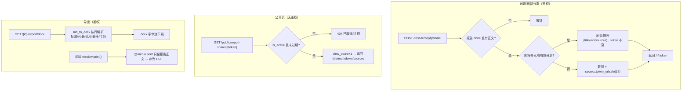

# 报告分享与导出 — 设计与八股（后端）

> V0.0.4「送达闭环」之 E：研究报告可生成**快照式公开只读分享链接**（仿对话分享 `/s/:token`），可**导出 Word(.docx)**、**打印为 PDF**（前端）。本篇只讲后端。

---

## 一、功能定位与需求

- **公开分享**：把一份完成的研究报告生成公开只读链接，任何人无需登录可看；原报告删改不影响已分享快照。可改标题、设过期、取消、「我的分享」管理。
- **导出 Word**：报告 Markdown → .docx 下载。
- **打印 PDF**：前端 `window.print()` + 打印 CSS（零后端依赖、中文完美），不在本篇。

---

## 一点五、流程图

### 分享创建 → 公开查看 + 导出



> **为什么快照式 + 弱引用 report_id**：分享的是「那一刻的报告」，原报告删改不影响已分享内容；`report_id` 不设级联，删报告后链接仍可访问。公开页无登录态，安全靠不可猜 token + is_active + 过期三道校验。

---

## 二、数据模型与迁移

### 表 `report_shares`（迁移 `9d2abf6b960b`）

| 字段 | 类型 | 说明 |
|------|------|------|
| `id`/`user_id` | UUID | 级联 users |
| `report_id` | UUID 索引 | 来源报告，**弱引用不设级联**（报告删不影响快照） |
| `share_token` | String(64) 唯一索引 | 公开访问令牌，随机不可猜 |
| `title` | String(256) | 标题 |
| `content_md` | Text | 报告 Markdown 正文快照 |
| `sources` | JSONB 可空 | 来源列表快照 |
| `is_active` | Boolean 索引 | 取消即 false（软删） |
| `expire_at` | DateTime(tz) 可空 | 过期，空=永久 |
| `view_count` | Integer | 浏览数 |

**为什么新建表而非复用 conversation_shares**：报告形态是「标题 + 单篇 Markdown + 来源」，与对话消息快照 `[{role,content,images}]` 形态差异大，硬塞会污染对话快照结构。独立成表更干净。

---

## 三、核心实现与代码路径

分层：`report_share_controller` 路由（并入 research_controller + 公开路由挂 conversation_share_controller 的 public_router）→ `report_share_service.py`（快照冻结/复用/取消/公开查看）→ `report_share_repository.py`。

### 3.1 分享服务 `report_share_service.py`

- `create_share`：校验报告存在且 status=done 且有 report_md → 把 title/content_md/sources 冻结进快照。同报告已有有效分享则刷新复用（不新建 token），否则 `secrets.token_urlsafe(16)` 生成。
- `revoke`：软删 `is_active=false`。
- `get_public`：按 token 查 → is_active + expire_at（注意 naive/aware 时区补正）校验 → view_count+1（失败只 warning）→ 返回 title/markdown/sources。

### 3.2 路由

- 鉴权（research_controller）：`POST /research/{id}/share`、`GET /research/shares`、`DELETE /research/shares/{share_id}`。**静态 `/research/shares` 注册在 `/{report_id}` 之前**避免 uuid 路由冲突。
- 公开（conversation_share_controller.public_router）：`GET /public/report-shares/{token}`（无鉴权）。

### 3.3 Word 导出 `core/export/md_to_docx.py`

`markdown_to_docx_bytes(title, markdown)` 用 **python-docx**（已是依赖，文档解析就在用）按行解析 md：标题(#~######)/段落/有序无序列表/引用块(>)/表格(| |)/分隔线/代码块(```)，行内处理 `**加粗**`/`` `代码` ``/`[文字](链接)`（链接降级为文字）。解析异常降级为纯段落。控制器 `GET /research/{id}/export/docx` 返回 docx 字节流，`Content-Disposition` 用 `filename*=UTF-8''` 编码中文名。

---

## 四、设计取舍（已定决策）

| 决策 | 选择 | 理由 |
|------|------|------|
| 分享存储 | **新表 report_shares**，不复用对话分享 | 报告形态差异大，避免污染对话快照结构 |
| 快照式 | 冻结 markdown + sources | 原报告删改不影响已分享内容 |
| 公开访问 | 无鉴权 + 不可猜 token + is_active + 过期 | 「无需登录就能看」 |
| Word 导出 | 后端 python-docx 手写转换 | 已是依赖，不装 pandoc（部署省心） |
| PDF | 前端 window.print() + 打印 CSS | 零依赖、中文完美、所见即所得 |
| report_id | 弱引用不级联 | 报告删除后分享快照仍可访问 |

---

## 五、易踩坑点

1. **路由冲突**：`/research/shares` 若注册在 `/research/{report_id}` 之后，"shares" 会被当 uuid 解析报 422。静态路由必须先注册。
2. **过期时区比较**：库里 `expire_at` 可能 naive，和 `datetime.now(timezone.utc)` 比要先补 tzinfo。
3. **中文文件名**：导出 docx 的 Content-Disposition 用 `filename*=UTF-8''{quote(name)}`，否则中文乱码。
4. **pandoc 依赖**：不用 pandoc 做 md→docx（部署要装二进制麻烦），用 python-docx 手写一个够用的转换器。
5. **PDF 分页坑**：前端打印若用 `position:absolute` + overflow 容器会被裁成一页；正确做法是把报告正文克隆到 body 顶层、打印时隐藏 #root，让内容在正常文档流里分页（属前端，记此备忘）。

---

## 六、面试问答（八股）

**Q1：报告分享为什么新建表，不复用对话分享？**
对话分享的快照是消息数组 `[{role,content,images,sender_name...}]`，而报告就是「标题 + 一篇 Markdown + 来源列表」，形态差异大。硬塞进 conversation_shares 会把对话快照结构搞脏、判断逻辑变复杂。报告分享逻辑又很简单，新建一张小表 `report_shares` 更干净；公开路由复用同一个 public_router 即可。

**Q2：Word 导出为什么不用 pandoc？**
pandoc 是 md→docx 最强的，但要在镜像里装 pandoc 二进制，部署成本高。项目里 python-docx 本来就是依赖（文档解析在用），所以手写一个 md→docx 转换器：按行识别标题/列表/引用/表格/代码块，行内处理加粗/代码/链接，覆盖报告里会出现的格式，解析不了的降级成纯段落。够用且零新增依赖。

**Q3：PDF 为什么走前端而不是后端生成？**
后端生成 PDF（如 weasyprint/wkhtmltopdf）要装重依赖且中文字体常踩坑。前端 `window.print()` + 打印专用 CSS 零依赖、中文完美、所见即所得，用户「打印 → 另存为 PDF」即可。唯一要注意的是打印时要把报告正文从滚动/定高容器里拎出来（克隆到 body 顶层 + 隐藏其余），否则会被 overflow 容器裁成一页。

**Q4：公开页怎么免登录看报告又保证安全？**
公开路由 `GET /public/report-shares/{token}` 不挂 `get_current_user`。安全靠三道：不可猜 token（`secrets.token_urlsafe`）、`is_active`、`expire_at`。快照只含报告正文与来源（公开内容），不含用户其他数据。
