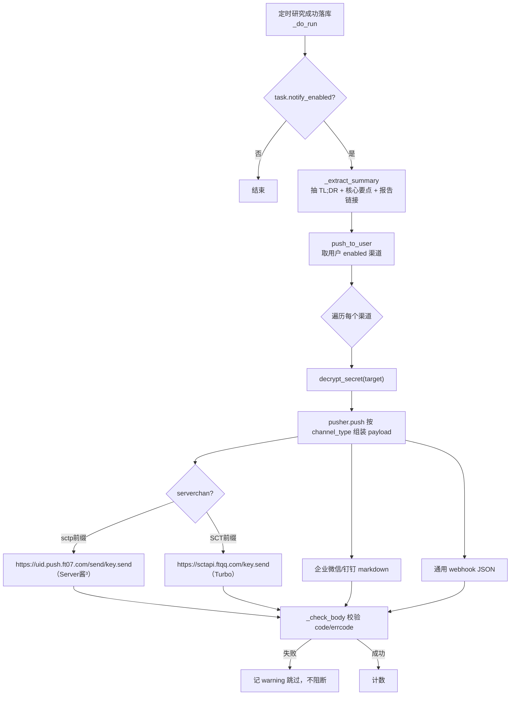

# 消息推送 — 设计与八股（后端）

> V0.0.4「送达闭环」之 C：定时任务跑完，把报告 TL;DR + 链接主动推到用户手机/微信。支持 **Server酱 / 企业微信群机器人 / 钉钉群机器人 / 通用 Webhook** 四渠道，每个用户配自己的密钥（Fernet 加密、只回显掩码），各推各的。不做 SMTP 邮件。本篇只讲后端。

---

## 一、功能定位与需求

- **结果推到手机**：定时研究完成后主动推送，不用用户去翻首页。
- **多渠道 + 用户自配**：四种「POST JSON 到一个 URL」式渠道，每个用户配自己的 key/url，互不干扰；可多条、可单独启停、可测试推送。
- **安全**：target（SendKey/URL）Fernet 加密入库，接口只返回掩码。
- **降级**：推送是副作用，单渠道失败记 warning 跳过，绝不阻断任务主流程。

---

## 一点五、流程图

### 定时任务完成 → 推送

> **为什么校验响应体而非只看 HTTP 200**：Server酱/企业微信/钉钉即便业务失败也常返回 200，真正结果在响应体（Server酱看 `code`、企微/钉钉看 `errcode`）。只看状态码会误报「发送成功」但用户没收到。

---

## 二、数据模型与迁移

### 表 `notify_channels`（迁移 `2628f0e24602`，同迁移给 `agent_tasks` 加 `notify_enabled`）

| 字段 | 类型 | 说明 |
|------|------|------|
| `id`/`user_id` | UUID | 级联 users，数据隔离 |
| `channel_type` | String(16) | serverchan / wecom / dingtalk / webhook |
| `name` | String(64) | 渠道备注名 |
| `target_encrypted` | Text | SendKey / webhook URL，**Fernet 加密** |
| `enabled` | Boolean 索引 | 启停 |

---

## 三、核心实现与代码路径

- `core/notify/pusher.py`：`push(channel_type, target, title, content)` 按渠道组装 payload + httpx POST + 超时；`_serverchan_url` 按 SendKey 前缀选接口（`sctp...` → Server酱³ `https://<uid>.push.ft07.com/send/<key>.send`，正则 `^sctp(\d+)t` 提取 uid；其余 → Turbo `sctapi.ftqq.com`）；`_check_body` 校验响应体业务码。单次失败返回 `(False, 原因)` 不抛。
- `notify_service.py`：CRUD（`encrypt_secret`/`mask_secret`）+ `test_push`（失败抛 BizError 让前端看到原因）+ `push_to_user`（取 enabled 渠道逐个推，单渠道失败跳过，返回成功数）。
- `notify_controller.py`：`/notify-channels` CRUD + `/{id}/test`。
- 接入 `tasks/agent_task.py._do_run`：研究成功且 `notify_enabled` → `_extract_summary`（正则抽 `>` 引用块 + 核心要点列表，截断）→ 拼报告链接（`notify_site_url`）→ `push_to_user`，整步 try/except 降级。

---

## 四、设计取舍（已定决策）

| 决策 | 选择 | 理由 |
|------|------|------|
| 渠道 | Server酱/企微/钉钉/webhook | 都是 POST JSON 到 URL，免服务端鉴权，用户自配 |
| 不做邮件 | 不上 SMTP | 单机配置麻烦，webhook 体验更好 |
| 每用户自配 key | 渠道带 user_id | 多租户各推各的；运营方不持有任何用户 key |
| key 存储 | Fernet 加密，回显掩码 | 同 API Key 待遇，安全 |
| 推送时机 | 任务成功后异步 | 副作用，失败不阻断主流程 |
| 成功判定 | 校验响应体 code/errcode | HTTP 200 不代表投递成功 |

---

## 五、易踩坑点

1. **HTTP 200 ≠ 投递成功**：必须解析响应体（Server酱 `code`、企微/钉钉 `errcode`），否则误报成功、用户没收到还查不到原因。
2. **Server酱 版本/域名**：旧版 `sc.ftqq.com` 已下线；Server酱³（`sctp` 开头）推到 App、Turbo（`SCT` 开头）推微信，接口域名不同。`sctp<uid>t<token>` 的推送域用其中的**数字 uid**（曾误取成 `sctp123`）。
3. **加列 server_default**：`agent_tasks.notify_enabled` 加列要 `server_default=true`，否则存量行失败。
4. **副作用降级**：推送整步包 try/except，单渠道失败跳过，绝不让推送失败影响研究任务落库。
5. **Redis/网络抖动**：httpx 设超时，失败返回原因不抛。

---

## 六、面试问答（八股）

**Q1：为什么选 Server酱/webhook 这类，不做邮件？**
这几种都是「往一个 URL POST 一个 JSON」的模式，免服务端鉴权、用户自己去申请 key，最省心；个人微信/群直达，体验比邮件好。SMTP 在单机部署要配发件服务器、容易进垃圾箱，二期再说。做成多渠道并列，用户用哪个配哪个，不强依赖任何一家。

**Q2：多用户怎么各推各的？key 怎么存？**
`notify_channels` 带 `user_id`，每个用户配自己的 SendKey/webhook，查询只取当前用户的；推送时取该用户所有 enabled 渠道。target（key/url）用 Fernet 加密入库、接口只返回尾部掩码（同 API Key 待遇），日志不打印明文。运营方不持有任何用户的 key。

**Q3：显示「发送成功」但用户没收到，怎么回事？**
最常见的坑：只看了 HTTP 状态码。Server酱、企业微信、钉钉即便业务失败（key 错、未配通道、签名错）也返回 200，真正结果在响应体（Server酱 `code`、企微/钉钉 `errcode`）。所以 `_check_body` 解析响应体业务码，非 0 视为失败并把 errmsg 透出。另外 Server酱³（sctp 开头）默认推到它的 App 不是微信，要推微信得用 Turbo 版——这是产品侧而非代码问题。

**Q4：推送失败会不会影响定时任务？**
不会。推送是任务完成后的副作用，整步包在 try/except 里，`push_to_user` 内部逐渠道再 try/except，单个渠道失败只记 warning 跳过、继续推其余。报告早已落库，推送失败不回滚、不抛出，绝不影响主流程。
