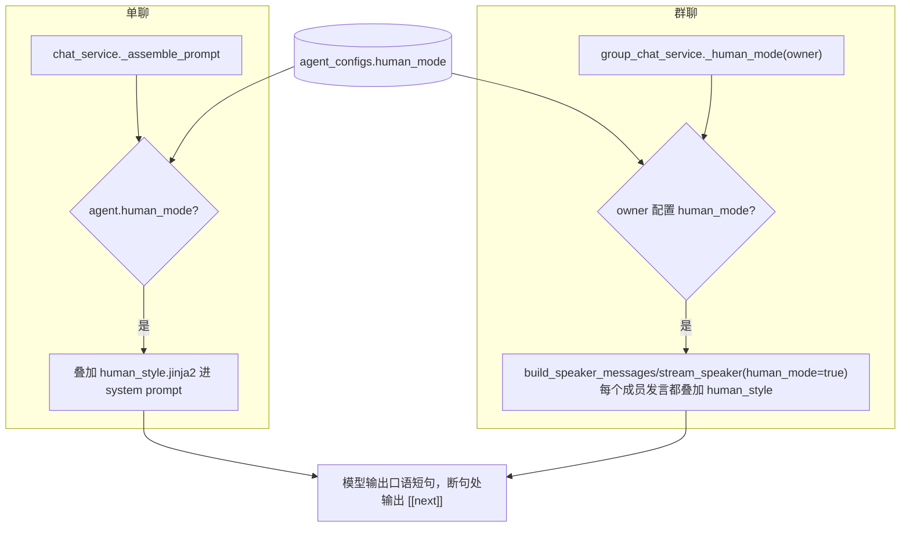
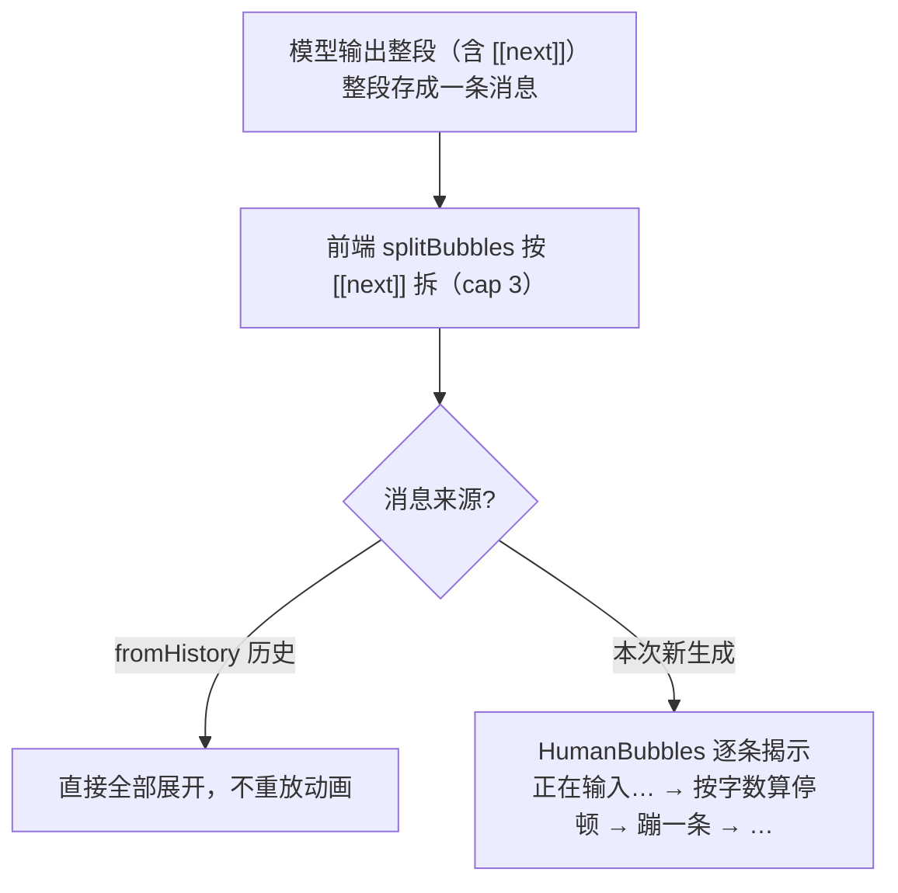

# 真人对话模式 — 设计与八股（后端为主，含前端关键机制）

> V0.0.4 交互特性：一个**全局开关**，开启后单聊/群聊所有 AI 回复像真人微信聊天——口语、简短、有情绪、会开玩笑，用工具也口语小结，不出 markdown 报告腔；并把一条回复拆成多条气泡、配「正在输入…」逐条连发。纯提示词驱动、不微调（对标 Claude role prompting + 禁 AI 腔 + few-shot）。本篇以后端为主，多气泡渲染属前端关键机制一并说明。

---

## 一、功能定位与需求

- **全局开关**：用户级 `agent_configs.human_mode`，一开全局生效（单聊 + 群聊统一）。
- **像真人**：口语短句、有情绪、能贫能怼；禁 markdown 标题/列表/表格、禁堆 emoji、禁「作为AI」、禁免责声明、禁客套；用工具也口语小结不甩报告。
- **多气泡连发**：一条回复拆成几条短消息，配「正在输入…」停顿逐条蹦出（按字数算打字节奏），更像微信。
- **不微调**：纯提示词 + few-shot 引导。

> 注：初版做成每角色 `agent_personas.human_mode`，实测「每角色都设很奇怪」，**回退为全局** `agent_configs.human_mode`（迁移 `76e7b46270d2` 删除，新增 `bf7ad4190462`）。

---

## 一点五、流程图

### 提示词注入（单聊 / 群聊统一读全局开关）

### 多气泡 render-split + 逐条延时（前端，不改流式协议）

> **关键修正：动画由「是否本次生成 fromHistory」驱动，而非 streaming**。短回复整段会在一次渲染里到达且 streaming 同时翻 false，若靠 streaming 判断会一次性全显（显得太快）。所以历史消息 `instant` 全显、本次生成的一定逐条演。

---

## 二、数据模型与迁移

`agent_configs` 加 `human_mode: Boolean`（默认 false，迁移 `bf7ad4190462`，加列 `server_default=sa.false()` 防存量行失败）。无新表。

---

## 三、核心实现与代码路径

### 3.1 提示词 `core/agent/prompts/human_style.jinja2`

- 重申「你就是真人朋友」：能开玩笑/吐槽/反问/有小情绪，别每句热心服务、别预判对方要啥。
- 禁 AI 腔黑名单：禁 markdown 标题/列表/表格、禁堆 emoji、禁「作为AI」、禁免责声明、禁客套口头禅堆砌。
- **发消息节奏（关键）**：语气连贯的话放**同一条**，只在换话题/想停顿时才 `[[next]]`；**大多 1~2 条、最多 3 条**，给了「太碎」反例 vs「成组」正例。
- 5 段 few-shot（闲聊/被夸/资料型口语小结/不知道老实说/接情绪），均 1~2 条示范。

### 3.2 注入落点

- 单聊：`chat_service._assemble_prompt` 读 `agent.human_mode`，叠加 `render_agent_prompt("human_style.jinja2")`（多模态 `_stream_multimodal` 同路径覆盖）；与情绪记忆/主动召回/跨会话/时效 context_hint 注入并存。
- 群聊：`group_chat_service._human_mode(owner)` 读全局开关，传入 `build_speaker_messages/stream_speaker(human_mode=...)`，所有成员统一。

### 3.3 多气泡（前端关键机制）

- `chat/types.ts`：`splitBubbles`（split `/\s*\[\[next\]\]\s*/`、过滤空段、cap=3 超出并入末条）/`hasBubbleSep`；`ChatAvatars.humanMode`；`UiMessage.fromHistory`。
- `chat/HumanBubbles.tsx`：逐条延时播放——`instant`(fromHistory) 直接全显；否则先「正在输入…」跳点，按字数算停顿（`min(3000, base + 字数×70)`，首条 base 900/后续 700）逐条揭示；节奏只依赖 `segLen/shown/instant`，**不依赖 segs 数组**（否则流式每个 token 重建数组重置定时器）。
- `MessageItem`：真人模式 AI 消息走 HumanBubbles，**隐藏 ChatProcess（正在理解问题…/工具过程条）+ 隐藏底部整排操作（复制/收藏/赞踩/时间，含用户侧）**。
- `ChatPage`：从 agentConfig 读 humanMode 入 avatars；history 消息标 `fromHistory:true`。
- 群聊 `GroupChatPage`、公开页 `SharePage`：静态拆多气泡。复制时分隔符还原成换行。

---

## 四、设计取舍（已定决策）

| 决策 | 选择 | 理由 |
|------|------|------|
| 粒度 | **全局开关**（agent_configs） | 单聊就一个角色，每角色设很奇怪；全局心智简单 |
| 实现 | 纯提示词 + few-shot，不微调 | 对标 Claude；微调成本高没必要 |
| 多气泡 | render-split（模型输出 [[next]]，前端拆） | 不改流式协议；存一条消息，收藏/反馈仍挂整条 |
| 动画驱动 | **fromHistory**（是否本次生成），非 streaming | 短回复整段瞬到时 streaming 已 false，靠它会一次性全显 |
| 节奏依赖 | segLen/shown/instant，不依赖 segs 数组 | 避免流式 token 重建数组重置定时器 |
| 拆分上限 | cap 3 + prompt 引导 1~2 条 | 防「每句一条」太碎 |
| prefill 预填 | 押二期 | 一期靠规则+few-shot 已够 |

---

## 五、易踩坑点

1. **动画「太快/一次性蹦出」**：根因是用 streaming 驱动动画——短回复整段一次到达且 streaming 同帧翻 false，HumanBubbles 挂载即 `shown=segLen`。改成 fromHistory 驱动：本次生成的一定从 0 逐条演。
2. **流式重置定时器**：effect 若依赖 `segs` 数组本身，流式每个 token 重建数组会反复清定时器、气泡憋到最后。改为只依赖 `segLen/shown/instant` + 用 ref 读 segs 文本。
3. **每句一条太碎**：模型爱过度拆。提示词明确「连贯的话放一条、大多 1~2 条」+ 给反例正例，前端 cap 3 兜底。
4. **真人模式残留助手 UI**：要同时隐藏过程条（正在理解问题…）和底部操作排，否则不像聊天。
5. **拟人度受模型限制**：弱模型易回潮 AI 腔、过度拆句，提示词只能引导不能 100% 保证（诚实局限）。
6. **加列 server_default**：`human_mode` 加列要 `server_default=false`。

---

## 六、面试问答（八股）

**Q1：为什么真人模式做成全局而不是每角色？**
初版做成每角色 `agent_personas.human_mode`，但单聊任何时刻只有一个生效角色、群聊也通常希望整群统一风格，「每个角色卡都要单独设一遍」心智负担大且奇怪。改成用户级全局开关 `agent_configs.human_mode`，一开全局生效，单聊读 agent 配置、群聊读群主配置，简单一致。（回退了 persona 字段和它的迁移，新增 agent_configs 列。）

**Q2：不微调模型怎么让 AI 不像 AI？**
对标 Claude 的做法：role prompting（system prompt 注入「你是真人朋友」人设）+ 禁 AI 腔黑名单（禁 markdown 结构/emoji 堆砌/免责声明/客套）+ few-shot 示例对话（show 而非 tell，给 5 段真人语气范例）。这是不微调情况下的标准解法。character.ai 那种微调对话底座成本高、我们不做。

**Q3：多气泡连发怎么实现，为什么不改流式协议？**
让模型在断句处输出分隔符 `[[next]]`，整段**仍存成一条消息**；「拆气泡」纯前端按 `[[next]]` split 成多个气泡渲染。这样流式不用加新事件（前端对累积文本 split，token 流到分隔符自然冒新气泡）、存储不动（一条消息，收藏/反馈/引用仍挂整条）、历史与分享渲染一致。前端 cap 3 兜底防模型过度拆。

**Q4：逐条「打字」动画为什么不能用 streaming 状态驱动？**
因为短回复整段可能在一次渲染里就到达，且 streaming 同帧翻 false——这时按 streaming 判断，HumanBubbles 一挂载就 `shown=segLen` 全显，没机会逐条演（这就是「还是很快」的 bug）。改成由「是不是本次新生成的消息」（`fromHistory`）驱动：历史消息直接全展开不重放，本次生成的消息一定从 0 开始、先「正在输入…」再按字数算停顿逐条揭示。另外 effect 节奏只依赖 `segLen/shown/instant`，不依赖每次重建的 segs 数组，否则流式 token 会反复重置定时器。

**Q5：真人模式下界面做了什么减法？**
AI 消息隐藏 ChatProcess（「正在理解问题…」进度条 + 工具过程条），改用「正在输入…」气泡；同时隐藏气泡下方整排操作（复制/收藏/赞踩/重新生成/时间，连用户消息侧的复制+时间也隐藏），让界面像纯聊天。非真人模式照旧保留这些助手能力。
