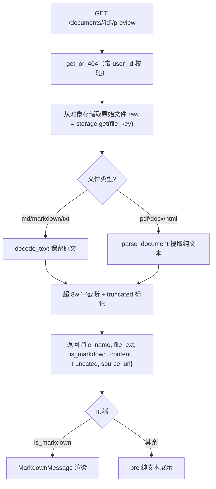

# 知识库文档预览 — 设计与八股（后端）

> V0.0.4 易用性增强：知识库里的文档可以点开看内容了——Markdown 渲染、其余类型纯文本展示、网页来源附「查看原网页」，不用再靠文件名猜这篇是什么。本篇只讲后端。

---

## 一、功能定位与需求

- **看原文**：文档原始文件存在对象存储（`file_key`），解析后的 chunk 进 ES，PG 只存元数据——所以「看内容」需要按需取原文。
- **按类型展示**：`.md/.markdown/.txt` 保留原文（md 交前端渲染）；`.pdf/.docx/.html` 提取纯文本。
- **超长截断**：限 8w 字，带 `truncated` 标记。

---

## 一点五、流程图

> **为什么按需重新解析而非读 ES 分块**：ES 里是检索用的父子分块（带重叠、被切碎），不适合当「完整原文」展示。直接取对象存储的原始文件按类型解析，得到的是干净完整正文。md 保留原文是为了前端能漂亮渲染（深度研究报告存进来就是 .md）。

---

## 二、数据模型与迁移

无新表、无迁移。复用 `documents` 表的 `file_key`/`file_ext`/`source_url`。

---

## 三、核心实现与代码路径

- `core/rag/parser.py`：新增对外 `decode_text(content)`（chardet 检测编码解码，保留原始文本，不做 markdown→纯文本转换）；复用 `parse_document(ext, content)`（pdf/docx/html/txt 提取纯文本）。
- `document_service.py`：`preview(user_id, doc_id)` —— `_get_or_404`（user_id 校验防越权）→ `storage.get(file_key)` → md/txt 走 `decode_text`、其余走 `parse_document` → 截断（`PREVIEW_MAX_CHARS=80000`）→ 返回 `{id, file_name, file_ext, is_markdown, source_url, content, truncated}`。
- `document_controller.py`：`GET /documents/{id}/preview`。

---

## 四、设计取舍（已定决策）

| 决策 | 选择 | 理由 |
|------|------|------|
| 内容来源 | 按需取对象存储原文重新解析 | ES 是检索分块、被切碎，不适合当完整原文 |
| md 处理 | 保留原文交前端渲染 | 渲染漂亮（研究报告就是 md） |
| 其余类型 | parse_document 提纯文本 | 复用已有解析能力 |
| 超长 | 截断 8w 字 + truncated | 控响应体大小，完整看下载原文件 |
| 越权 | `_get_or_404` + user_id | 拿不到别人的文档 |

---

## 五、易踩坑点

1. **别读 ES 分块当原文**：分块有重叠、被切碎、面向检索，展示出来支离破碎。要取原始文件重新解析。
2. **md 不能走 parse_document**：`parse_document` 对 md 会转成纯文本（丢格式）。md 要用 `decode_text` 保留原文，前端再渲染。
3. **越权**：必须 `_get_or_404` 带 user_id 校验，否则换个 id 能看别人文档。
4. **响应体过大**：长文档要截断，否则 JSON 过大；带 truncated 让前端提示「完整内容请下载」。
5. **原文件可能已清理**：storage.get 失败要抛中文 BizError（如「原始文件读取失败，可能已被清理」）。

---

## 六、面试问答（八股）

**Q1：文档预览的内容从哪来，为什么不直接读检索用的 ES 分块？**
原始文件存在对象存储（PG 只存元数据、ES 存检索分块）。预览要的是「完整、干净的原文」，而 ES 里是父子分块——有重叠、被切碎、面向检索，直接展示会支离破碎。所以预览按需从对象存储取原始文件，再按类型解析成完整正文返回。

**Q2：不同类型怎么处理？为什么 md 特殊对待？**
`.md/.markdown/.txt` 用 `decode_text` 保留原始文本（md 交前端 MarkdownMessage 渲染、txt 原样展示）；`.pdf/.docx/.html` 用 `parse_document` 提取纯文本。md 特殊是因为 `parse_document` 会把 md 转成纯文本丢掉格式，而我们想保留 markdown 让前端漂亮渲染（深度研究报告存进知识库就是 .md，预览体验很关键）。

**Q3：怎么防越权和控制响应体？**
`preview` 走 `_get_or_404(user_id, doc_id)`，带 user_id 过滤，换 id 拿不到别人的文档。内容截断到 8w 字并带 `truncated` 标记，避免超长 JSON；前端据此提示「完整内容请下载原文件」。读取原文件失败（已清理等）抛中文 BizError。
